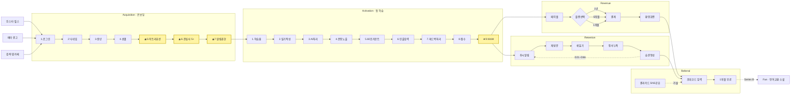

# 산출물 2 — 유저 플로우 (3-2)

## 페르소나

**김지연 · 29세 · 마케터 · 결혼적령기 · 갓생 자기계발 중**
- 토익 850, 회사에서 외국인 미팅 잡힐 때마다 도망다님
- 출퇴근 길에 영어앱 3개 깔았다가 모두 D7 안에 이탈
- 인스타에서 "영어 일기 챌린지" 인플루언서 콘텐츠를 자주 저장
- 결제 의향: 월 1만원대까지 OK, 단 "효과 체감" 조건

---

## 전체 플로우 (텍스트 도식 — Miro/FigJam 옮길 때 기준)

```
═══════════════════════════════════════════════════════════════════
[Push] 일상 데이터 기반 학습 + 정서 시각화    [Pull] "왜 안 늘지?" 효능감 결핍
        │                                              │
        └──────────────────────┬───────────────────────┘
                               ▼
═══ AWARENESS ═════════════════════════════════════════════════════
   인스타 릴스 노출 (인플루언서 인증)
   메타 광고 ("일기로 공부하는 영어 회화")
   검색 (영어 일기 앱)
   맘카페 추천 글
                               │
                               ▼
═══ ACQUISITION (온보딩 7단계) ═════════════════════════════════════
   [1] 앱 실행 — 수푸리 캐릭터 + "영어의숲" 로고
        ├ Google로 시작하기
        └ Apple로 시작하기
                  │
   [2] 닉네임 입력 — "제가 앞으로 뭐라고 불러드리면 될까요?"
        (이름 추천 받기 옵션)
                  │
   [3] 출생연도 — 휠 스피너 (1993 디폴트)
                  │
   [4] 성별 — He / She / 기타
                  │
   [5] ★ 셀프 어트리뷰션 — "앱을 설치하시게 된 경로가 궁금해요"
        ├ 구글플레이 검색 및 피쳐
        ├ SNS 광고
        ├ 지인의 추천 (직접 추천, 링크 공유)
        ├ 지인의 SNS (스토리, 피드, 릴스)
        ├ 잉냥이·올무 SNS
        └ 기타
                  │
   [6] 관심사 선택 (최소 5개 강제) — 4/10 진행 표기
        ├ 취미: 쇼핑, 여행, 산책, 드라이브, 맛집탐방, 카페투어,
        │       사진촬영, 캠핑, 요리, 베이킹, 와인, 위스키,
        │       인테리어, 필사, 네일아트
        ├ 엔터: 영화, 드라마, 예능, 뮤지컬·연극, 전시회,
        │       애니메이션, 웹툰, 게임, 유튜브
        └ 스포츠: 수영, 축구, 야구, 농구...
                  │
   [7] ★ 알림 권한 — "학습을 놓치지 않도록 알림을 보내드릴게요"
        소셜프루프 카피: "알림을 받는 분들은 다음 날 이어서
                         학습할 확률이 27% 더 높아요"
        (수푸리 캐릭터 톡 인터랙션)
                               │
                               ▼
═══ ACTIVATION (첫 학습 세션) ═════════════════════════════════════
   [1] 학습하기 홈 — 날짜 카드 (10월 24일 금요일)
       "이 장면으로 다이어리 채우기 →"
                  │
   [2] 일기 작성 — 사진 첨부 가능 + 텍스트 인풋
       "친구랑 같이 파스타 먹고 전시회 봤다"
       (한글 자판, 사진 추가 버튼)
                  │
   [3] "수푸리가 오늘의 문장을 만들고 있어요" (로딩, 기대감)
                  │
   [4] 오늘 배울 표현 노출
       "Today, I ate vongole pasta"
       "오늘 나는 봉골레 파스타를 먹었어요"
       [학습 시작하기 버튼]
                  │
   [5] 60초 타이머 카운트 시작
       마이크 입력 또는 텍스트 입력 선택
                  │
   [6] 인출 학습 — 사용자가 직접 영어 문장 만들기
       "Today, I ate vongole pasta" 정답 입력
                  │
   [7] "수푸리가 피드백을 준비하고 있어요" (로딩)
                  │
   [8] 점수 + 피드백 — 게임화 (점수 카운트 애니메이션)
       (저점수 시 격려 / 고점수 시 별빛 효과)
                  │
   [9] ★ WoW 모먼트 — "첫 번째 학습을 성공적으로 끝냈어요!"
       검은 배경 + 별빛 애니메이션 + 결과 카드
       (이 순간 70%가 당일 결제 — 사업계획서 p.19)
                               │
                       ┌───────┴────────┐
                       ▼                ▼
═══ REVENUE ═══════════    ═══ RETENTION ═════════════════════════
[1] 페이월                  다음 날 푸시 알림
    "부담없이 시작하는       "어제 배운 문장,
     내 이야기로 배우는       복습해볼까요?"
     영어"                  "언어는 쉬면 금방 멀어져요"
    (하루 200원 강조)       (수푸리 캐릭터 톡)
                                   │
[2] 플랜 카드                  ▼
    ▸ 1년 6,900원/월 ★     학습하기 홈 재방문
      (56% 할인, 빨간 뱃지)        │
      정가 190,800원              ▼
      혜택가 82,500원         새 일기 작성 (변동 보상)
    ▸ 6개월 9,900원/월              │
      38% 할인, 인기 뱃지         ▼
      혜택가 59,000원         학습 → 정서 데이터 누적
    ▸ 1개월 15,900원               │
                                   ▼
[3] 결제 모달                  연속 학습 챌린지
    "지금 결제하면                 │
     최대 56% 할인 받을 수 있어요"  ▼
    카운트다운 (할인 종료까지)  정서 시각화
    [플랜 시작하기]                │
                                   ▼
[4] App Store 결제 시트       습관 형성 단계
    "6개월 플랜 ₩59,000원"    [D1] [D3] [D7] [D21] [D66]
    "측면 버튼으로 확인"       외적 동기 → 내적 동기 전환
                                   │
[5] 환영 화면                  ─────┐
    "환영해요 {Username}님!         │
     지금부터 영어의숲의             │
     모든 기능을 제한 없이 이용"      │
    구매한 플랜 카드                 │
    친구 추천 보너스 라인 보임 ──────┤
                                   ▼
                       ═══ REFERRAL ═════════════════
                       [받는 쪽]
                       초대 코드 입력 화면
                       "1개월 무료 추가 혜택"
                       (구독 후 14일 한정)
                          │
                       [환영 화면 통합]
                       "친구 추천 보너스" 라인 노출
                          │
                       [보내는 쪽 — 화면 미공개]
                       (가설: 학습 결과 카드를
                        SNS 스토리로 공유하면
                        추천 링크 동봉)
                          │
                       K-factor = 0.31
                       (3명이 1명을 데려옴)
                               │
                               ▼
                       ═══ FAN (Future / Series B) ═══
                       언어교환 매칭 소셜 플랫폼
                       (언어교육앱 버전의 아자르)
                       락인 데이터 기반 취향 매칭
```

---

## 핵심 분기점 (빨간 박스로 강조)

| # | 분기점 | 측정 이벤트 | 리스크 |
|---|---|---|---|
| ① | 온보딩 [6] 관심사 5개 미만 | `interest_select_dropoff` | 5개 강제 = 이탈 가능 vs 자기참조 시드 |
| ② | 온보딩 [7] 알림 권한 거부 | `push_permission=false` | D1 리텐션 -27%p (자사 카피) |
| ③ | Activation [2]→[5] 일기만 쓰고 학습 안 함 | `diary_create` ∩ ¬`study_start` | "콘텐츠 소비자"화 — 결제 안 함 |
| ④ | Activation [9] WoW 모먼트 미체험 | `study_complete=false` | D1 이탈 직결 |
| ⑤ | Revenue [2] 1개월 플랜 선택 | `plan_select=1m` | LTV 손해 (1년 대비 1/12 효과) |
| ⑥ | D7 → D30 절벽 | D30 부활률 2% | 습관화 실패 — 가장 큰 누수 |

---

## 도식화 가이드

1. **Miro/FigJam에서 화면 캡처를 노드로 직접 사용** — 이미 보유한 이미지 자산
2. 각 노드 옆에 측정 이벤트명을 라벨로 부착 → `key_metrics.csv`와 1:1 매핑
3. 분기점은 빨간 박스 + 사업계획서 지표 (예: "D1 70% 결제") 라벨
4. 화면 위쪽에 퍼널 단계 헤더 (Awareness | Acquisition | Activation | Revenue | Retention | Referral | Fan)
5. 흐름 화살표 두께 = 트래픽 볼륨 비례 (가설치라도 시각화)

---

## Mermaid 다이어그램 (https://mermaid.live)


