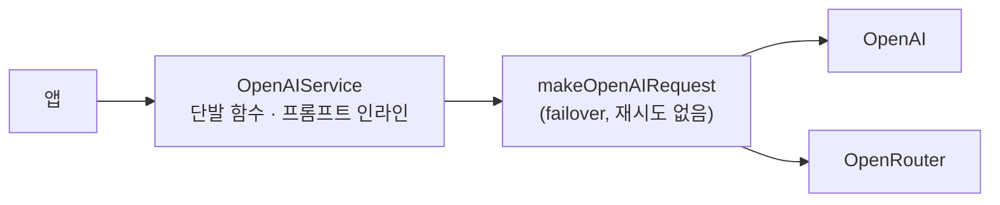
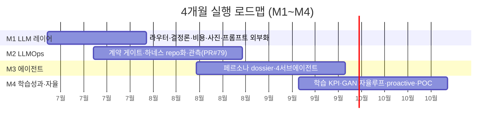
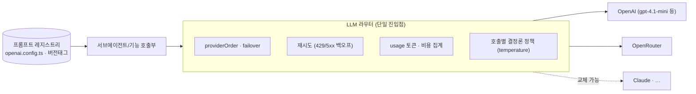
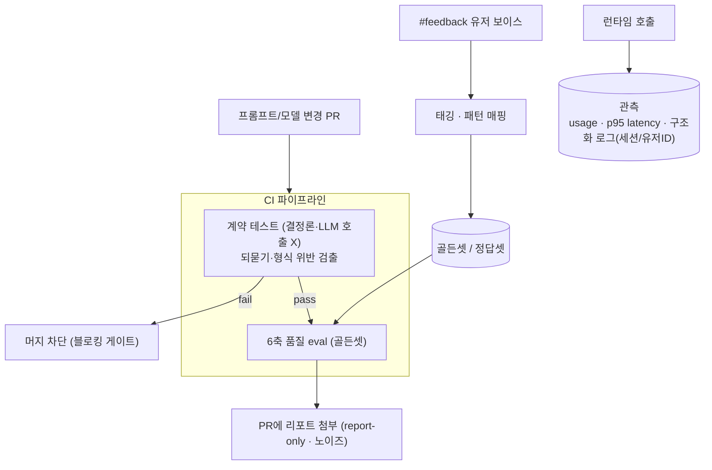
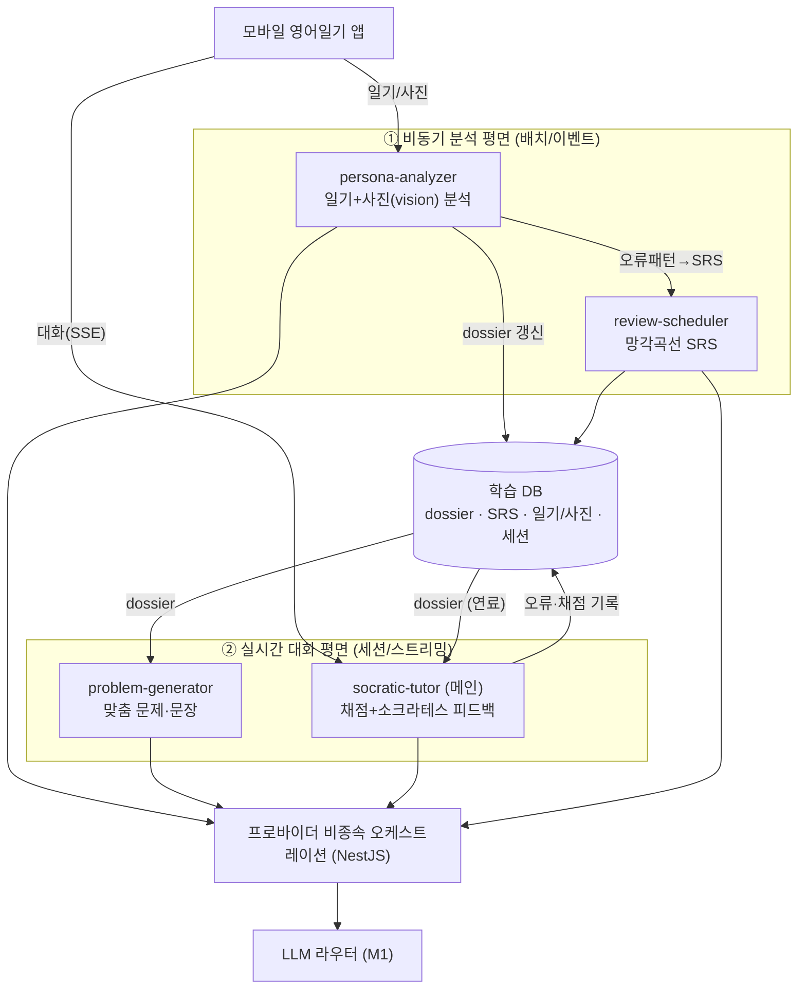
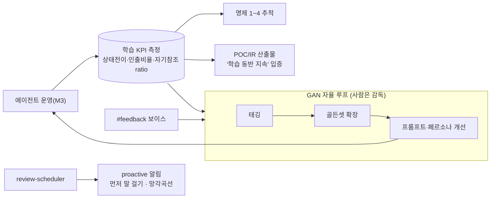

# 언어학습 AI Agent — 전략 & 아키텍처 문서 (근거 버전)

> 이 문서는 **기존 버전**(`language-learning-agent-strategy.md`, HOW 중심)에
> **설계의 이유·근거(자기참조·인출)** 를 덧대고 **논문 인용**을 단 버전이다. 이론 상세는 컨셉노트
> "자기참조형 인출 기반 모바일 언어 학습 경험 설계" 참조. 인용 목록은 §10.
> 근거는 코드(`OpenAIService`) · Slack `#ax_prompt-ops` · Notion 1차 리포트(실측) 기반.

## 목차
0. 왜 이렇게 만드는가 — 설계의 뿌리
1. 목적 & 비전
2. 전사 맥락에서의 위치
3. 현황 아키텍처 (As-is)
4. 설계 원칙
5. 목표 아키텍처 (To-be) — 4개월 마일스톤
   - 5.0 4개월 로드맵 · 5.1 M1 · 5.2 M2 · 5.3 M3 · 5.4 M4
6. 공통 설계 (모델 라우팅 · 도구 · 동기 · 다국어 · 음성대화)
7. 검증 (시스템 + 학습 성과·지속)
8. 리스크 & 열린 결정
9. 부록 — 소스
10. 참고문헌

---

## 0. 왜 이렇게 만드는가 — 설계의 뿌리

한 가지 모순에서 출발한다. **게임은 안 시켜도 하고, 공부는 시켜도 안 한다.** 원리는 같은데 왜 다를까 —
차이는 **소재가 '나'에게서 나오는가**에 있다. 그래서 두 축으로 설계한다.

- **자기참조(소재가 나에게서):** 내 일기·사진·생각이 학습 소재가 되면 '연습'과 '진짜 하고 싶은 표현'의
  간격이 사라진다 → 동기가 생긴다(자기참조 효과; Rogers et al., 1977).
- **인출(백지에서 떠올리기):** 보고 따라하는 게 아니라 스스로 산출해야 진짜로 는다(인출 연습이
  단순 반복·모방보다 우월; Karpicke & Blunt, 2011; Kang et al., 2013). 어렵지만 **그 어려움이 학습의
  핵심이라 일부러 낮추지 않는다**(바람직한 어려움; Bjork, 1994).

둘을 합치면: **난이도를 낮추지 않고도(인출 유지) 동기를 공급(자기참조)** 해 "작심 3일"을 넘긴다.
기존 게임화·스트릭은 재방문은 올리되 학습과 분리된 '가짜 재방문'에 머물렀고(Eyal, 2014; Shortt et al.,
2023), 학습과학은 인지부하로 이탈을 키웠다 — 자기참조성은 그 둘을 잇는 빈칸이다. 그래서 '지속'을
스트릭으로 부풀려진 단순 재방문이 아니라 **"학습이 같이 일어난 지속"** 으로 본다(§7).

그리고 이 방식은 **유저의 자유로운 표현을 실시간으로 교정**해줄 수 있어야 가능한데, 그게 LLM으로
비로소 됐다(Kittredge et al., 2025). **이 문서(에이전트)가 바로 그 실현체다.**

---

## 1. 목적 & 비전

기존 **모바일 영어일기 앱**(언어의숲)에 AI Agent를 도입한다. 유저의 **일기(텍스트)+사진**이
독점 데이터(moat)다 — 단순히 데이터를 많이 가져서가 아니라, **소재가 유저 자신에게서 나와
동기(Ryan & Deci, 2000)·애착(확장된 자기; Belk, 1988)의 원천**이 되기 때문이다(§0). Agent의 정체성은
**"유저를 깊이 아는 외국인 친구"** — 단순 교정기가 아니라 일기·사진으로 **멘탈모델·관심사·성격·맥락**을
이해하고 그 위에서 교정·학습을 돕는다. 궁극 목표: **"어려움에도 불구하고 계속 학습하게."**

**핵심 기능 4개**(M3에서 서브에이전트화): ⓪페르소나 분석(중심) ①맞춤 문제·문장 ②소크라테스식 채점·피드백
③망각곡선 복습.

**언어쌍 비종속(다국어 모드):** 지금은 한국어 화자의 **영어 학습**(KO→EN)이지만, 같은 메커니즘은
어떤 언어쌍에도 적용된다. 다음 확장은 **외국인 대상 한국어 학습**(EN→KO), 궁극적으로 임의의
(모국어 L1 → 목표어 L2)다. '외국인 친구'는 곧 **목표어(L2) 원어민 친구**다(§6.4).

**북극성(궁극형):** 텍스트 문답을 넘어, **실제 외국인 친구와 전화영어 하듯 음성으로 자유롭게 대화**하는
수준이 목표다. 한국어·영어를 자연스럽게 오가며(code-switching) 학습자 수준에 맞춰 호환적으로 이야기한다
— '문제 풀이'가 아니라 '진짜 대화'(§6.5).

**아키텍처 대전제**: 기반 기술을 특정 SDK/프로바이더에 묶지 않는다. LLM은 라우터 뒤의 **교체 가능한
부품**으로 두고, 에이전트 루프·상태·도구는 **우리 백엔드(NestJS)** 가 소유한다. 기존
`providerOrder`(OpenAI↔OpenRouter failover) 자산을 라우터로 승격해 계승한다.

---

## 2. 전사 맥락에서의 위치

회사는 4영역 — **①유저데이터 · ②제품/OPS · ③마케팅·결제 · ④대시보드** — 를 순환시킨다.
**본 문서 = ②제품 트랙 + 그 LLMOps**다.

- 우선순위: **①·②·④ 연결이 핵심**, **③(마케팅·결제)은 후순위**(가장 약하고 제어 난도 높음)
- 기능3의 "먼저 말 걸기" 프로액티브 알림은 **로컬 컴퓨트(맥미니)+데이터 연동**에 의존 — M3/M4
- 팀 회복력 원칙: 지식을 **사람 머릿속이 아니라 시스템·문서·계약 테스트**에 둔다(누가 빠져도 대응 가능)
- **대외(POC/IR) 명분:** "GPT 래핑 아니냐"에 대한 답 — **검증 가능한 설계 원리(§0)를 LLM으로 구현**한 것.
  컨셉노트(이론)와 본 문서(구현)가 [왜 → 어떻게] 한 쌍을 이룬다.

---

## 3. 현황 아키텍처 (As-is) — 실측 기반

오늘의 구조는 **"단발 함수 + 멀티프로바이더 호출"** 이다. 에이전트 루프·상태·페르소나는 없다.

*공백: stateless · 사진 입력 주석처리 · temp=1 · usage 미관측 · 재시도 없음 · 프롬프트 인라인 중복*

**견고한 점(계승)**: 멀티프로바이더 failover, `[ai-latency]` 로깅, 3콜→1콜 병합(`generateExpressionPack`),
방어적 파싱·폴백, RAG/임베딩.

**구조적 공백**: 재시도 없음 / `usage` 미관측 / `temperature:1` 남발(채점·피드백 포함) /
JSON 정규식 추출 / **사진 입력 주석처리(독점데이터 미활용)** / **stateless(기억 없음)** / 프롬프트 인라인 중복.

**팀 Prompt Ops(코드 밖에서 이미 작동)**: 진단표(5 패턴 — opener·시제/상·명사화·강조·형식),
정답셋 20건, 채점 하네스(`run_eval.py`, 6축), 버전관리(v1/v1.1/v1.2), draft PR #79
(`translation-guard.util`·`prompt-contract.yml`, 15/15).

**1차 리포트 실측(Notion)** — 아키텍처 결정의 근거:
- v1 81.3 → **v1.2 92.1**, 30%↓. **되묻기 0점 버그**(입력 `<original>`을 [역할]에 묻어둠 →
  *"Sure! Please provide…"*) — v1.1/v1.2의 `#입력문` 슬롯 분리로 해결
- **점수 노이즈 ±2~7**(생성 temp=1 + 채점 변동) → **품질 점수는 하드 게이트로 못 씀**
- **모델 권고 `gpt-4.1-mini`**(품질 동급·**p95 1.64s→0.85s**·비용↓), gpt-4o-mini 탈락
- **가장 큰 latency 레버 = 병렬화·스트리밍**(모델 다운사이징보다 큼)

> 진단: "0에서 시작"이 아니다. 공백은 **코드 정합성 → 운영 시스템화 → 에이전트화 → 측정·자율** 순서의 토대다.

---

## 4. 설계 원칙
1. **페르소나 = 살아있는 구조화 문서(dossier).** 원시 history 대신 압축 dossier를 1차 컨텍스트로.
2. **위임 우선.** 분석·생성·채점·복습을 서브에이전트로 분리·격리.
3. **복리 루프.** 일기 누적 → 페르소나 풍부 → 개인화↑ → 참여↑ → 데이터↑ *(= §0 애착 경로; Belk, 1988)*.
4. **프로바이더 비종속.** LLM은 라우터 뒤 교체 가능한 부품.
5. **결정론은 코드로.** SRS·점수·계약검증은 결정론 코드, LLM은 자연어만.
6. **측정 우선.** 프롬프트·모델 변경은 골든셋·계약 테스트 통과 후 배포. 노이즈는 report-only.
7. **독점 데이터 활용.** 일기+사진(특히 사진)을 실제 입력에 투입 *(= §0 자기참조; Rogers et al., 1977)*.
8. **언어쌍 비종속.** 학습 메커니즘은 특정 언어쌍에 묶이지 않는다 — (L1→L2)를 **config 차원**으로 두고,
   프롬프트·골든셋·오류 taxonomy만 언어쌍별로 갈아끼운다(§6.4).

---

## 5. 목표 아키텍처 (To-be) — 4개월 마일스톤

`M1 LLM 레이어 → M2 LLMOps → M3 Agent → M4 학습성과·자율`. 각 단계가 **독립적으로 동작하는
아키텍처 상태**를 만들고 다음의 토대가 된다. **측정 가능한 토대 위에서만 에이전트를 올린다.**

### 5.0 4개월 로드맵

| 월 | 마일스톤 | 한 줄 | 핵심 산출 |
|---|---|---|---|
| **1개월차** | **M1 LLM 레이어** | 라우터로 정합화 | 결정론·재시도·비용·사진·프롬프트 외부화 |
| **2개월차** | **M2 LLMOps** | 측정 = 배포 관문 | 계약 게이트·하네스 repo화·관측 (**PR #79 머지**) |
| **3개월차** | **M3 에이전트** | 페르소나 + 4서브 | dossier·socratic·generator·review (**POC 핵심**) |
| **4개월차** | **M4 학습성과·자율** | 루프를 닫고 입증 | 학습 KPI·GAN 자율루프·proactive 알림·POC/IR 산출 |

> 단계는 일부 겹친다(M1↔M2 병행, M3는 가장 무거워 3~4개월차 걸침, M4 측정은 M3와 함께 시작).
> 다만 **M3를 M1·M2 토대 없이 먼저 가지 않는다**(측정 불능 리스크).
>
> **북극성(M4 이후):** 텍스트 문답 → **실시간 음성 자유 대화(전화영어)** + 한↔영 코드스위칭(§6.5).

### 5.1 M1. LLM 레이어 — 라우터 단일 진입점

모든 LLM 호출을 **라우터 하나**로 모은다. 프로바이더·재시도·비용·결정론 정책이 여기 집중된다.
프롬프트는 코드에서 분리해 **레지스트리(`openai.config.ts` + 버전 태그)** 로.

**핵심 설계 결정**
- **되묻기 버그 제거**: 입력 슬롯 분리(`#입력문`) 구조를 모든 경로에 강제 → 라이브 빈응답 차단(리포트 §3-2)
- **결정론 정책**: 채점·피드백은 `temperature 0~0.2`, 점수는 structured 정수 — 노이즈(±2~7) 제거
- **라우터 책임 집중**: failover에 **재시도 + `usage` 집계** 추가(현재 둘 다 없음)
- **모델은 슬롯**: 운영 기본을 `gpt-4.1-mini`로 검토(p95 반토막·비용↓), 교체는 config 1줄
- **latency 레버**: 순차 멀티콜 **병렬화 + SSE 스트리밍**(모델 교체보다 효과 큼)
- **사진 입력 복구**: 주석처리된 vision 첨부 활성화 → 독점데이터 실사용
- **프롬프트 외부화**: 인라인 중복 제거, 버전·diff 추적 + **언어쌍(locale) 키**로 분리(다국어 대비) — 레지스트리화

### 5.2 M2. LLMOps — 측정이 배포의 관문

프롬프트/모델 변경이 **측정 파이프라인을 통과해야만** 배포되는 구조. 이미 있는 하네스를 repo CI로 승격한다.

> **이건 유저 대면 배포가 아니라 CI 내부 인프라(가드레일)다.** 앱의 특정 기능이 바깥으로
> 나가는 게 아니라 "변경이 안전한지 자동 검증하는 테스트 망"을 까는 것 — main 머지도 안전.
> 중요한 건 '배포 여부'가 아니라 **변경의 blast radius(파급 범위)를 아는 것**.

**핵심 설계 결정**
- **2층 검증**: 결정론 **계약 테스트는 블로킹 게이트**(되묻기·형식 — LLM 호출 없이 싸고 확정적),
  **6축 품질 점수는 report-only**(노이즈가 커서 하드 게이트 부적합 — 리포트 변동성)
- **하네스 repo화**: 로컬 `run_eval.py` → backend `tools/prompt-eval`+`ops/eval`+`prompt-eval.yml`(PR 자동)
- **eval 신뢰화**: 채점 `temp=0`/다회평균, **예시↔정답셋 분리**(오염 방지 — 리포트 §3-4)
- **골든셋 성장(GAN 루프)**: #feedback 보이스 태깅 → 버그/패턴 매핑 → 정답셋 확장(+writing 버전)
- **관측 평면**: `usage` 비용 + **p95 latency**(avg보다 체감 좌우) + 구조화 로그/세션·유저ID
- **첫 작업 = draft PR #79 마무리**(계약 테스트를 required 게이트로) → 하네스가 24/7 시스템이 됨

### 5.3 M3. 에이전트 — 2평면 · 4서브에이전트 · dossier

측정 가능한 토대 위에 **외국인 친구 에이전트**를 올린다. 비동기 분석과 실시간 대화를 분리하고,
페르소나 dossier가 둘을 잇는다.

> **대외 입증·POC 정렬:** socratic-tutor(기능2)는 "개인화 추출 + evaluation + 발문 생성(추가 물음)"
> 구조로, 정부지원 POC(업스테이지 **Socratic** 트랙)와 정확히 맞물린다("영어만 빼면 동일"). 이 에이전트가
> 돌아가는 것 자체가 **'래핑이 아니라 기술'임을 입증**하는 대외 셀링 포인트다.

**왜 2평면**: 분석은 무겁고 비실시간(배치·이벤트), 대화는 가볍고 실시간이어야 한다. 분석 평면이
만든 **dossier가 대화 평면의 연료** — 복리 루프를 돈다.

**4 서브에이전트** (각자 프롬프트 계약 · 입출력 스키마 · 모델 슬롯(교체) · eval):

| 에이전트 | 평면/기능 | 입력 → 출력 | 계승 |
|---|---|---|---|
| **A. persona-analyzer** | ① 배치 / ⓪ | 신규 일기+**사진(vision)**+dossier → dossier **diff**(관심사·성격·CEFR·오류패턴·멘탈모델, 근거 인용) | `analyzeDiary` 확장+사진 활성화 |
| **B. problem-generator** | ②/배치 / ① | dossier+오늘 일기+난이도+약점 → `{korean, primary, alternatives[3], target_error_pattern}` | `generateExpressionPack` 페르소나화 |
| **C. socratic-tutor** (메인) | ② 실시간 / ② | 답안+정답+dossier → 채점(**결정론 temp 0~0.2**) + 소크라테스 피드백(정답 즉시 X·유도질문·친구 톤·**되묻기 금지 계약**) | `score`+`feedback` 소크라테스화 |
| **D. review-scheduler** | ① 배치 / ③ | 아이템+quality(0~5) → 다음 복습일·알림. **SRS 간격은 결정론 코드(SM-2/FSRS)** | 신규 (`error_log`→SRS 자동 등록) |

> **설계 근거(§0과 연결):** socratic-tutor가 **정답을 바로 안 주는** 이유 = "보고 따라하기"가 아니라
> **백지에서 떠올리는 인출**이라야 진짜 학습이기 때문(Karpicke & Blunt, 2011; 생성효과 Slamecka & Graf,
> 1978). problem-generator가 **내 일기**를 소재로 쓰는 이유 = 소재가 나에게서 나와야 동기가 생기기
> 때문(자기참조; Rogers et al., 1977).

**페르소나 dossier(구조)**: `persona.md`(관심사/성격/관계 + mermaid) · `language_profile.md`(CEFR·오류) ·
`error_log`(→SRS) · `timeline`. 대화엔 원시 history 대신 **압축 dossier**만 주입.

### 5.4 M4. 학습 성과 · 자율 루프 — "루프를 닫고 대외로 입증"

에이전트가 돌기 시작하면, 이제 **이론(자기참조·인출)이 맞는지 데이터로 확인하고 스스로 개선되게** 만든다.

**핵심 설계 결정**
- **학습 성과 KPI 가동**(§7-B): 상태전이·인출비율·자기참조 ratio를 dossier·대시보드에 적재, 명제1~4 추적
- **GAN 자율 루프**: #feedback·KPI → 태깅 → 골든셋 확장 → eval → 프롬프트/페르소나 개선까지 자동(사람 감독)
- **HOTL 전환**: 교정·페르소나 갱신을 자율 실행, 사람은 감독만. 전환 기준 = **학습 KPI·계약 게이트 통과율로 정량화**
- **proactive 에이전트**: "먼저 말 걸기" + 망각곡선 복습 알림 풀가동(review-scheduler 운영) — 로컬 컴퓨트(맥미니) 의존
- **대외 산출물**: POC(업스테이지 Socratic) 데모 + IR용 "학습 동반 지속" 입증 패키지

**산출**: 이론→구현→측정 루프 완결 + 24/7 자율 운영 + 대외 입증 패키지.

---

## 6. 공통 설계 (횡단)

### 6.1 모델 라우팅 (프로바이더 비종속)
역량 티어 → 슬롯(서브에이전트별 config 교체):

| 티어 | 쓰는 곳 | 현재 후보 | 교체 가능 |
|------|---------|-----------|-----------|
| 강력 추론·교수법 | socratic-tutor | gpt-4.1 / gpt-4o | Claude Opus/Sonnet |
| 멀티모달 | persona-analyzer | gpt-4.1(vision) | Claude(vision) |
| 생성 | problem-generator | **gpt-4.1-mini**(리포트 권고) | Sonnet |
| 경량·고속 | 분류/판정 | mini급 | Haiku |

### 6.2 도구 카탈로그
`get_persona` · `update_persona(diff)` · `ingest_journal` · `save_error_patterns`/`log_error` ·
`enqueue_srs`/`get_due_items`/`update_item_review(quality)` · `grade_answer` · `save_generated_item`.
function-calling으로 프로바이더 공통 추상화. 셸/파일 도구 미부여(injection 최소화).

### 6.3 동기 설계 — "계속하게" 만드는 세 갈래
1. **재미(바로 작동):** 내 얘기가 소재라 관련 있고 흥미가 생긴다 → 자율성·관련성 충족 → 내재적 동기
   (Ryan & Deci, 2000) 〔problem-generator〕
2. **자신감(바로 작동):** 떠먹여주지 않고 스스로 떠올려 맞히니(인출; Bjork, 1994) 성취감이 쌓인다 →
   자기효능감(Bandura, 1977) 〔socratic-tutor〕
3. **애착(쌓일수록):** 내 기록이 누적되면 '나의 일부'처럼 느껴져 떠나기 아쉬워진다 → 확장된 자기
   (Belk, 1988) 〔dossier 누적 = 플라이휠〕

앞 둘은 **매 세션 즉각**, 셋째는 **데이터가 쌓여야 작동하는 장기 효과**(장기 리텐션의 핵심).
여기에 격려 톤·적응형 난이도·즉각 스트리밍(0.5초 체감)이 보조한다.

### 6.4 다국어 — 언어쌍 비종속(language-pair agnostic)
모델(프로바이더)을 슬롯으로 두듯, **언어쌍 (L1→L2)도 config 차원**이다. 같은 아키텍처로
영어 학습(KO→EN)과 외국인 대상 한국어 학습(EN→KO)을 모두 굴린다.

| 언어쌍 비종속 (공통 골격) | 언어쌍별 교체 |
|---|---|
| 2평면·4서브에이전트·dossier·라우터·SRS | 프롬프트(레지스트리 locale 키) |
| 자기참조·인출 메커니즘 | 골든셋·정답셋 |
| 계약 테스트 골격 | 오류 taxonomy(영어: opener·시제·명사화 / 한국어: 조사·어순·높임말 …) |
| persona dossier 구조 | `language_profile`의 L1·L2·CEFR |

- **서브에이전트는 (L1→L2)로 파라미터화:** socratic-tutor = **목표어(L2) 원어민** 친구,
  problem-generator = L1 문장 → L2 답.
- **언어 비종속 근거:** 자기참조·인출 효과는 특정 언어에 종속되지 않는다. 한국어 학습도
  '자기 생각의 표현'이라 자기표현성이 결정적(컨셉노트 명제4 경계조건 — 자기표현적 영역에서 효과 강함).
- **확장 비용:** 새 언어쌍 = **아키텍처 재작업이 아니라 config + 골든셋 + 오류 taxonomy 추가.**
- **시점:** KO→EN(현재) → **EN→KO(외국인 대상 한국어 · K-콘텐츠 수요)** → 임의 다국어.
  M1~M4를 **언어쌍 비종속으로 설계**해 두면 한국어 모드는 새 트랙이 아니라 "config + 데이터".

### 6.5 실시간 음성 대화 — 북극성(North Star)
궁극형은 **전화영어처럼 음성으로 자유롭게 대화**하는 외국인 친구다(텍스트 문답 → 실시간 대화).
- **음성 레이어:** socratic-tutor 앞뒤에 STT(말→글)·TTS(글→말)를 두고 **저지연 양방향 스트리밍**
  (SSE → 실시간 듀플렉스/WebRTC). 설계 원칙의 '0.5초 응답'이 이를 겨냥.
- **대화 모드:** 구조화 문답(현재) ↔ **자유 대화(전화영어)** 모드 전환. dossier·오류 패턴은 그대로 연료.
- **코드 스위칭(한↔영 혼용):** 학습자 수준에 맞춰 한국어·영어를 오가며 '호환적으로' 대화 — 막히면
  모국어로 풀어주고 다시 목표어로. (다국어 §6.4 언어쌍 config + 발화 내 혼용)
- **근거:** 실시간 말하기는 **자기표현·인출의 최고 형태** — 보고 베끼지 않고 그 자리에서 자기 생각을
  산출하므로(자기표현성·생성효과; Slamecka & Graf, 1978), 자기참조 인출 학습의 정점이다.
- **아키텍처 정합:** 프로바이더 비종속 라우터·언어쌍 config·dossier가 이미 이 방향이라 음성·실시간은
  **'레이어 추가'이지 재설계가 아니다.**
- **시점:** M1~M4(텍스트·측정·자율) 토대 위 **M4 이후 북극성**. (음성 인프라·지연·비용·턴테이킹은 §8)

---

## 7. 검증 (시스템 + 학습 성과·지속)

**(A) 시스템 건강 — 마일스톤별**
- **M1**: 되묻기 0 회귀 · 비용 로그 노출 · 모델 스왑 1-config · p95 개선
- **M2**: 프롬프트 변경 PR이 계약 게이트 통과해야 머지 · 6축 report 자동 첨부 · eval 오염 0
- **M3**: 가상 유저(일기+사진) 분석→생성→소크라테스→복습 e2e · dossier 누적 갱신 · 프로바이더 교체 무영향
- **M4**: GAN 자율 루프 가동 · HOTL 전환 기준 충족 · proactive 알림 동작 · POC 데모 산출

**(B) 학습 성과·지속 — "진짜 배우면서 남는가"**
- **지속을 재방문율로 보지 않는다.** 스트릭으로 부풀려진 '가짜 재방문' 대신, 상태(활성/휴면/이탈)의
  **이동**을 보되 그 이동 조건에 학습을 넣는다 — **인출이 일어난 세션 비율 · 틀린 뒤 다시 돌아온 비율**
  (Gustafson, 2023). 행동로그만으론 이탈 원인이 안 보이므로(Singh et al., 2021) 지속의향을 보조 지표로
  병행하되 의향–행동 간극은 한계로 둔다.
- **자기참조가 실제 작동하는지**(‘지난주의 나’ 기준; Jonathan et al., 2017): 자기 문장으로 답한 비율 ·
  내 일기·사진에서 나온 소재 비율 · 베끼지 않고 백지에서 떠올린 비율. (이 지표들은 dossier에도 적재)
- **핵심 가설(명제):** ①자기참조↑→동기→지속, ②자기참조↑→자기효능감→지속, ③기록 누적↑→애착→**장기 지속
  (D30+)**, ④경계: 언어·글쓰기(자기표현적)에서 효과가 강하다.

> 이 (B)가 에이전트의 **목표함수**다 — "가짜 재방문 배제, **학습 동반 지속** 극대화".

---

## 8. 리스크 & 열린 결정
- **GitHub 범위**: `languageforest-backend`(PR #79·`tools/prompt-eval`) 접근 추가 필요
- 페르소나 저장(문서/DB/**하이브리드 추천**) · SRS(SM-2/FSRS) · 사진 활성화 범위(비용·프라이버시) ·
  실시간(SSE/WS) · 오케스트레이션 구현체(자체 NestJS vs 경량 프레임워크 — 프로바이더 비종속 유지가 조건)
- **다국어 확장**: 언어쌍별 **오류 taxonomy·골든셋 분리**(영어 ≠ 한국어), 평가 기준·CEFR 매핑 별도
- **실시간 음성(북극성)**: STT/TTS 지연·품질·비용 · 턴테이킹/바지인(끼어들기) · 코드스위칭 일관성
- **순서 고정**: M1·M2 토대 없이 M3 먼저 가지 않는다(측정 불능 리스크)

## 9. 부록 — 소스
컨셉노트 "자기참조형 인출 기반 모바일 언어 학습 경험 설계"(이론) · 코드 `OpenAIService` ·
Slack `#ax_prompt-ops`(PR #79) · Notion 1차 리포트(`run_eval.py`/`run_latency.py`, v1.2 92.1,
gpt-4.1-mini 권고) · 진단표(5패턴)·정답셋 20건

## 10. 참고문헌
- Alamri, H., Lowell, V., Watson, W., & Watson, S. L. (2020). Using personalized learning as an instructional approach to motivate learners in online higher education. *Journal of Research on Technology in Education, 52*(3), 322–352.
- Bandura, A. (1977). Self-efficacy: Toward a unifying theory of behavioral change. *Psychological Review, 84*(2), 191–215.
- Belk, R. W. (1988). Possessions and the extended self. *Journal of Consumer Research, 15*(2), 139–168.
- Bjork, R. A. (1994). Memory and metamemory considerations in the training of human beings. In *Metacognition: Knowing about knowing* (pp. 185–205). MIT Press.
- Campbell, D. T., & Fiske, D. W. (1959). Convergent and discriminant validation by the multitrait-multimethod matrix. *Psychological Bulletin, 56*(2), 81–105.
- Chiu, T. K. F. (2022). Applying the self-determination theory (SDT) to explain student engagement in online learning during the COVID-19 pandemic. *Journal of Research on Technology in Education, 54*(S1), S14–S30.
- Conway, M. A., & Pleydell-Pearce, C. W. (2000). The construction of autobiographical memories in the self-memory system. *Psychological Review, 107*(2), 261–288.
- Craik, F. I. M., & Lockhart, R. S. (1972). Levels of processing: A framework for memory research. *Journal of Verbal Learning and Verbal Behavior, 11*(6), 671–684.
- Cronbach, L. J., & Meehl, P. E. (1955). Construct validity in psychological tests. *Psychological Bulletin, 52*(4), 281–302.
- Eyal, N. (2014). *Hooked: How to build habit-forming products.* Portfolio/Penguin.
- Fogg, B. J. (2009). A behavior model for persuasive design. In *Proceedings of the 4th International Conference on Persuasive Technology* (Article 40). ACM.
- Gustafson, E. (2023). Meaningful metrics: How data sharpened the focus of product teams. *Duolingo Blog.*
- Jonathan, C., Tan, J. P.-L., Koh, E., Caleon, I., & Tay, S. H. (2017). Enhancing students' critical reading fluency, engagement and self-efficacy using self-referenced learning analytics dashboard visualizations. In *Proceedings of ICCE 2017.* APSCE.
- Kang, S. H. K., Gollan, T. H., & Pashler, H. (2013). Don't just repeat after me: Retrieval practice is better than imitation for foreign vocabulary learning. *Psychonomic Bulletin & Review, 20*(6), 1259–1265.
- Karpicke, J. D., & Blunt, J. R. (2011). Retrieval practice produces more learning than elaborative studying with concept mapping. *Science, 331*(6018), 772–775.
- Kittredge, A. K., Hopman, E. W. M., Reuveni, B., Dionne, D., Freeman, C., & Jiang, X. (2025). Mobile language app learners' self-efficacy increases after using generative AI. *Frontiers in Education.*
- Mayer, R. E. (2005). Cognitive theory of multimedia learning. In *The Cambridge Handbook of Multimedia Learning* (pp. 31–48). Cambridge University Press.
- McGaugh, J. L. (2000). Memory—A century of consolidation. *Science, 287*(5451), 248–251.
- Mihaylova, M., et al. (2022). A meta-analysis on mobile-assisted language learning applications. *PLOS ONE.*
- Oulasvirta, A., Rattenbury, T., Ma, L., & Raita, E. (2012). Habits make smartphone use more pervasive. *Personal and Ubiquitous Computing, 16*(1), 105–114.
- Peng, H., Ma, S., & Spector, J. M. (2019). Personalized adaptive learning: An emerging pedagogical approach enabled by a smart learning environment. *Smart Learning Environments, 6*(1), Article 9.
- Rogers, T. B., Kuiper, N. A., & Kirker, W. S. (1977). Self-reference and the encoding of personal information. *Journal of Personality and Social Psychology, 35*(9), 677–688.
- Ryan, R. M., & Deci, E. L. (2000). Self-determination theory and the facilitation of intrinsic motivation, social development, and well-being. *American Psychologist, 55*(1), 68–78.
- Shortt, M., Tilak, S., Kuznetcova, I., Martens, B., & Akinkuolie, B. (2023). Gamification in mobile-assisted language learning: A systematic review of the Duolingo literature from public release of 2012 to early 2020. *Computer Assisted Language Learning, 36*(3), 517–554.
- Singh, M., et al. (2021). From hello to bye-bye: Churn prediction in English language learning app. In *Proceedings of ICCE 2021.*
- Slamecka, N. J., & Graf, P. (1978). The generation effect: Delineation of a phenomenon. *Journal of Experimental Psychology: Human Learning and Memory, 4*(6), 592–604.
