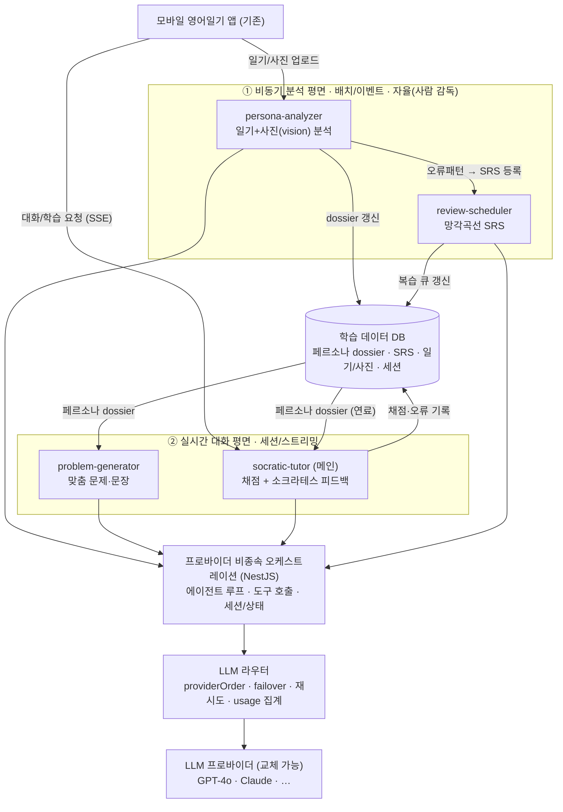

# 언어학습 AI Agent — 팀 내부 전략문서

> 팀이 agent 개발 전 과정을 공유하기 위한 문서. *왜·무엇을·어떻게·누가·어떻게 운영하나*까지.

## 목차
0. 목적 & 비전
1. **현황 진단 (As-is)** — 코드 + 팀 Prompt Ops
2. 핵심 설계 원칙
3. 아키텍처 — 프로바이더 비종속 + 두 평면
4. 페르소나 분석 (중심축)
5. **4대 서브에이전트 상세 기획**
6. 도구(tool) 카탈로그
7. 모델 라우팅 (프로바이더 비종속)
8. **LLMOps & 평가 운영** — 이미 시작된 Prompt Ops 위에 구축
9. 개발 프로세스 & 역할
10. 동기 설계
11. 로드맵 · 검증
12. 리스크 & 추가 결정

---

## 0. 목적 & 비전

기존 **모바일 영어일기 앱**(겉으로는 영어 일기 앱, 언어의숲)에 AI Agent를 도입한다.
유저로부터 **일기(텍스트)+사진**을 받는다 — 이것이 **독점 데이터(moat)**.

Agent의 정체성: **"유저를 깊이 아는 외국인 친구"**. 단순 교정기가 아니라 일기·사진을
분석해 **멘탈모델·관심사·성격·사고 깊이·삶의 맥락**을 이해하고, 그 위에서 외국어를
교정·학습 지원한다. 궁극 목표: **"어려움에도 불구하고 계속 학습하게 만드는 것."**

핵심 기능 4개(각각 서브에이전트 — §5): ⓪페르소나 분석(중심) ①맞춤 문제·문장 생성
②소크라테스식 채점·피드백 ③망각곡선 복습.

> **기반 기술은 특정 SDK·프로바이더에 묶지 않는다.** LLM은 **교체 가능한 부품**으로 두고,
> 우리 백엔드(NestJS)에 **프로바이더 비종속 오케스트레이션**을 둔다. 이미 보유한
> `providerOrder`(OpenAI↔OpenRouter failover) 자산을 그대로 계승·확장한다.

---

## 1. 현황 진단 (As-is)

> 추측이 아니라 **실제 프로덕션 코드(`OpenAIService`)** + **팀 Prompt Ops 기록(Slack `#ax_prompt-ops`)** 기준.

### 1-1. 코드 레벨 (`OpenAIService`, NestJS)
- **멀티프로바이더 failover** — OpenRouter↔OpenAI, `providerOrder` 기본 `[openai, openrouter]`,
  **실측 latency 근거**(OpenAI median 1.17s/안정 vs OpenRouter 1.5→12s 스파이크)
- 모델: OpenRouter `openai/gpt-4o`, OpenAI `gpt-4o-mini`, RAG `gpt-4o-mini`,
  임베딩 `text-embedding-3-small`, 일부 `gpt-4.1` 하드코딩
- 기능 풍부: `analyzeDiary`(요약·이모지·해시태그·라포 4병렬)·일기초안(vision)·문제 생성·
  정답/대안·`generateExpressionPack`(3콜→1 JSON콜)·힌트 빈칸 청크·**채점·피드백**·맥락 사전·RAG

**강점(계승)**: 프로바이더 failover, `[ai-latency]` 계측 로깅, 직렬 3콜→1콜 병합 최적화,
방어적 파싱·폴백(원문 복원/빈칸 비율 검증), RAG/임베딩 보유

**코드 갭(여전히 유효)**
1. **재시도 없음**(프로바이더당 1회), 429/5xx 백오프 없음
2. **비용 트래킹 0**(`usage` 미관측, latency만)
3. **`temperature: 1` 남발** — **채점·피드백까지** → `scoreViaOpenAI` **점수 흔들림**(비결정)
4. **구조화 출력 취약** — JSON 정규식 추출, strict schema 미사용
5. **사진(vision) 사실상 미사용** — `buildMessageContent` 이미지 첨부 **주석처리** →
   `analyzeDiary`·문제 생성은 텍스트만. 프롬프트엔 "사진 고려"라 적혀 있으나 입력엔 없음
   (**프롬프트-구현 불일치 = 독점 데이터인 사진 미활용**)
6. **상태 없음(stateless)** — 단발 호출, 유저 히스토리·페르소나 주입 없음(기억 부재)
7. 페르소나 프롬프트 함수마다 중복

### 1-2. 팀 Prompt Ops (이미 작동 중 — 코드 밖/일부 repo)
코드만 보면 "거버넌스 0"처럼 보이지만, **팀 차원에선 실측 기반 Prompt Ops가 태동해 작동 중**:
- **진단표 + 5개 오류 패턴**(opener 남용 / 시제 미스 / 동사 명사화 / 강조 부사 누락 / OK)
- **프롬프트 버전관리 + 측정**(v1.1/1.2/1.3) → 성과를 "최적화 12점↑"이 아니라
  **(1) 운영 버그 픽스 (2) 동급 품질에 토큰 30%↓** 로 정확히 규정
  - 발견한 운영 버그: **v1이 가끔 번역 대신 "Sure! Please provide…"라고 되묻음** →
    feedback 채널 "잘 안돼요"의 유력 범인(라이브 유저가 빈 응답 수신)
- **v0 측정 하네스가 이미 backend(dev) repo에**: `tools/prompt-eval` + `ops/eval` 골든셋 +
  `prompt-eval.yml`(PR 자동 실행, **report-only**). Notion은 사람 읽는 리포트용
- **draft PR #79**: `translation-guard.util` + 계약 spec + `prompt-contract.yml`, **테스트 15/15 통과**
- 프롬프트 소스 단일화 방향: `src/config/openai.config.ts`

> PR #79 본문은 `languageforest-backend`(현 GitHub 접근 범위 밖)라 직접 확인 못 함 — repo 접근 추가 필요.

### 진단 요약 — **운영 견고 + Prompt Ops 태동 / 에이전트화·상태화·사진활용 미비**
번역·채점 등 **제품 기능은 이미 풍부**하고, 멀티프로바이더·측정 하네스·계약 테스트 draft까지
**기대 이상으로 앞서 있다**. 비어 있는 건 ⓐ**상태/페르소나(기억)** ⓑ**사진 신호 활용**
ⓒ**서브에이전트화**(현재 단발 함수 나열) ⓓ실측 비용·트레이싱 ⓔ`temperature` 정리.
→ **새로 만들기보다 "기능을 에이전트·페르소나로 엮고, 이미 시작한 Prompt Ops를 게이트까지 끌어올리는 것"** 이 과제.

---

## 2. 핵심 설계 원칙

1. **페르소나 = 살아있는 구조화 문서(dossier).** 원시 일기·대화에 매번 의존하지 않고
   distill된 문서를 1차 컨텍스트로 쓴다. 긴 히스토리 대신 **압축 dossier**를 주입한다.
2. **위임 우선.** 분석·생성·채점·복습을 **서브에이전트로 분리**하고 컨텍스트를 격리한다.
   (컨텍스트가 길어질수록 품질이 떨어지므로 각자 자기 일만)
3. **복리 루프(플라이휠).** 일기 누적 → 페르소나 풍부 → 개인화↑ → 참여↑ → 데이터↑.
4. **프로바이더 비종속.** LLM은 라우터 뒤의 교체 가능한 부품. 특정 SDK·모델에 코드가 묶이지 않게.
5. **결정론은 코드로.** SRS 간격 계산·점수·계약 검증은 결정론 코드. LLM은 자연어 부분만.
6. **자율 실행 · 사람 감독.** 분석·페르소나 갱신은 자동 실행, 민감 영역만 사람이 게이트.
7. **측정 우선.** 모든 프롬프트는 골든셋·계약 테스트로 검증한 뒤 배포한다.
8. **독점 데이터 활용.** 일기+사진(특히 **사진**)을 실제 입력에 넣어 moat로 만든다.

**한 줄:** LLM은 "분석·생성·대화", 백엔드/DB는 "상태·스케줄·결정론", **페르소나 문서는
에이전트의 살아있는 기억**. 프로바이더는 교체 가능. API 키는 앱에 두지 않는다.

---

## 3. 아키텍처 — 프로바이더 비종속 + 두 평면

**왜 두 평면:** 분석은 무겁고 비실시간(배치·이벤트), 대화는 가볍고 실시간이어야 한다.
분석 평면이 만든 **페르소나 dossier가 대화 평면의 연료**가 되어 복리 루프를 돈다.

**왜 프로바이더 비종속:** 에이전트 루프·도구·상태를 **우리 오케스트레이션 레이어**가 갖고,
LLM은 라우터 뒤의 부품으로 둔다. 도구 호출은 OpenAI/Claude 공통의 function-calling으로
추상화하고, 모델은 서브에이전트별 **config**로 교체한다. 이미 보유한 `providerOrder`
failover를 라우터로 승격해 재시도·`usage` 집계를 여기서 일원화한다.
→ 나중에 다른 API로 갈아끼워도 **오케스트레이션·프롬프트·eval 자산은 그대로**.

---

## 4. 페르소나 분석 — 시스템의 중심축

**살아있는 dossier(문서):**
- `persona.md` — 인물 도시에(관심사/성격/말투/관계/목표) + mermaid 관계도
- `language_profile.md` — CEFR 추정·반복 오류 패턴·어휘 범위
- `error_log` — 반복 오류(→ SRS 아이템 자동 등록)
- `timeline` — 최근 일기 요약 타임라인

이 문서들이 **에이전트의 1차 컨텍스트**. 대화엔 원시 history 대신 **압축 dossier**만 주입.
생성 메커니즘은 §5-A(persona-analyzer).

> 프라이버시: 일기·사진은 민감. 유저별 격리·접근통제·보존정책 필요(§12).

---

## 5. 4대 서브에이전트 상세 기획

> 각 서브에이전트는 **독립 프롬프트 계약 + 입출력 스키마 + 모델 슬롯(교체 가능) + eval 기준**을
> 갖는다. 모델은 "지금 고를 수 있는 옵션"이며 라우터 config로 교체된다(§7).

### A. `persona-analyzer` — ⓪ 페르소나 분석 (① 평면, 배치/이벤트)
- **트리거**: 일기·사진 업로드 이벤트 또는 야간 배치
- **입력**: 신규 일기(텍스트) + **사진(vision, 현재 주석처리된 입력을 활성화)** + 기존 dossier
- **모델 슬롯**: 멀티모달 추론(현재 stack의 `gpt-4o`급, 교체 가능). vision 필수
- **도구**: `get_persona` · `update_persona(diff)` · `save_error_patterns` · `enqueue_srs`
- **출력(structured)**: dossier **diff**(관심사/성격/감정/CEFR/오류패턴/멘탈모델) + `error_log` 항목,
  각 항목에 **근거(일기 인용)** 와 확신도
- **프롬프트 계약**: 기존 dossier 대비 **변경분만** diff로 / 추측은 추측으로 표시 /
  환각 금지(근거 없는 단정 금지) / 사진 신호 반드시 반영
- **eval**: 추출 정확도(인간 라벨 대비) · 환각율 · 사진 반영 여부
- **계승**: 현 `analyzeDiary`(요약/이모지/해시태그/라포)를 흡수·확장 + **사진 입력 활성화**

### B. `problem-generator` — ① 맞춤 문제·문장 (② 평면 또는 배치)
- **트리거**: 학습 세션 시작 / 복습 큐 보충
- **입력**: 압축 dossier + 오늘 일기 + 난이도 + 약점(`error_log`)
- **모델 슬롯**: 생성 품질(현 `gpt-4o`/`sonnet`급), vision 선택
- **도구**: `get_persona` · `get_due_items` · `save_generated_item`
- **출력(structured JSON)**: `{ korean, primary(원어민 영어), alternatives[3],
  target_error_pattern, difficulty }` — 현 `generateExpressionPack` 구조 계승
- **프롬프트 계약**: 페르소나 관심사 반영 / **약점 패턴을 겨냥**해 출제 / 난이도별 단어수 /
  문장부호 규칙(현 프롬프트 규칙 승계)
- **eval**: 수준 적합성 · 관심사 반영율 · 약점 커버리지 · 원어민 자연스러움
- **계승**: `generateKoreanSentences` + `generateAnswerWithAlternatives` + `generateExpressionPack`
  를 **통합·페르소나화**

### C. `socratic-tutor` — ② 채점 + 소크라테스 피드백 (② 평면, 메인·실시간)
- **트리거**: 유저 답안 제출 / 대화 턴
- **입력**: 유저 답안 + 정답 + 압축 dossier + 대화 히스토리
- **모델 슬롯**: 최고 추론·교수법(현 `gpt-4o`/`opus`급), **스트리밍**(0.5초 체감)
- **도구**: `get_persona` · `grade_answer` · `update_item_review(quality)` · `log_error`
- **출력 2갈래**:
  - **채점(결정론적)**: structured **정수 점수**, `temperature 0~0.2` (현 temp 1 → 교체)
  - **피드백(소크라테스)**: 정답 즉시 누설 X, 유도 질문으로 스스로 고치게, 최대 1~3개, 친구 톤
- **프롬프트 계약**: **정답 즉시 누설 금지** / 오류 패턴 짚되 질문으로 / 격려·존댓말 / 길이 제한 /
  **"되묻기 버그"(번역 대신 'Sure! Please provide…') 금지** → 계약 테스트로 강제(§8)
- **eval**: 정답 누설 안 함(룰 채점) · 오류 검출 recall/precision · 친구 톤 일관성 · 되묻기 0
- **계승**: `scoreViaOpenAI`(temp 1→0, 결정론 분리) + `feedbackViaOpenAI`를 **페르소나·소크라테스화**

### D. `review-scheduler` — ③ 망각곡선 복습 (① 평면, 배치/이벤트)
- **트리거**: 채점 결과 이벤트 / 야간 배치
- **입력**: 학습 아이템 + recall quality(0~5) + 현재 SRS 상태
- **모델 슬롯**: **거의 불필요** — **SRS 간격 계산은 결정론 백엔드 코드(SM-2/FSRS)**.
  LLM은 quality 판정 보조만(보통 `socratic-tutor`가 이미 판정)
- **도구**: `get_due_items` · `update_item_review`
- **출력**: 다음 복습일 · 복습 큐 · 푸시 알림 트리거
- **eval**: 복습 타이밍 정확도 · 망각곡선 적합도
- **신규**: `error_log` → SRS 아이템 자동 등록(`persona-analyzer`와 연동)

### 오케스트레이션 패턴
- **비동기 평면**(A, D): 배치·이벤트로 자율 실행 → dossier·SRS 갱신(사람 감독)
- **실시간 평면**(C 메인, B): 세션에서 스트리밍. 메인 `socratic-tutor`가 필요 시
  B/A 산출물을 **dossier로** 받는다(원시 결과를 통째로 끌고 다니지 않음 = 위임·격리)

---

## 6. 도구(tool) 카탈로그

| 도구 | 역할 | 주 사용 |
|------|------|------|
| `get_persona(user_id)` | 압축 dossier 조회 | B·C |
| `update_persona(diff)` | dossier diff 갱신 | A |
| `ingest_journal(entry, photos)` | 신규 일기/사진 수집·분석 트리거 | A |
| `save_error_patterns` / `log_error` | 오류 패턴 적재 | A·C |
| `enqueue_srs` / `get_due_items` / `update_item_review(quality)` | SRS 큐·복습 | A·C·D |
| `grade_answer` | 결정론 채점 보조 | C |
| `save_generated_item(item)` | 생성 문제 등록 | B |

- 도구 호출은 **프로바이더 공통 function-calling**으로 추상화(특정 SDK 비종속)
- **권한 최소화(보안):** 파일시스템·셸 도구 불필요 → 위 커스텀 도구로만 한정,
  prompt injection 블래스트 반경 최소화

---

## 7. 모델 라우팅 (프로바이더 비종속)

특정 모델을 "정답"으로 박지 않는다. **역량 티어 → 슬롯**으로 두고 서브에이전트별 config로 교체:

| 티어 | 쓰는 곳 | 현재 stack 후보 | 교체 가능 |
|------|---------|-----------------|-----------|
| 강력 추론·교수법 | socratic-tutor(메인) | `gpt-4o` | Claude Opus/Sonnet 등 |
| 멀티모달 추론 | persona-analyzer | `gpt-4o`(vision) | Claude(vision) 등 |
| 생성 품질 | problem-generator | `gpt-4o` / `gpt-4o-mini` | Sonnet 등 |
| 경량·고속 | 단순 분류/판정 | `gpt-4o-mini` | Haiku 등 |

- **라우터**(현 `providerOrder` 승격)가 failover·**재시도(현재 없음 → 추가)**·`usage` 집계 담당
- 모델 스왑은 **config 변경 1줄**이 되도록(현재 env+하드코딩 혼재 → 단일화)

---

## 8. LLMOps & 평가 운영 — 이미 시작된 Prompt Ops 위에 구축

> "0에서 구축"이 아니다. 팀은 이미 진단표·버전관리·v0 측정 하네스·계약 테스트 draft를 가졌다(§1-2).
> 이걸 **게이트까지 끌어올리고, 코드 갭을 메운다.**

**이어서 강화할 것 (있는 것 발전)**
- **계약 테스트를 PR 블로킹 게이트로** — "되묻기 버그" 등을 **결정론적 계약 테스트**로
  (LLM 호출 X = 싸고 결정론적, promptfoo 같은 신규 도구 불필요, 기존 `test/` 순수 함수).
  draft PR #79(`translation-guard.util`+`prompt-contract.yml`, 15/15) 머지 경로:
  ① feedback 실제 되묻기 케이스를 fixture에 추가 ② `learning.service` 응답 경로에 가드+retry
  ③ CI 초록 → required
- **6축 품질 점수는 report-only 유지** — 점수 차가 노이즈(±2~7)라 하드 게이트 금지
- **골든셋 확장** — 현 "결함 발견용" 외에 **정답 케이스 10~15건** 추가(균형), feedback 되묻기 fixture
- **프롬프트 소스 단일화 + 버전 태그** — `src/config/openai.config.ts`로 모으고 버전·diff 추적
  (함수 인라인 중복 제거)

**아직 없어 새로 깔 것 (코드 갭)**
- **재시도** — 라우터에 429/5xx 지수 백오프(현재 프로바이더당 1회)
- **실측 비용** — `usage` 토큰을 모든 호출에 로깅 → 유저/세션/기능별 집계(현 휴리스틱 0)
- **`temperature` 정리** — 채점·피드백을 0~0.2 결정론으로(현 temp 1)
- **구조화 출력** — 정규식 추출 → strict/JSON schema
- **관측/트레이싱** — 구조화 로그 + 세션/유저ID + 도구 트레이스(현 PM2 텍스트 로그)
- **가드레일** — 프라이버시(일기/사진)·환각·되묻기·입출력 필터

---

## 9. 개발 프로세스 & 역할

- **자율화 전환(사람 승인 → 사람 감독):** 초기엔 교정·페르소나 갱신을 사람이 확인,
  eval·계약 테스트 신뢰가 쌓이면 감독만. **전환 기준 = 골든셋 통과율·되묻기 0·사고율로 정량화**
- **역할 분담:**
  - **총괄(M)**: 우선순위·리스크·여러 도메인 조율
  - **도메인 전문(T)**: 교육 도메인 지식(망각곡선·SRS·교수법·5개 오류 패턴)으로 워크플로우·eval 설계
    — **차별화 핵심**(경쟁사는 AI 이전 설계라 못 엎음, 우리는 지금 판을 짠다)
  - **현장(A)**: feedback 채널 등 유저 정성 신호 수집(되묻기 버그도 여기서 포착됨)
- **지식 구조(문서 우선):** 프롬프트·골든셋·페르소나 스키마·의사결정 로그를 폴더로 구조화,
  mermaid로 파이프라인 시각화, 리포트 지속 갱신
- **개발 루프:** plan → 측정 → 배포 → 누적. 각 사이클이 eval·프롬프트·페르소나 자산을 쌓아 다음을 쉽게

---

## 10. 동기 설계 — "계속 학습하게"

- **깊은 개인화**(페르소나) → 친구가 내 삶을 안다 → 정서적 유대·습관화
- **소크라테스식** → 떠먹여주지 않아 성취감, 좌절 대신 자기 발견
- **망각곡선 복습** → 잊기 직전 복습 → 정착·진전 체감
- 시스템 프롬프트에 **격려 톤 + 적응형 난이도**(어려우면 단계 낮춤)
- **즉각 스트리밍 응답**(0.5초 체감)으로 사람 같은 친구 경험

---

## 11. 로드맵 · 검증

| 단계 | 내용 | 산출 |
|---|---|---|
| 0. 토대 | 라우터 승격(재시도·`usage`)·프롬프트 단일화·계약 테스트 PR 게이트(PR #79 경로) | LLMOps 게이트 |
| 1. 상태·페르소나 | `persona-analyzer`(**사진 입력 활성화**)+dossier+`get_persona` | 살아있는 기억 |
| 2. 생성 페르소나화 | `problem-generator` 통합 + structured 출력 | 맞춤 문제 |
| 3. 소크라테스 튜터 | `socratic-tutor`(채점 결정론화 + 소크라테스 피드백 + 친구 톤) | 메인 대화 |
| 4. 복습 루프 | `review-scheduler`(SM-2/FSRS) + `error_log` 자동 등록 | 망각곡선 |
| 5. 자율화 | 사람 감독(HOTL) 전환 + 관측·트레이싱 | 24/7 닫힌 루프 |

**검증**: 가상 유저(일기 5~7편+사진)로 분석→생성→소크라테스 피드백→복습 end-to-end /
dossier가 일기 추가마다 정확히 갱신되는지 / 소크라테스가 정답 안 흘리는지 / **되묻기 0**(계약 테스트) /
`usage` 기반 비용·캐시 적중률 / 프로바이더 교체 시 오케스트레이션 무변경 확인.

---

## 12. 리스크 & 추가 결정
- **GitHub 범위**: `languageforest-backend`(PR #79·`tools/prompt-eval`) 접근 추가 필요
- **페르소나 저장 형태**: 마크다운 문서 vs 구조화 DB vs **하이브리드(추천)**
- **SRS 알고리즘**: SM-2(단순) vs FSRS(정밀)
- **프라이버시/보존**: 일기·사진 분석 동의 범위, 페르소나 격리·삭제 정책
- **사진 입력 활성화 범위**: 토큰/비용·프라이버시 trade-off
- **실시간 UX**: SSE vs WebSocket, 추후 음성(0.5초)
- **에이전트 오케스트레이션 구현체**: 자체(NestJS) vs 경량 프레임워크 — **프로바이더 비종속 유지가 조건**

### 참고
- 코드: `OpenAIService`(NestJS) · Slack `#ax_prompt-ops`(진단표·v1.x·PR #79·`tools/prompt-eval`)
- 모델·도구·비용은 프로바이더 문서(현 OpenAI/OpenRouter, 향후 교체 가능)
