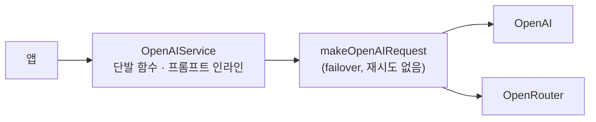
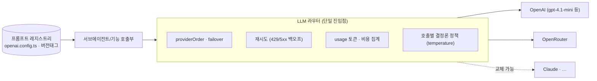
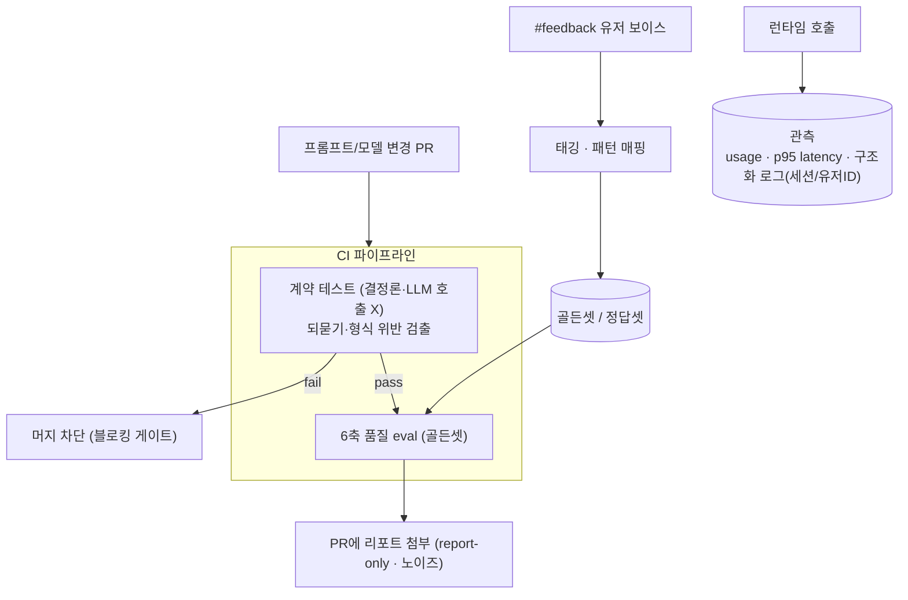
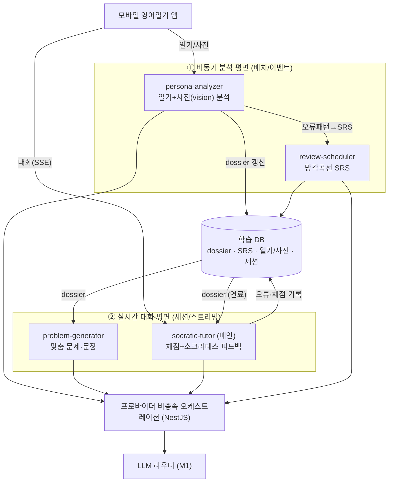

# 언어학습 AI Agent — 전략 & 아키텍처 문서

> 팀 내부 문서. 현황 아키텍처 → 설계 원칙 → **단계별 목표 아키텍처(LLM 레이어 → LLMOps → Agent)**.
> 추론이 아니라 실제 코드(`OpenAIService`) · Slack `#ax_prompt-ops` · Notion 1차 리포트(실측) 기반.

## 0. 목적 & 비전
기존 **모바일 영어일기 앱**(언어의숲)에 AI Agent를 도입한다. 유저의 **일기(텍스트)+사진**이
독점 데이터(moat)다. Agent의 정체성은 **"유저를 깊이 아는 외국인 친구"** — 단순 교정기가 아니라
일기·사진으로 **멘탈모델·관심사·성격·사고 깊이·삶의 맥락**을 이해하고 그 위에서 교정·학습을 돕는다.
궁극 목표: **"어려움에도 불구하고 계속 학습하게 만드는 것."**

핵심 기능 4개(M3에서 서브에이전트화): ⓪페르소나 분석(중심) ①맞춤 문제·문장 ②소크라테스식 채점·피드백
③망각곡선 복습.

**아키텍처 대전제**: 기반 기술을 특정 SDK/프로바이더에 묶지 않는다. LLM은 라우터 뒤의 **교체 가능한
부품**으로 두고, 에이전트 루프·상태·도구는 **우리 백엔드(NestJS)** 가 소유한다. 기존
`providerOrder`(OpenAI↔OpenRouter failover) 자산을 라우터로 승격해 계승한다.

**전사 맥락에서 이 문서의 위치**: 회사는 4영역(①유저데이터 · ②제품/OPS · ③마케팅·결제 · ④대시보드)을
돌린다. **본 문서 = ②제품 트랙 + 그 LLMOps**다. 우선순위는 **①·②·④ 연결이 핵심, ③(마케팅·결제)은 후순위**.
(기능3의 "먼저 말 걸기" 프로액티브 알림은 로컬 컴퓨트(맥미니)+데이터 연동에 의존 — M3 비동기 평면.)

---

## 1. 현황 아키텍처 (As-is) — 실측 기반

오늘의 구조는 **"단발 함수 + 멀티프로바이더 호출"** 이다. 에이전트 루프·상태·페르소나는 없다.

*공백: stateless · 사진 입력 주석처리 · temp=1 · usage 미관측 · 재시도 없음 · 프롬프트 인라인 중복*

**견고한 점(계승)**: 멀티프로바이더 failover, `[ai-latency]` 로깅, 3콜→1콜 병합(`generateExpressionPack`),
방어적 파싱·폴백, RAG/임베딩.

**구조적 공백**: 재시도 없음 / `usage` 미관측 / `temperature:1` 남발(채점·피드백 포함) /
JSON 정규식 추출 / **사진 입력 주석처리(독점데이터 미활용)** / **stateless(기억 없음)** /
프롬프트 인라인 중복.

**팀 Prompt Ops(코드 밖에서 이미 작동)**: 진단표(5 패턴 — opener·시제/상·명사화·강조·형식),
정답셋 20건, 채점 하네스(`run_eval.py`, 6축), 버전관리(v1/v1.1/v1.2), draft PR #79
(`translation-guard.util`·`prompt-contract.yml`, 15/15).

**1차 리포트 실측(Notion)** — 아키텍처 결정의 근거:
- v1 81.3 → **v1.2 92.1**, 30%↓. **되묻기 0점 버그**(입력 `<original>`을 [역할]에 묻어둠 →
  *"Sure! Please provide…"*) — v1.1/v1.2의 `#입력문` 슬롯 분리로 해결
- **점수 노이즈 ±2~7**(생성 temp=1 + 채점 변동) → **품질 점수는 하드 게이트로 못 씀**
- **모델 권고 `gpt-4.1-mini`**(품질 동급·**p95 1.64s→0.85s**·비용↓), gpt-4o-mini 탈락
- **가장 큰 latency 레버 = 병렬화·스트리밍**(모델 다운사이징보다 큼)

> 진단: "0에서 시작"이 아니다. 공백은 **코드 정합성 → 운영 시스템화 → 에이전트화** 순서의 토대다.

---

## 2. 설계 원칙
1. **페르소나 = 살아있는 구조화 문서(dossier).** 원시 history 대신 압축 dossier를 1차 컨텍스트로.
2. **위임 우선.** 분석·생성·채점·복습을 서브에이전트로 분리·격리.
3. **복리 루프.** 일기 누적 → 페르소나 풍부 → 개인화↑ → 참여↑ → 데이터↑.
4. **프로바이더 비종속.** LLM은 라우터 뒤 교체 가능한 부품.
5. **결정론은 코드로.** SRS·점수·계약검증은 결정론 코드, LLM은 자연어만.
6. **측정 우선.** 프롬프트·모델 변경은 골든셋·계약 테스트 통과 후 배포. 노이즈는 report-only.
7. **독점 데이터 활용.** 일기+사진(특히 사진)을 실제 입력에 투입.

---

# 3. 목표 아키텍처 (To-be) — 단계별 진화

`M1 LLM 레이어 → M2 LLMOps → M3 Agent`. 각 단계가 **독립적으로 동작하는 아키텍처 상태**를 만들고
다음의 토대가 된다. **측정 가능한 토대 위에서만 에이전트를 올린다.** (M1↔M2는 일부 병행 가능 —
되묻기 핫픽스는 M1 코드 + M2 계약 테스트가 한 PR. 단 M3를 토대 없이 먼저 가지 않는다.)

## ▶ M1. LLM 레이어 아키텍처 — 라우터 단일 진입점

모든 LLM 호출을 **라우터 하나**로 모은다. 프로바이더·재시도·비용·결정론 정책이 여기 집중된다.
프롬프트는 코드에서 분리해 **레지스트리(`openai.config.ts` + 버전 태그)** 로.

**핵심 설계 결정**
- **되묻기 버그 제거**: 입력 슬롯 분리(`#입력문`) 구조를 모든 경로에 강제 → 라이브 빈응답 차단(리포트 §3-2)
- **결정론 정책**: 채점·피드백은 `temperature 0~0.2`, 점수는 structured 정수 — 노이즈(±2~7) 제거
- **라우터 책임 집중**: failover에 **재시도 + `usage` 집계** 추가(현재 둘 다 없음)
- **모델은 슬롯**: 운영 기본을 `gpt-4.1-mini`로 검토(p95 반토막·비용↓), 교체는 config 1줄
- **latency 레버**: 순차 멀티콜 **병렬화 + SSE 스트리밍**(모델 교체보다 효과 큼)
- **사진 입력 복구**: 주석처리된 vision 첨부 활성화 → 독점데이터 실사용
- **프롬프트 외부화**: 인라인 중복 제거, 버전·diff 추적 가능한 레지스트리로

## ▶ M2. LLMOps 아키텍처 — 측정이 배포의 관문

프롬프트/모델 변경이 **측정 파이프라인을 통과해야만** 배포되는 구조. 이미 있는 하네스를
repo CI로 승격한다.

> **이건 유저 대면 배포가 아니라 CI 내부 인프라(가드레일)다.** 앱의 특정 기능이 바깥으로
> 나가는 게 아니라 "변경이 안전한지 자동 검증하는 테스트 망"을 까는 것 — main 머지도 안전.
> 중요한 건 '배포 여부'가 아니라 **변경의 blast radius(파급 범위)를 아는 것**.

**핵심 설계 결정**
- **2층 검증**: 결정론 **계약 테스트는 블로킹 게이트**(되묻기·형식 — LLM 호출 없이 싸고 확정적),
  **6축 품질 점수는 report-only**(노이즈가 커서 하드 게이트 부적합 — 리포트 변동성)
- **하네스 repo화**: 로컬 `run_eval.py` → backend `tools/prompt-eval`+`ops/eval`+`prompt-eval.yml`(PR 자동)
- **eval 신뢰화**: 채점 `temp=0`/다회평균, **예시↔정답셋 분리**(오염 방지 — 리포트 §3-4)
- **골든셋 성장(GAN 루프)**: #feedback 보이스 태깅 → 버그/패턴 매핑 → 정답셋 확장(+writing 버전)
- **관측 평면**: `usage` 비용 + **p95 latency**(avg보다 체감 좌우) + 구조화 로그/세션·유저ID

## ▶ M3. 에이전트 아키텍처 — 2평면 · 4서브에이전트 · dossier

측정 가능한 토대 위에 **외국인 친구 에이전트**를 올린다. 비동기 분석과 실시간 대화를 분리하고,
페르소나 dossier가 둘을 잇는다.

> **대외 입증·POC 정렬:** socratic-tutor(기능2)는 "개인화 추출 + evaluation + 발문 생성(추가 물음)"
> 구조로, 정부지원 POC(업스테이지 **Socratic** 트랙)와 정확히 맞물린다("영어만 빼면 동일"). 이 에이전트가
> 돌아가는 것 자체가 **'래핑이 아니라 기술'임을 입증**하는 대외 셀링 포인트다.

**왜 2평면**: 분석은 무겁고 비실시간(배치·이벤트), 대화는 가볍고 실시간이어야 한다. 분석 평면이
만든 **dossier가 대화 평면의 연료** — 복리 루프를 돈다.

**4 서브에이전트** (각자 프롬프트 계약 · 입출력 스키마 · 모델 슬롯(교체) · eval):
- **A. persona-analyzer** (①, 배치) — 입력: 신규 일기+**사진(vision)**+기존 dossier / 출력: dossier
  **diff**(관심사·성격·CEFR·오류패턴·멘탈모델, 근거 인용) / 계승: `analyzeDiary` 확장+사진 활성화
- **B. problem-generator** (②/배치, 기능1) — 입력: dossier+오늘 일기+난이도+약점 / 출력:
  `{korean, primary, alternatives[3], target_error_pattern}` / 계승: `generateExpressionPack` 페르소나화
- **C. socratic-tutor** (②, 메인·실시간, 기능2) — 채점(**결정론 temp 0~0.2**) + 소크라테스 피드백
  (정답 즉시 X·유도질문·친구 톤·**되묻기 금지 계약**) / 계승: `score`+`feedback` 소크라테스화
- **D. review-scheduler** (①, 기능3) — **SRS 간격은 결정론 코드(SM-2/FSRS)**, LLM은 quality(0~5)만 /
  `error_log` → SRS 자동 등록

**페르소나 dossier(구조)**: `persona.md`(관심사/성격/관계 + mermaid) · `language_profile.md`(CEFR·오류) ·
`error_log`(→SRS) · `timeline`. 대화엔 원시 history 대신 **압축 dossier**만 주입.

---

## 4. 모델 라우팅 (프로바이더 비종속)
역량 티어 → 슬롯(서브에이전트별 config 교체):

| 티어 | 쓰는 곳 | 현재 후보 | 교체 가능 |
|------|---------|-----------|-----------|
| 강력 추론·교수법 | socratic-tutor | gpt-4.1 / gpt-4o | Claude Opus/Sonnet |
| 멀티모달 | persona-analyzer | gpt-4.1(vision) | Claude(vision) |
| 생성 | problem-generator | **gpt-4.1-mini**(리포트 권고) | Sonnet |
| 경량·고속 | 분류/판정 | mini급 | Haiku |

## 5. 도구 카탈로그
`get_persona` · `update_persona(diff)` · `ingest_journal` · `save_error_patterns`/`log_error` ·
`enqueue_srs`/`get_due_items`/`update_item_review(quality)` · `grade_answer` · `save_generated_item`.
function-calling으로 프로바이더 공통 추상화. 셸/파일 도구 미부여(injection 최소화).

## 6. 동기 설계
깊은 개인화(페르소나)로 정서적 유대·습관화 · 소크라테스식으로 성취감 · 망각곡선 복습으로 정착 ·
격려 톤+적응형 난이도 · 즉각 스트리밍(0.5초 체감).

---

## 7. 검증
- **M1**: 되묻기 0 회귀 · 비용 로그 노출 · 모델 스왑 1-config · p95 개선
- **M2**: 프롬프트 변경 PR이 계약 게이트 통과해야 머지 · 6축 report 자동 첨부 · eval 오염 0
- **M3**: 가상 유저(일기+사진) 분석→생성→소크라테스→복습 e2e · dossier 누적 갱신 · 프로바이더 교체 무영향

## 8. 리스크 & 열린 결정
- **GitHub 범위**: `languageforest-backend`(PR #79·`tools/prompt-eval`) 접근 추가 필요 — 현재 불가
- 페르소나 저장(문서/DB/**하이브리드 추천**) · SRS(SM-2/FSRS) · 사진 활성화 범위(비용·프라이버시) ·
  실시간(SSE/WS) · 오케스트레이션 구현체(자체 NestJS vs 경량 프레임워크 — 프로바이더 비종속 유지가 조건)
- **순서 고정**: M1·M2 토대 없이 M3 먼저 가지 않는다(측정 불능 리스크)

### 소스
코드 `OpenAIService` · Slack `#ax_prompt-ops`(PR #79) · Notion 1차 리포트(`run_eval.py`/`run_latency.py`,
v1.2 92.1, gpt-4.1-mini 권고) · 진단표(5패턴)·정답셋 20건
