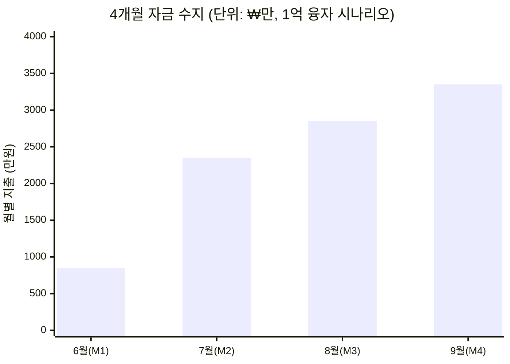

# 영어의숲 4-Month MRR ₩10M 액션플랜
## 사업계획서 데이터 + 5사 레퍼런스 적용

> **Status**: Draft v1 / 2026-05-19  
> **분석자**: Claude (언어의숲 리서치)  
> **사업계획서**: 36p Pitch Deck (2026.05 공유)  
> **제약 조건**: Burn rate 4개월 / 6월말 융자 ₩1억 또는 ₩2억 / 목표 MRR ₩1,000만  
> **참조**: 본 액션플랜의 5사 레퍼런스 근거는 [`00-synthesis.md`](./00-synthesis.md) 참조. 각 케이스 풀 분석은 [`01-cal-ai.md`](./01-cal-ai.md) 외 4개 파일.

---

## 📋 한 줄 요약

D1 리텐션 30.1%(업계 2배)·70% D1 결제율이라는 강력한 단위경제 자산 위에, **온보딩=Paywall (Cal AI) + 인플루언서 시스템화 (Cal AI) + Paywall A/B 월 5건 (Superwall) + 4단계 마케팅 페이스 (M1 0원 → M4 ₩2,500만)** 로 MRR ₩107만 → ₩1,000만 (9.3x)을 4개월 안에 달성. 자금 소요 총 ₩9,400만으로 1억 융자 내에서 가능.

---

## 1. 영어의숲 현재 상태 진단

### 1.1 핵심 파라미터 (사업계획서 출처)

| 지표 | 현재 (25.12~26.01) | 27년 BEP 목표 | **4개월 목표** | Gap |
|------|-------------------|--------------|---------------|-----|
| **MRR** | ₩107만 | ₩1,590만 | **₩1,000만** | **9.3x** |
| 결제유저 (ARPPU ₩55,292) | ~194명 | ~2,880명 | ~1,810명 | +1,616명 |
| DAU | 150 | 2,400 | ~2,000 | 13.3x |
| MAU | 1,500 | 24,000 | ~20,000 | 13.3x |
| **D1 리텐션 (접속)** | **30.1%** ★ | 40% | 30%+ 유지 | (자산) |
| D1 리텐션 (완료) | 39% | 50% | 45%+ | +6%p |
| D7 리텐션 (접속) | 14% | 22% | 18%+ | +4%p |
| 결제전환율 | 1.8~2.58% | 3.5% | **3.0%+** | +1.2%p |
| 바이럴 계수 | 0.10 | 0.30 | 0.25+ | 2.5x |
| ARPPU | ₩55,292 | ₩110,000 | ₩55,000 유지 | (가격 인상은 BEP 후) |
| CPI | ₩529 | ₩450 | ₩600~800 (광고 본격화 시 일시 상승) | - |
| CAC | ₩18,623 | ₩16,000 | ₩20,000 이내 | - |
| LTV/CAC | 4.73 (국내 2.4, 해외 7.8) | 6.9 | 5.5+ | +0.77 |
| 월 고정비 | ₩850만 | ₩850만 | ₩850만 (동결) | - |
| 월 영업이익 | -₩743만 | 0 | -₩200만 이내 (M4) | +₩543만 |

★ **D1 리텐션 30.1%는 동종업계 2배** — Stage 1 검증의 핵심 신호. 절대 잃지 말 것.

### 1.2 자산 vs 약점

**🟢 자산 (Strengths)**
- D1 30.1% (업계 2배) — Cal AI·Drops 못 미치는 약점이지만 학습 카테고리에선 압도적
- **70%가 D1에 결제** — 결제 의향 매우 높음. paywall이 이미 잘 작동 중
- 학습과학 4축 (자기참조효과·정보처리이론·자기효능감 이론·난이도 자동화) — 카피 어려움 (백엔드 설계 ↑)
- 특허 출원 (10-2025-0146995) + KAIST 데이터전략 연구실 MOU — IP 방어선
- 비즈니스 모델 사이클: 70% D1 결제 → 30% D7 결제 → 자연스러운 paywall 동선

**🔴 약점 (Weaknesses)**
- **절대 유입량 부족**: DAU 150 / MAU 1,500 — Cal AI 출시 1개월 시점(MAU 약 10만)의 1.5%
- 바이럴 계수 0.10 — Reflectly·Cal AI·Forest 모두 0.3~0.6 영역
- 해외 매출 PoC 미진행 — LTV/CAC 해외 7.8 vs 국내 2.4 격차 활용 못 함
- DAU/MAU = 10% — 매일 트리거 앱(알라미 41%) 대비 낮음

---

## 2. 자금 수지 시뮬레이션 (4개월)

| 월 | 운영비 | 마케팅비 | 합계 지출 | 누적 |
|----|--------|----------|-----------|------|
| M1 (6월) | 850 | 0 | 850 | 850 |
| M2 (7월) | 850 | 1,500 | 2,350 | 3,200 |
| M3 (8월) | 850 | 2,000 | 2,850 | 6,050 |
| M4 (9월) | 850 | 2,500 | 3,350 | **9,400** |

- **1억 융자 시**: 4개월 누적 지출 9,400 - MRR 누적 매출 ~2,500 ≈ **잔여 약 ₩3,100만** (안전 마진 충분)
- **2억 융자 시**: 4개월 후 잔여 **약 ₩1억 3천만** → Pre-A까지 6~9개월 추가 runway

---

## 3. 5사 학습 → 영어의숲 직접 적용

> 풀 디테일은 [`00-synthesis.md`](./00-synthesis.md) 참조. 여기는 **사업계획서 컨텍스트에서 즉시 적용 가능한 것만** 추렸음.

### 3.1 Cal AI 4가지 적용

| # | 패턴 | 영어의숲 적용 | 기대 효과 |
|---|------|---------------|-----------|
| 1 | **온보딩 = Paywall** | 첫 일기 입력 전 1.5분 "영어 페르소나 진단 퀴즈" + 로딩 화면 (Sunk cost) | 결제전환율 1.8% → 3.0%+ |
| 2 | **인플루언서 시스템화** | 1K-10K 25-35 여성 갓생·영어공부 인플루언서 50명 시드 + VA DM 자동화 | M2~M3 신규 +8,000명 |
| 3 | **Paywall A/B 월 5건** | Superwall/Adapty 도입, 주 1건 실험, 16건 누적/4개월 | 전환율 +30%+ |
| 4 | **Day 1 단일 BM** | 사업계획서 Free to Learn은 BEP 후로 미룸 | 단위경제 명확화 |

### 3.2 알라미 3가지 적용

| # | 패턴 | 영어의숲 적용 |
|---|------|---------------|
| 1 | 한국 → 해외 매출 전환 (85%) | **M4에 영미권 한인 중년 여성 PoC** (미시 USA·토론토 한인회 페이스북 그룹) — 사업계획서 명시 결제전환 2.7배 검증 |
| 2 | 광고 도입은 BEP 후 | 현재 구독 100% 유지 — 알라미가 후회한 "광고 우선" 단계 우회 중 |
| 3 | ASO 키워드 장기 점유 | "영어 일기", "AI 영어 학습", "영어 작문 AI" 키워드 점유 시작 (M3~) |

### 3.3 Drops 3가지 적용

| # | 패턴 | 영어의숲 적용 |
|---|------|---------------|
| 1 | 의도된 결핍 BM (5분/일) | 사업계획서 Public SaaS와 정확히 매칭 — **유지** |
| 2 | 광고 영구 거부 | 학습 가치 훼손 우려. Free to Learn은 신중히, 또는 영구 거부도 옵션 |
| 3 | 다국어 = 매출 복제 | Pre-A에서 한국어 학습 추가 — 사업계획서대로 |

### 3.4 Reflectly: 1가지 적용 + 1가지 안티패턴 ⚠️

- **적용**: 일기 입력이 paywall로 가는 자연스러운 동선 — 70% D1 결제율을 80%+로 끌어올리기 (Cal AI 온보딩 결합)
- **⚠️ 안티패턴 회피**: 단일 메커닉 고수 → Daylio·Stoic에 점유 빼앗김. **영어의숲은 사업계획서 "메타게임 순환 구조"를 M3부터 일정 앞당겨 구현** (학습 → 서브 콘텐츠 → 바이럴 → 학습 루프)

### 3.5 Forest 2가지 적용

| # | 패턴 | 영어의숲 적용 |
|---|------|---------------|
| 1 | **"숲" 메타포 직접 매칭** ★ | 영어의숲의 이름이 곧 메커닉. 일기 1편 = 나무 1그루, 학습 누적 = 숲 우거짐. 사용자가 자기 숲 보고 "여기서 못 끊겠다" 만들기 |
| 2 | 가상→실제 연결 | 30일 연속 학습 = 굿즈 키링·스티커 (사업계획서 명시) / K-Culture IP 제휴 (BTS·블랙핑크 영어 자료) |

---

## 4. 4개월 월별 액션플랜

### M1 (6월): 결제전환율 강제 개선 + 인플루언서 시드 준비
**예산**: 운영 850 / 마케팅 0 = **₩850만**

| 액션 | 담당 | KPI |
|------|------|-----|
| 온보딩 퀴즈 1분 5문항 (Cal AI 식) | 이찬중·서동재 | M1 말 라이브 |
| "AI 페르소나 생성 중" 로딩 화면 (Lottie) | 김지아 | M1 말 라이브 |
| Paywall A/B 4건 (Adapty/Superwall) | 이찬중 | 1건 winner +10%+ |
| 25-35 여성 인플루언서 100명 리스트 빌드 | 이찬중 | 100명 검증 |
| 25-35 여성 PoC 인터뷰 5명 (WoW Point 분석) | 김지아 | 정성 인사이트 5건 |

**End KPI**: 결제전환율 1.8% → **2.5%**, MRR ₩107만 → **₩150만**

### M2 (7월): 융자 입금 후 인플루언서 시드 + 첫 페이드
**예산**: 운영 850 / 마케팅 1,500 = **₩2,350만**

| 액션 | 예산 | KPI |
|------|------|-----|
| 인플루언서 시드 50명 (무료 1개월 + 인증) | ₩0 (재화만) | 콘텐츠 50건 + 노출 10만+ |
| VA 1명 채용 (DM·관리) | ₩60만 | 추가 인플루언서 80명 |
| Meta·Instagram 페이드 (25-35 여성 타겟) | ₩800만 (일 ₩25만) | 신규 가입 8,000명 (CPI ~₩1,000) |
| Paywall A/B 4건 추가 | ₩0 | 전환율 +0.3%p |
| 챌린지 #1: "30일 영어 일기 = 갓생 인증" | ₩100만 (굿즈 키링) | 챌린지 참여 500명 |
| "숲" 시각 자산 강화 (Forest 차용) | ₩0 (개발) | 시각화 화면 라이브 |
| 잔여 | ₩540만 | 예비비 |

**End KPI**: 결제전환율 → **2.8%**, DAU 150 → **400**, MRR → **₩350만**

### M3 (8월): 바이럴 메커닉 본격 + 콘텐츠 공장
**예산**: 운영 850 / 마케팅 2,000 = **₩2,850만**

| 액션 | 예산 | KPI |
|------|------|-----|
| 인플루언서 retainer 전환 (10명) | ₩500만 (월 ₩50만 × 10) | 월 30~40편 콘텐츠 |
| Meta·TikTok 페이드 확대 | ₩1,000만 (일 ₩33만) | 신규 가입 10,000명 |
| SNS 공유 가능한 학습 카드 디자인 | ₩0 | 공유율 ↑3x |
| 챌린지 #2: "친구 초대 = 굿즈" | ₩200만 | 바이럴 계수 0.10 → 0.20 |
| Apple Search Ads 시범 | ₩200만 | 키워드 5개 점유 |
| Paywall A/B 4건 추가 | ₩0 | 전환율 +0.2%p |
| K-Culture 외국인 PoC 미니 (인스타) | ₩100만 | 한국어 학습자 100명 가입 |

**End KPI**: 결제전환율 → **3.0%**, DAU 400 → **1,200**, 바이럴 0.10 → **0.20**, MRR → **₩650만**

### M4 (9월): MRR ₩1,000만 sprint + 해외 PoC
**예산**: 운영 850 / 마케팅 2,500 = **₩3,350만**

| 액션 | 예산 | KPI |
|------|------|-----|
| 영미권 한인 중년 여성 PoC (알라미 식) | ₩500만 | 결제 유저 50~100명, 결제전환 2.7배 검증 |
| 페이드 마케팅 본격 (Meta + TikTok + ASA) | ₩1,600만 | 신규 가입 12,000명 |
| 마이크로 인플루언서 풀 확대 (20명) | ₩200만 | 월 60편 콘텐츠 |
| Paywall A/B 4건 추가 (누적 16건) | ₩0 | 전환율 +0.2%p |
| 챌린지 #3: 추석 챌린지 | ₩200만 | 활성화 ↑20% |

**End KPI**: 결제전환율 **3.2%**, DAU **2,000**, 바이럴 **0.25**, **MRR ₩1,000만+**, 해외 매출 비중 **15%**

---

## 5. 영어의숲 즉시 의사결정 매트릭스

| 결정 사항 | 사업계획서 현재 | 5사 레퍼런스 | **본 액션플랜 권고** |
|----------|------------|------------|------------------|
| 무료체험 길이 | (미명시) | Cal AI 3일 / Drops 5분/일 / 알라미 무광고 무료 | **7일 무료체험** (3일은 한국 시장 신뢰 손실 ↑) |
| 가격 공개 | (월 ₩6,900 공개) | Cal AI 비공개 (안티), Drops·알라미·Forest 공개 | **현재 공개 유지** ★ |
| 광고 도입 시점 | Pre-A (Free to Learn) | 알라미: 광고 우선 후회 / Cal AI: 광고 영원히 X / Drops·Reflectly: 영구 거부 | **BEP 후로 미룸** ★ |
| 다국어 시점 | 2026 하반기 (한국어) | Drops 5년 50+ 언어, Forest 단일 언어 유지 | **사업계획서대로 Pre-A에서 시작** |
| Paywall 트리거 위치 | (D1 70% 결제) | Cal AI 온보딩 후, Reflectly 일기 3편 후 | **일기 1편 입력 직후 = "WoW Point"** (현재 70% D1 결제 강화) |
| 인플루언서 vs 페이드 순서 | 인플루언서 우선 | Cal AI 인플루언서 → $2M MRR → 페이드 | **M1·M2 인플루언서 → M3·M4 페이드 확대** |
| 챌린지 보상 | 굿즈 키링·스티커 | Forest 가상→실제 나무, Alarmy 무 | **현금 X, 현물 굿즈 + 무료 구독 연장** |
| 다이내믹 프라이싱 | (미명시) | Cal AI 운영중 (불만 다수) | **단일 가격 유지** (한국 시장 신뢰) |

---

## 6. 영어의숲 90일 OKR

### O1: 4개월 내 MRR ₩1,000만 도달
- **KR1.1** 결제전환율 1.8% → **3.0%+** (paywall A/B 16건 누적)
- **KR1.2** DAU 150 → **2,000**
- **KR1.3** 바이럴 계수 0.10 → **0.25+**
- **KR1.4** 누적 결제 유저 194 → **1,810명**

### O2: Stage 1 BEP 안정화 (3-Stage Loop 가설 검증)
- **KR2.1** LTV/CAC 4.73 → **5.5+**
- **KR2.2** 페이드 마케팅 ROAS > 1.5 (M4 시점)
- **KR2.3** 해외 결제 유저 비중 0% → **15%** (영미권 한인 PoC)

### O3: Pre-A 라운드 진입 조건 충족
- **KR3.1** D7 리텐션 14% → **22%+**
- **KR3.2** 부활율 2% → **5%+** (Reflectly 안티패턴 회피 신호)
- **KR3.3** 특허 1건 등록 완료, KAIST 공동 논문 1편 초안
- **KR3.4** Pre-A IR 자료 9월말까지 완성 (10월 글로벌 TIPS 신청)

---

## 7. 안 해야 할 것 (영어의숲 5사 안티패턴 회피)

| # | 출처 | 안티패턴 | 영어의숲 회피 결정 |
|---|------|----------|--------------------|
| 1 | Reflectly | 단일 메커닉 고수 → 후발에 잠식 | 사업계획서 "메타게임 순환 구조"를 M3부터 일정 앞당겨 구현 |
| 2 | 알라미 | 구독 도입 지연 (광고 우선) | 현재 구독 100% 유지. Free to Learn은 BEP 후 |
| 3 | Cal AI | 3일 무료체험 + 가격 불투명 | **7일 무료체험 + 공개 가격** |
| 4 | Forest | 유료광고 회피 | 4개월 BEP 압박 하에선 ❌. M2부터 페이드 적극 활용 |
| 5 | Cal AI | 광고를 너무 일찍 도입 | M2까지 인플루언서 → M3부터 페이드 (Cal AI 순서 그대로) |
| 6 | Drops | Stage 2 진입 의도적 거부 | BEP 후 광고 도입은 옵션으로 열어둠. 학습 가치 훼손 시 즉시 철회 |

---

## 8. 즉시 실행 To-Do (이번 주)

- [ ] **이찬중**: 본 액션플랜 팀 공유 → M1 산출물 합의 (5/20~21)
- [ ] **서동재**: 온보딩 퀴즈 1분 5문항 와이어 → 김지아와 디자인 (5/22)
- [ ] **김지아**: "AI 페르소나 생성 중" 로딩 화면 디자인 (5/22~26)
- [ ] **김민주**: Adapty 또는 Superwall SDK 통합 검토 (5/22)
- [ ] **이찬중**: 25-35 여성 인플루언서 100명 리스트 빌드 (5/22~30)
- [ ] **이찬중**: 6월말 융자 1억 OR 2억 시나리오 확정 → 마케팅비 배분 재조정 (6/25)
- [ ] **이찬중**: M1 paywall A/B 실험 4건 가설 정의 (5/25)
- [ ] **김지아**: 25-35 여성 PoC 인터뷰 5명 (5/27~6/3) — "WoW Point" 분석

---

## References

### 영어의숲 1차 자료
1. 영어의숲 사업계획서 PDF (2026.05 공유, 36p) — T1
2. 데모영상: <https://youtube.com/shorts/ZJ70YUooMzs> — T1
3. 특허출원 번호: 10-2025-0146995 — T1

### 5사 레퍼런스 풀 분석
- [`01-cal-ai.md`](./01-cal-ai.md), [`02-alarmy.md`](./02-alarmy.md), [`03-drops.md`](./03-drops.md), [`04-reflectly.md`](./04-reflectly.md), [`05-forest.md`](./05-forest.md)
- [`00-synthesis.md`](./00-synthesis.md) — 5사 합성 매트릭스 및 일반 패턴 추출
