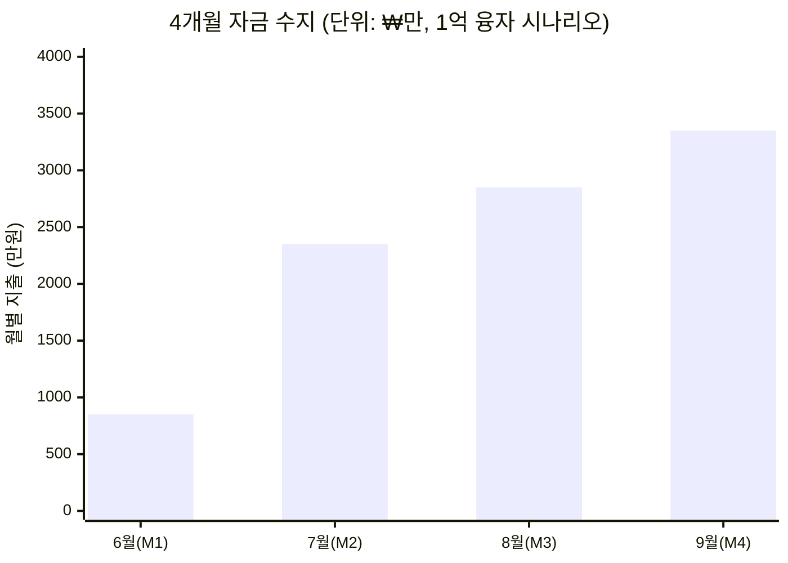
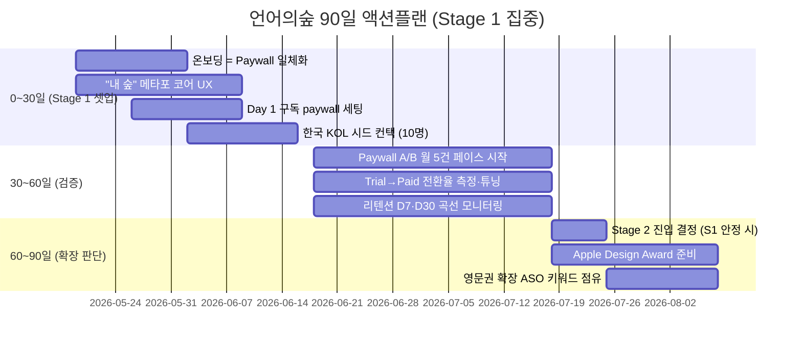

# 5사 Reference 합성 (Synthesis) — 언어의숲 BM·그로스 플레이북

> **Status**: Draft v1 / 2026-05-19  
> **분석자**: Claude  
> **소스 케이스**: [01-cal-ai.md](./01-cal-ai.md) · [02-alarmy.md](./02-alarmy.md) · [03-drops.md](./03-drops.md) · [04-reflectly.md](./04-reflectly.md) · [05-forest.md](./05-forest.md)  
> **분석 프레임**: 5관점 (성장과정 / LTV / CAC / BM / 3-Stage Loop) — Plan 파일 참조

---

## TL;DR (Executive Summary)

5사 분석에서 **4/5 이상에서 반복되는 9개 공통 패턴**과 **케이스마다 갈리는 5개 분기점**을 추출했다. 사용자가 제시한 **"S1 구독 BEP → S2 광고·F2P → S3 노하우 확장"** 가설은 **방향성은 맞지만, 카테고리에 따라 변형이 크다**. 학습·웰빙 카테고리는 광고 도입을 의도적으로 거부하는 게 옳을 수 있다.

**언어의숲 90일 액션플랜 핵심**:
1. **0~30일**: Day 1 구독 paywall + 온보딩=Paywall 일체화 (Cal AI 모델) + "내 숲" 메타포 (Forest 이름 정합)
2. **30~60일**: Paywall A/B 테스트 월 5건 페이스 (Superwall 표준)
3. **60~90일**: 단위경제 검증 후 Apple Design Award / Google Play 어워드 노림

---

# 🔥 PART A — 영어의숲 사업계획서 적용: 4개월 MRR ₩10M 액션플랜

> **추가 일자**: 2026-05-19 (사업계획서 공유 후)  
> **제약 조건**: Burn rate 4개월 / 6월말 융자 ₩1억 또는 ₩2억 / 목표 MRR ₩1,000만  
> **사업계획서 출처**: 36p Pitch Deck (2026.05 공유)

## A1. 영어의숲 현재 상태 진단 (사업계획서 기준)

### 핵심 파라미터

| 지표 | 현재 (25.12~26.01) | 27년 BEP 목표 | **4개월 목표** | Gap |
|------|-------------------|--------------|---------------|-----|
| **MRR** | ₩107만 | ₩1,590만 | **₩1,000만** | **9.3x** |
| 결제유저 (ARPPU ₩55,292) | ~194명 | ~2,880명 | ~1,810명 | +1,616명 |
| DAU | 150 | 2,400 | ~2,000 | 13.3x |
| MAU | 1,500 | 24,000 | ~20,000 | 13.3x |
| **D1 리텐션 (접속)** | **30.1%** ★ | 40% | 30%+ 유지 | (자산) |
| D1 리텐션 (완료) | 39% | 50% | 45%+ | +6%p |
| D7 리텐션 (접속) | 14% | 22% | 18%+ | +4%p |
| 결제전환율 | 1.8~2.58% | 3.5% | **3.0%+** | +1.2%p |
| 바이럴 계수 | 0.10 | 0.30 | 0.25+ | 2.5x |
| ARPPU | ₩55,292 | ₩110,000 | ₩55,000 유지 | (가격 인상은 BEP 후) |
| CPI | ₩529 | ₩450 | ₩600~800 (광고 본격화 시 일시 상승) | - |
| CAC | ₩18,623 | ₩16,000 | ₩20,000 이내 | - |
| LTV/CAC | 4.73 (국내 2.4, 해외 7.8) | 6.9 | 5.5+ | +0.77 |
| 월 고정비 | ₩850만 | ₩850만 | ₩850만 (동결) | - |
| 월 영업이익 | -₩743만 | 0 | -₩200만 이내 (M4) | +₩543만 |

★ **D1 리텐션 30.1%는 동종업계 2배** — Stage 1 검증의 핵심 신호. 절대 잃지 말 것.

### 자산 vs 약점

**🟢 자산 (Strengths)**
- D1 30.1% (업계 2배) — Cal AI·Drops 못 미치는 약점이지만 학습 카테고리에선 압도적
- **70%가 D1에 결제** — 결제 의향 매우 높음. paywall이 이미 잘 작동 중
- 학습과학 4축 (자기참조효과·정보처리이론·자기효능감 이론·난이도 자동화) — 카피 어려움 (백엔드 설계 ↑)
- 특허 출원 (10-2025-0146995) + KAIST 데이터전략 연구실 MOU — IP 방어선
- 비즈니스 모델 사이클: 70% D1 결제 → 30% D7 결제 → 자연스러운 paywall 동선

**🔴 약점 (Weaknesses)**
- **절대 유입량 부족**: DAU 150 / MAU 1,500 — Cal AI 출시 1개월 시점(MAU 약 10만)의 1.5%
- 바이럴 계수 0.10 — Reflectly·Cal AI·Forest 모두 0.3~0.6 영역
- 해외 매출 PoC 미진행 — LTV/CAC 해외 7.8 vs 국내 2.4 격차 활용 못 함
- DAU/MAU = 10% — 매일 트리거 앱(알라미 41%) 대비 낮음

## A2. 자금 수지 시뮬레이션 (4개월)



| 월 | 운영비 | 마케팅비 | 합계 지출 | 누적 |
|----|--------|----------|-----------|------|
| M1 (6월) | 850 | 0 | 850 | 850 |
| M2 (7월) | 850 | 1,500 | 2,350 | 3,200 |
| M3 (8월) | 850 | 2,000 | 2,850 | 6,050 |
| M4 (9월) | 850 | 2,500 | 3,350 | **9,400** |

- **1억 융자 시**: 4개월 누적 지출 9,400 - MRR 누적 매출 ~2,500 ≈ **잔여 약 3,100만** (안전 마진 충분)
- **2억 융자 시**: 4개월 후 잔여 **약 1억 3천만** → Pre-A까지 6~9개월 추가 runway

## A3. 5사 학습 → 영어의숲 직접 적용 (요약)

> 풀 디테일은 본 문서 Section 2~8 참조. 여기는 **사업계획서 컨텍스트에서 즉시 적용 가능한 것만** 추렸음.

### Cal AI 4가지 적용

| # | 패턴 | 영어의숲 적용 | 기대 효과 |
|---|------|---------------|-----------|
| 1 | **온보딩 = Paywall** | 첫 일기 입력 전 1.5분 "영어 페르소나 진단 퀴즈" + 로딩 화면 (Sunk cost) | 결제전환율 1.8% → 3.0%+ |
| 2 | **인플루언서 시스템화** | 1K-10K 25-35 여성 갓생·영어공부 인플루언서 50명 시드 + VA DM 자동화 | M2~M3 신규 +8,000명 |
| 3 | **Paywall A/B 월 5건** | Superwall/Adapty 도입, 주 1건 실험, 16건 누적/4개월 | 전환율 +30%+ |
| 4 | **Day 1 단일 BM** | 사업계획서 Free to Learn은 BEP 후로 미룸 | 단위경제 명확화 |

### 알라미 3가지 적용

| # | 패턴 | 영어의숲 적용 |
|---|------|---------------|
| 1 | 한국 → 해외 매출 전환 (85%) | **M4에 영미권 한인 중년 여성 PoC** (미시 USA·토론토 한인회 페이스북 그룹) — 사업계획서 명시 결제전환 2.7배 검증 |
| 2 | 광고 도입은 BEP 후 | 현재 구독 100% 유지 — 알라미가 후회한 "광고 우선" 단계 우회 중 |
| 3 | ASO 키워드 장기 점유 | "영어 일기", "AI 영어 학습", "영어 작문 AI" 키워드 점유 시작 (M3~) |

### Drops 3가지 적용

| # | 패턴 | 영어의숲 적용 |
|---|------|---------------|
| 1 | 의도된 결핍 BM (5분/일) | 사업계획서 Public SaaS와 정확히 매칭 — **유지** |
| 2 | 광고 영구 거부 | 학습 가치 훼손 우려. Free to Learn은 신중히, 또는 영구 거부도 옵션 |
| 3 | 다국어 = 매출 복제 | Pre-A에서 한국어 학습 추가 — 사업계획서대로 |

### Reflectly: 1가지 적용 + 1가지 안티패턴 ⚠️

- **적용**: 일기 입력이 paywall로 가는 자연스러운 동선 — 70% D1 결제율을 80%+로 끌어올리기 (Cal AI 온보딩 결합)
- **⚠️ 안티패턴 회피**: 단일 메커닉 고수 → Daylio·Stoic에 점유 빼앗김. **영어의숲은 사업계획서 "메타게임 순환 구조"를 M3부터 일정 앞당겨 구현** (학습 → 서브 콘텐츠 → 바이럴 → 학습 루프)

### Forest 2가지 적용

| # | 패턴 | 영어의숲 적용 |
|---|------|---------------|
| 1 | **"숲" 메타포 직접 매칭** ★ | 영어의숲의 이름이 곧 메커닉. 일기 1편 = 나무 1그루, 학습 누적 = 숲 우거짐. 사용자가 자기 숲 보고 "여기서 못 끊겠다" 만들기 |
| 2 | 가상→실제 연결 | 30일 연속 학습 = 굿즈 키링·스티커 (사업계획서 명시) / K-Culture IP 제휴 (BTS·블랙핑크 영어 자료) |

## A4. 4개월 월별 액션플랜

### M1 (6월): 결제전환율 강제 개선 + 인플루언서 시드 준비
**예산**: 운영 850 / 마케팅 0 = **₩850만**

| 액션 | 담당 | KPI |
|------|------|-----|
| 온보딩 퀴즈 1분 5문항 (Cal AI 식) | 이찬중·서동재 | M1 말 라이브 |
| "AI 페르소나 생성 중" 로딩 화면 (Lottie) | 김지아 | M1 말 라이브 |
| Paywall A/B 4건 (Adapty/Superwall) | 이찬중 | 1건 winner +10%+ |
| 25-35 여성 인플루언서 100명 리스트 빌드 | 이찬중 | 100명 검증 |
| 25-35 여성 PoC 인터뷰 5명 (WoW Point 분석) | 김지아 | 정성 인사이트 5건 |

**End KPI**: 결제전환율 1.8% → **2.5%**, MRR ₩107만 → **₩150만**

### M2 (7월): 융자 입금 후 인플루언서 시드 + 첫 페이드
**예산**: 운영 850 / 마케팅 1,500 = **₩2,350만**

| 액션 | 예산 | KPI |
|------|------|-----|
| 인플루언서 시드 50명 (무료 1개월 + 인증) | ₩0 (재화만) | 콘텐츠 50건 + 노출 10만+ |
| VA 1명 채용 (DM·관리) | ₩60만 | 추가 인플루언서 80명 |
| Meta·Instagram 페이드 (25-35 여성 타겟) | ₩800만 (일 ₩25만) | 신규 가입 8,000명 (CPI ~₩1,000) |
| Paywall A/B 4건 추가 | ₩0 | 전환율 +0.3%p |
| 챌린지 #1: "30일 영어 일기 = 갓생 인증" | ₩100만 (굿즈 키링) | 챌린지 참여 500명 |
| "숲" 시각 자산 강화 (Forest 차용) | ₩0 (개발) | 시각화 화면 라이브 |
| 잔여 | ₩540만 | 예비비 |

**End KPI**: 결제전환율 → **2.8%**, DAU 150 → **400**, MRR → **₩350만**

### M3 (8월): 바이럴 메커닉 본격 + 콘텐츠 공장
**예산**: 운영 850 / 마케팅 2,000 = **₩2,850만**

| 액션 | 예산 | KPI |
|------|------|-----|
| 인플루언서 retainer 전환 (10명) | ₩500만 (월 ₩50만 × 10) | 월 30~40편 콘텐츠 |
| Meta·TikTok 페이드 확대 | ₩1,000만 (일 ₩33만) | 신규 가입 10,000명 |
| SNS 공유 가능한 학습 카드 디자인 | ₩0 | 공유율 ↑3x |
| 챌린지 #2: "친구 초대 = 굿즈" | ₩200만 | 바이럴 계수 0.10 → 0.20 |
| Apple Search Ads 시범 | ₩200만 | 키워드 5개 점유 |
| Paywall A/B 4건 추가 | ₩0 | 전환율 +0.2%p |
| K-Culture 외국인 PoC 미니 (인스타) | ₩100만 | 한국어 학습자 100명 가입 |

**End KPI**: 결제전환율 → **3.0%**, DAU 400 → **1,200**, 바이럴 0.10 → **0.20**, MRR → **₩650만**

### M4 (9월): MRR ₩1,000만 sprint + 해외 PoC
**예산**: 운영 850 / 마케팅 2,500 = **₩3,350만**

| 액션 | 예산 | KPI |
|------|------|-----|
| 영미권 한인 중년 여성 PoC (알라미 식) | ₩500만 | 결제 유저 50~100명, 결제전환 2.7배 검증 |
| 페이드 마케팅 본격 (Meta + TikTok + ASA) | ₩1,600만 | 신규 가입 12,000명 |
| 마이크로 인플루언서 풀 확대 (20명) | ₩200만 | 월 60편 콘텐츠 |
| Paywall A/B 4건 추가 (누적 16건) | ₩0 | 전환율 +0.2%p |
| 챌린지 #3: 추석 챌린지 | ₩200만 | 활성화 ↑20% |

**End KPI**: 결제전환율 **3.2%**, DAU **2,000**, 바이럴 **0.25**, **MRR ₩1,000만+**, 해외 매출 비중 **15%**

## A5. 영어의숲 즉시 의사결정 매트릭스

| 결정 사항 | 사업계획서 현재 | 5사 레퍼런스 | **본 액션플랜 권고** |
|----------|------------|------------|------------------|
| 무료체험 길이 | (미명시) | Cal AI 3일 / Drops 5분/일 / 알라미 무광고 무료 | **7일 무료체험** (3일은 한국 시장 신뢰 손실 ↑) |
| 가격 공개 | (월 ₩6,900 공개) | Cal AI 비공개 (안티), Drops·알라미·Forest 공개 | **현재 공개 유지** ★ |
| 광고 도입 시점 | Pre-A (Free to Learn) | 알라미: 광고 우선 후회 / Cal AI: 광고 영원히 X / Drops·Reflectly: 영구 거부 | **BEP 후로 미룸** ★ |
| 다국어 시점 | 2026 하반기 (한국어) | Drops 5년 50+ 언어, Forest 단일 언어 유지 | **사업계획서대로 Pre-A에서 시작** |
| Paywall 트리거 위치 | (D1 70% 결제) | Cal AI 온보딩 후, Reflectly 일기 3편 후 | **일기 1편 입력 직후 = "WoW Point"** (현재 70% D1 결제 강화) |
| 인플루언서 vs 페이드 순서 | 인플루언서 우선 | Cal AI 인플루언서 → $2M MRR → 페이드 | **M1·M2 인플루언서 → M3·M4 페이드 확대** |
| 챌린지 보상 | 굿즈 키링·스티커 | Forest 가상→실제 나무, Alarmy 무 | **현금 X, 현물 굿즈 + 무료 구독 연장** |
| 다이내믹 프라이싱 | (미명시) | Cal AI 운영중 (불만 다수) | **단일 가격 유지** (한국 시장 신뢰) |

## A6. 영어의숲 90일 OKR (수정)

### O1: 4개월 내 MRR ₩1,000만 도달
- **KR1.1** 결제전환율 1.8% → **3.0%+** (paywall A/B 16건 누적)
- **KR1.2** DAU 150 → **2,000**
- **KR1.3** 바이럴 계수 0.10 → **0.25+**
- **KR1.4** 누적 결제 유저 194 → **1,810명**

### O2: Stage 1 BEP 안정화 (3-Stage Loop 가설 검증)
- **KR2.1** LTV/CAC 4.73 → **5.5+**
- **KR2.2** 페이드 마케팅 ROAS > 1.5 (M4 시점)
- **KR2.3** 해외 결제 유저 비중 0% → **15%** (영미권 한인 PoC)

### O3: Pre-A 라운드 진입 조건 충족
- **KR3.1** D7 리텐션 14% → **22%+**
- **KR3.2** 부활율 2% → **5%+** (Reflectly 안티패턴 회피 신호)
- **KR3.3** 특허 1건 등록 완료, KAIST 공동 논문 1편 초안
- **KR3.4** Pre-A IR 자료 9월말까지 완성 (10월 글로벌 TIPS 신청)

## A7. 안 해야 할 것 (영어의숲 5사 안티패턴 회피)

| # | 출처 | 안티패턴 | 영어의숲 회피 결정 |
|---|------|----------|--------------------|
| 1 | Reflectly | 단일 메커닉 고수 → 후발에 잠식 | 사업계획서 "메타게임 순환 구조"를 M3부터 일정 앞당겨 구현 |
| 2 | 알라미 | 구독 도입 지연 (광고 우선) | 현재 구독 100% 유지. Free to Learn은 BEP 후 |
| 3 | Cal AI | 3일 무료체험 + 가격 불투명 | **7일 무료체험 + 공개 가격** |
| 4 | Forest | 유료광고 회피 | 4개월 BEP 압박 하에선 ❌. M2부터 페이드 적극 활용 |
| 5 | Cal AI | 광고를 너무 일찍 도입 | M2까지 인플루언서 → M3부터 페이드 (Cal AI 순서 그대로) |
| 6 | Drops | Stage 2 진입 의도적 거부 | BEP 후 광고 도입은 옵션으로 열어둠. 학습 가치 훼손 시 즉시 철회 |

## A8. 즉시 실행 To-Do (이번 주)

- [ ] **이찬중**: 본 액션플랜 팀 공유 → M1 산출물 합의 (5/20~21)
- [ ] **서동재**: 온보딩 퀴즈 1분 5문항 와이어 → 김지아와 디자인 (5/22)
- [ ] **김지아**: "AI 페르소나 생성 중" 로딩 화면 디자인 (5/22~26)
- [ ] **김민주**: Adapty 또는 Superwall SDK 통합 검토 (5/22)
- [ ] **이찬중**: 25-35 여성 인플루언서 100명 리스트 빌드 (5/22~30)
- [ ] **이찬중**: 6월말 융자 1억 OR 2억 시나리오 확정 → 마케팅비 배분 재조정 (6/25)
- [ ] **이찬중**: M1 paywall A/B 실험 4건 가설 정의 (5/25)
- [ ] **김지아**: 25-35 여성 PoC 인터뷰 5명 (5/27~6/3) — "WoW Point" 분석

---

# 📚 PART B — 5사 합성 (Reference Synthesis)

> Part B는 기존 5사 분석의 참고용 매트릭스. Part A 작성의 근거.

---

## 1. 5사 5관점 비교 매트릭스

| 차원 | Cal AI 🇺🇸 | 알라미 🇰🇷 | Drops 🇭🇺 | Reflectly 🇩🇰 | Forest 🇹🇼 |
|---|---|---|---|---|---|
| **창업·역사** | 2024.05 (22개월) | 2013.05 (13년) | 2015 (~10년) | 2017 (~9년) | 2014.05 (12년) |
| **창업자 수** | 4인 (10대 2 + 20대 2) | 1인 (신재명, KAIST) | 2인 (Daniel·Mark) | 3인 (Aarhus 동문) | 2인 (Marcus·Amy 부부) |
| **팀 규모 (현재)** | 7명 (매각 시) | 70~80명 | 30~40명 (매각 시) | ~15~30명 | 10~15명 |
| **펀딩** | $0 | 거의 0 | 0 → 매각 | ~$5M (시드+A) | $0 |
| **누적 사용자** | 15M (22개월) | 7,500만~8,500만 | 25M (매각 시) | ~13M | 40M+ |
| **MAU** | 비공개 | 460만 | 비공개 | 정체 | 비공개 |
| **추정 매출** | $50M+ ARR (2026.01) | 337억원 (2024) | €6.3M (2019) | ~$15M ARR 정점 | 비공개 |
| **수익화 모델** | 구독 only | 광고+구독+IAP+B2B | 구독+Lifetime | 구독 | 유료 다운로드+IAP → 2025.12 구독 |
| **연 구독 가격** | $29~$40 | $59.99 | $69.99 | $59.99 | 비공개 (신규) |
| **현재 Stage** | S3 (d) 매각 | S2~S3 (B2B 확장) | S3 (d) 매각 | S2 진입 실패 | S1 → S2 진입 (2025.12) |

---

## 2. LTV 레버 매트릭스 (프로덕트 관점)

| LTV 레버 | Cal AI | 알라미 | Drops | Reflectly | Forest |
|---------|--------|--------|-------|-----------|--------|
| **핵심 Hook 메커닉** | 사진 → AI 칼로리 | 미션형 알람 (강제 트리거) | 5분 시간 제한 | AI 가이드 일기 | 가상 나무 죄책감 |
| **누적 자산 (Investment)** | 식사 로그 | 알람·수면 데이터 | 진도·토픽·스트릭 | 일기·기분 데이터 | 가상 숲 + 실제 식수 |
| **트리거 빈도** | 매 끼니 (3~5회/일) | 매일 아침 (자동) | 매일 5분 | 매일 1회 | 집중 세션마다 |
| **DAU/MAU** | 비공개 | **41%** | 비공개 | 정체 | 비공개 |
| **무료 사용자 유료 전환** | ★★★★★ (paywall 강) | ★★★ (광고만 봐도 OK) | ★★★★ (시간 제한 강) | ★★★ | ★★★ |
| **ARPU 인상 레버** | 다이내믹 프라이싱 | 광고 mediation 최적화 | Lifetime 옵션 | 거의 변화 없음 | 2025.12 구독 신규 |
| **D30 리텐션** | 비공개 (~30%+ 추정) | 비공개 (높음) | 비공개 | 정체 | 비공개 (학생 충성도 높음) |

### LTV 인사이트
- **누적 자산 (Investment 레이어) 5/5 공통** — 모든 5사가 사용자의 일별 데이터를 누적시켜 "끊으면 손해"라는 sticky 메커닉 보유
- **단일 차별화 메커닉 5/5** — 멀티 기능 X. 각 앱은 한 줄로 설명됨
- **부정적 트리거 활용** (1/5) — Forest만 "나무 죽음의 죄책감"이라는 negative reward 사용. 매우 강력.

---

## 3. CAC 레버 매트릭스 (마케팅 관점)

| CAC 채널 | Cal AI | 알라미 | Drops | Reflectly | Forest |
|---------|--------|--------|-------|-----------|--------|
| **ASO 키워드** | △ (TikTok 우세) | ★★★★★ ("alarm clock") | ★★★★ (각 언어) | ★★★ | ★★★★ ("focus app") |
| **Apple/Google 피처드** | △ | ★★★★ | ★★★★★ (2018 올해의 앱) | ★★★★★ (Apple Best 2018) | ★★★★★ (Google 2018) |
| **디자인 어워드** | × | ★★ | ★★★★ | ★★★★★ | ★★★★ |
| **인플루언서 마케팅** | ★★★★★ (TikTok DM) | × | △ | △ | × |
| **유료광고 (Meta·TikTok)** | ★★★★★ ($7K/일) | △ (낮음) | × | △ (펀딩 후 일부) | × |
| **PR·매체 인터뷰** | ★★★★ (창업자 스토리) | ★★★★ (신재명 한국 매체) | ★★★ (Fast Company) | ★★★ | ★★ |
| **UGC (사용자 자발 SNS 공유)** | ★★★★★ (음식 비포애프터) | ★★★★ ("못 꺼지는 알람" 영상) | ★★★ (단어 카드) | ★★★★ (일기 비주얼) | ★★★★★ (공부 인증샷) |
| **사회적 가치 PR** | × | × | × | × | ★★★★★ (실제 나무 식수) |
| **외부 트렌드 합승** | ★★★★ (AI 붐) | ★ | △ | ★★★ (self-care 2018) | ★★★ (자기계발 트렌드) |

### CAC 인사이트
- **산출물이 콘텐츠가 됨 5/5 공통** — 각 앱마다 사용자가 자발적으로 SNS에 올릴 무엇이 있음. 가장 강력한 무료 CAC
- **유료광고 의존 매우 낮음 4/5** — Cal AI만 본격 광고비. 나머지는 어워드·UGC·피처드 중심
- **2018년 디자인 어워드 시즌이 결정적** — Drops·Reflectly·Forest 모두 2018년 어워드로 폭증

---

## 4. BM·Paywall 매트릭스 (비즈니스 관점)

| BM 차원 | Cal AI | 알라미 | Drops | Reflectly | Forest |
|---------|--------|--------|-------|-----------|--------|
| **BM 구조** | 구독 only | **광고+구독+IAP+B2B** | 구독+Lifetime | 구독 | 유료 DL → 구독 전환 (2025.12) |
| **광고 도입** | × | ◎ (코어) | × (의도적 거부) | × | × (구식 BM) |
| **무료체험 길이** | **3일** | 없음 | 없음 (영구 freemium) | 시기별 | 없음 |
| **Paywall 트리거** | 온보딩 끝 (hard) | 미션 3개째 | 5분 한도 도달 | 온보딩 끝 | 다운로드 (구) / 기능 잠금 (신) |
| **Day 1 Paywall** | ◎ | △ (광고 우선이었음) | ◎ | ◎ | × (구) → ◎ (신) |
| **연 vs 월 (월 환산 할인)** | 변동 | 50%↓ | 55%↓ | 50%↓ | 비공개 (신) |
| **다이내믹 프라이싱** | ◎ (사용자별 차등) | △ (지역 차등) | △ | △ | △ |
| **Paywall A/B 실험 (10개월)** | **123건** | 다수 (비공개) | 비공개 | 거의 없음 (정체) | 비공개 |
| **유료 전환율 추정** | ~10%+ (Cal AI 비공개) | 10~20% (T3) | 3~5% (T3) | 2.5% (2019) | 5% (구 모델) |

### BM 인사이트
- **Day 1 Paywall 4/5 채택** — Cal AI·Drops·Reflectly·Forest(신)는 출시·온보딩 직후 결제 유도. 알라미만 광고 우선
- **광고 도입 = 카테고리 결정** — 알람·집중 카테고리는 광고 가능, **학습·웰빙·식단 카테고리는 광고 거부가 옳음**
- **Paywall A/B 테스트 페이스가 핵심 경쟁력** — Cal AI 22개월 동안 123건 실험. Reflectly는 실험 페이스 둔화로 정체

---

## 5. 3-Stage Growth Loop 매트릭스

| Stage | Cal AI | 알라미 | Drops | Reflectly | Forest |
|-------|--------|--------|-------|-----------|--------|
| **S1 (BEP)** | Day 1 구독 (1개월 만에 매출) | 유료 앱 + 광고 (수년) | Freemium + 5분 제한 (1~2년) | 구독 + 펀딩 (2년) | **유료 다운로드 (11년 유지)** |
| **S2 (광고·F2P·micropayment)** | **건너뜀** | 2019 구독 도입 (느림) | **의도적 거부** | **진입 실패** | 2025.12 진입 (늦음) |
| **S3 (확장)** | (d) MyFitnessPal 매각 (22개월) | (c) B2B DARO + (b) 다국가 | (d) Kahoot 매각 (5년) | 진입 불가 | 미진행 (단일 앱 유지) |
| **전환 트리거** | AI 기술 우위 → 빠른 매각 | 광고 한계 → 구독·B2B 진화 | 자율성 한계 → EXIT | 운영 둔화 → 정체 | LTV 천장 → BM 전환 |

### 3-Stage 인사이트 (사용자 가설 검증)

**사용자의 원 가설**: "S1 구독 BEP → S2 광고·F2P·micropayment → S3 노하우 확장"

**검증 결과**:
- **방향성은 맞음** (3/5: 알라미·Cal AI(축약)·Forest)
- **광고 추가가 항상 옳지 않음** — Drops·Reflectly·Forest는 광고 의도적 거부 (학습·웰빙 카테고리 특성)
- **S2를 건너뛰고 S3 직행 가능** — Cal AI는 22개월 만에 매각 (AI 기술 우위 시간가치 활용)
- **S2 진입 자체가 가장 어려움** — Reflectly는 펀딩 받고도 S2 실패
- **S1 BM이 카테고리에 따라 다름** — 구독(Cal AI·Reflectly), 유료 다운로드(Forest), 유료+무료광고(알라미), Freemium(Drops)

**수정된 가설** (5사 학습 반영):
```
[S1] 단위경제 검증 (BEP) — 카테고리에 맞는 단일 BM
   └ AI 카테고리 → 구독 우선
   └ 유틸리티 → 광고 가능
   └ 학습·웰빙 → 구독 우선, 광고 거부

[S2] 추가 수익 레이어 OR 의도적 단순화 유지
   └ 매크로 환경·카테고리 정합성 확인 후 결정
   └ 메커닉 진화 페이스 의무화 (분기 1회 이상)

[S3] 확장 방향 4지선다
   └ (a) 카테고리 복제: 매우 어려움 (5사 중 0건 성공)
   └ (b) 시장·언어 확장: 안전 (알라미·Drops 성공)
   └ (c) B2B: 알라미 DARO 모델 (장기)
   └ (d) IP 매각: Cal AI·Drops (시간가치 핵심)
```

---

## 6. 공통점 (4/5 이상에서 반복)

| # | 공통점 | 적용 케이스 |
|---|--------|-------------|
| 1 | **단일 차별화 메커닉 (한 줄 설명)** | 5/5 |
| 2 | **앱 산출물이 SNS 콘텐츠가 됨 (UGC 자생산)** | 5/5 |
| 3 | **누적 자산 = sticky 리텐션 동인** | 5/5 |
| 4 | **창업자/팀이 본인 문제에서 출발한 PMF** | 5/5 |
| 5 | **소수정예 (10~80명)·자본 효율 극단** | 5/5 |
| 6 | **유료광고 의존 매우 낮음, 오가닉·어워드·UGC 중심** | 4/5 (Cal AI 예외) |
| 7 | **Day 1 또는 빠른 paywall 도입** | 4/5 (알라미는 늦음) |
| 8 | **Apple/Google 어워드·피처드가 단일 최대 그로스 이벤트** | 4/5 (Cal AI 예외 — TikTok 우세) |
| 9 | **글로벌(다국가) 출시·로컬화 빠름** | 4/5 (Reflectly 영문권 편중) |

---

## 7. 분기점 (케이스마다 갈리는 결정)

| # | 분기점 | A 선택 | B 선택 |
|---|--------|--------|--------|
| 1 | **광고 도입 여부** | 알라미 ◎ (코어 매출) | Drops·Reflectly·Forest ✕ (의도적 거부) |
| 2 | **첫 BM** | Day 1 구독: Cal AI·Reflectly | 유료 앱: Forest / 광고 우선: 알라미 |
| 3 | **마케팅 채널 우위** | 인플루언서+광고: Cal AI | ASO+UGC+어워드: 알라미·Drops·Reflectly·Forest |
| 4 | **EXIT vs 독립 유지** | 매각: Cal AI(22개월)·Drops(5년) | 독립: 알라미·Forest (11~13년) |
| 5 | **메커닉 진화 페이스** | 의무화: Cal AI·알라미 (계속 신기능) | 정체: Reflectly (5년간 동일) → 실패 |

---

## 8. 언어의숲 적용 매핑 (Adopt / Adapt / Discard)

### 🟢 Adopt (그대로 채택)

| # | 인사이트 | 출처 | 언어의숲 적용안 |
|---|---------|------|----------------|
| 1 | **단일 차별화 메커닉** | 5사 공통 | "내 일기 → AI가 영어 학습자료" 한 문장으로 잠그기. 멀티 기능 X |
| 2 | **온보딩 = Paywall 일체화** | Cal AI | 1.5~2.5분 "내 영어 진단 퀴즈" → "AI 학습 플랜 생성 중" → 결과 노출 → 3일 무료체험 paywall |
| 3 | **Day 1 Paywall + 구독 단일 BM** | Cal AI·Drops·Reflectly | 출시일부터 구독 paywall. 광고·잡 IAP 분산 X |
| 4 | **"내 숲" 누적 자산 메타포** | Forest (이름 정합 !!) | 영어 일기·학습 세션마다 단어·문장이 나무로 심김. 매일 안 하면 시들고, 누적되면 우거짐 |
| 5 | **Paywall A/B 테스트 운영의 한 축** | Cal AI (123건/22개월) | 출시 직후부터 paywall layout·문구·가격 월 5건 이상 실험 |
| 6 | **사회적 가치를 BM에 묶기** | Forest (Trees for the Future) | 구독료 일부를 저소득층 학생 영어 교육 지원 등에 연결 |
| 7 | **창업자 스토리 자산화** | Cal AI·알라미·Forest | 창업자 본인이 Medium·뉴스레터 운영. 매체 인터뷰 적극 |
| 8 | **다국가·다언어 빠른 출시** | Drops·알라미 | Korea-first 6~12개월 → 영문권 1년 차 → 일·중·동남아 2년 차 |

### 🟡 Adapt (변형 채택)

| # | 인사이트 | 변형 이유 | 언어의숲 적용안 |
|---|---------|----------|----------------|
| 1 | **시간 제한 BM (Drops 5분)** | 학습 시간 자체는 자유 — 대신 "AI 처리 횟수" 제한 | 무료: 하루 1편 영어 일기 → AI 학습자료 / Premium: 무제한 |
| 2 | **부정적 리워드 (Forest 나무 죽음)** | "나무 시드는" 메커닉 차용 | 매일 일기 안 쓰면 어휘 숲의 일부 나무가 시든다 — 단, 학습은 부드럽게 |
| 3 | **인플루언서 마케팅 (Cal AI TikTok)** | 한국 영어 학습 KOL 시장 활용 | 영어 학습 유튜버·인스타 인플루언서 시드 협업 (Cal AI식 시스템화) |

### 🔴 Discard (피할 것)

| # | 안티패턴 | 출처 | 회피 이유 |
|---|---------|------|----------|
| 1 | **3일 자동갱신 트랩 + 가격 불투명** | Cal AI | Apple 단속 + 브랜드 신뢰 손실. **언어의숲은 7일+ 무료체험 + 공개 가격** |
| 2 | **구독 도입 늦춤** | 알라미 (7년 광고 우선) | LTV 천장 명확. Day 1 구독이 옳음 |
| 3 | **메커닉 진화 정체** | Reflectly (5년 동일) | 분기 1회 이상 신규 메커닉 출시 의무화 |
| 4 | **광고 도입 (학습 카테고리)** | Reflectly·Drops·Forest 모두 거부 | 학습 가치 훼손. 구독 단일 유지 |
| 5 | **펀딩 후 운영 둔화** | Reflectly | 펀딩 받으면 제품 출시 페이스 KPI를 분기마다 강제 |
| 6 | **단일 앱 카테고리 고수** | 알라미 (12년 단일 앱) | 인접 카테고리 시드 일찍 깔아둘 것 (다국어 등) |

---

## 9. 언어의숲 90일 액션플랜



### 0~30일 (Stage 1 셋업)
| 액션 | 출처 | KPI |
|------|------|-----|
| 온보딩 퀴즈 1.5~2.5분 → "학습 플랜 생성 중" → 결과 노출 → 3일 무료체험 paywall | Cal AI | 온보딩 완료율 ≥ 70% |
| "내 숲" 메타포: 학습 세션마다 단어/문장이 나무로 심김 | Forest | UX 시안 완성 |
| 광고·IAP 0, 구독 단일 BM | Drops·Reflectly | Day 1 paywall 작동 |
| 한국 영어 학습 KOL 10명에 베타 액세스 + 솔직한 후기 요청 | Cal AI | KOL 영상 5건+ 발생 |

### 30~60일 (단위경제 검증)
| 액션 | 출처 | KPI |
|------|------|-----|
| Paywall A/B 실험 월 5건 (layout·문구·가격) | Cal AI (123건/22개월) | 실험 5건/월 |
| 트라이얼→유료 전환율 측정, 목표 30%+ | Adapty 벤치마크 | 전환율 30%+ |
| 리텐션 D7/D30 모니터링, 플래토 형성 여부 | 5사 공통 | D30 30%+ |
| 한국 매체 PR 첫 사이클 (창업자 스토리) | 알라미·Cal AI | 매체 보도 3건+ |

### 60~90일 (Stage 2 진입 판단)
| 시나리오 | 액션 |
|---------|------|
| **단위경제 ◎ + 리텐션 플래토 형성** | Stage 2 진입 설계: 다국어 확장 / B2B 라이트 / 영문권 진입 |
| **단위경제 △ + 리텐션 정체** | Stage 1 재설계: 메커닉 진화 / 가격 재조정 / 온보딩 개선 |
| **공통**: Apple Design Award 2027 신청 준비 (디자인·접근성·비주얼 투자) | Drops·Reflectly·Forest 표준 |

---

## 10. 핵심 단일 메시지 (한 줄)

> **"단일 메커닉 + 누적 자산 + 산출물=콘텐츠 + Day 1 paywall + 분기 신규 출시" — 5사가 공통으로 검증한 부트스트랩 글로벌 앱의 다섯 가지 조건. 광고 도입은 카테고리 따라 다르고, 학습·웰빙은 거부가 옳다.**

언어의숲 = 이 다섯 조건에 **"숲" 메타포 + AI 자동화 + Korean origin"** 세 가지 자기 강점을 더하면, 5사 중 어떤 모델보다 빠른 단위경제 달성이 가능.

---

## References

각 5사의 1차·2차·3차 출처는 해당 파일 References 섹션 참조:
- [01-cal-ai.md](./01-cal-ai.md)
- [02-alarmy.md](./02-alarmy.md)
- [03-drops.md](./03-drops.md)
- [04-reflectly.md](./04-reflectly.md)
- [05-forest.md](./05-forest.md)
