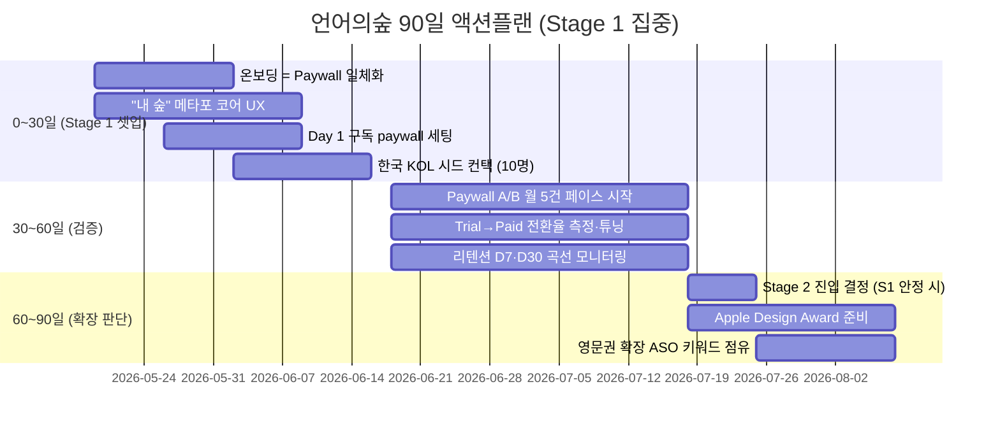

# 5사 Reference 합성 (Synthesis) — 언어의숲 BM·그로스 플레이북

> **Status**: Draft v1 / 2026-05-19  
> **분석자**: Claude  
> **소스 케이스**: [01-cal-ai.md](./01-cal-ai.md) · [02-alarmy.md](./02-alarmy.md) · [03-drops.md](./03-drops.md) · [04-reflectly.md](./04-reflectly.md) · [05-forest.md](./05-forest.md)  
> **분석 프레임**: 5관점 (성장과정 / LTV / CAC / BM / 3-Stage Loop) — Plan 파일 참조

---

## TL;DR (Executive Summary)

5사 분석에서 **4/5 이상에서 반복되는 9개 공통 패턴**과 **케이스마다 갈리는 5개 분기점**을 추출했다. 사용자가 제시한 **"S1 구독 BEP → S2 광고·F2P → S3 노하우 확장"** 가설은 **방향성은 맞지만, 카테고리에 따라 변형이 크다**. 학습·웰빙 카테고리는 광고 도입을 의도적으로 거부하는 게 옳을 수 있다.

**언어의숲 90일 액션플랜 핵심**:
1. **0~30일**: Day 1 구독 paywall + 온보딩=Paywall 일체화 (Cal AI 모델) + "내 숲" 메타포 (Forest 이름 정합)
2. **30~60일**: Paywall A/B 테스트 월 5건 페이스 (Superwall 표준)
3. **60~90일**: 단위경제 검증 후 Apple Design Award / Google Play 어워드 노림

> **📌 영어의숲 사업계획서 적용 액션플랜은 별도 파일로 분리됨**: [`00-action-plan.md`](./00-action-plan.md)  
> 본 문서는 5사 일반 합성·매트릭스·패턴만 담음. 본 합성을 영어의숲 사업계획서(MRR·D1 리텐션·자금 수지) 데이터에 적용한 4개월 액션플랜은 위 링크의 별도 파일 참조.

---

## 1. 5사 5관점 비교 매트릭스

| 차원 | Cal AI 🇺🇸 | 알라미 🇰🇷 | Drops 🇭🇺 | Reflectly 🇩🇰 | Forest 🇹🇼 |
|---|---|---|---|---|---|
| **창업·역사** | 2024.05 (22개월) | 2013.05 (13년) | 2015 (~10년) | 2017 (~9년) | 2014.05 (12년) |
| **창업자 수** | 4인 (10대 2 + 20대 2) | 1인 (신재명, KAIST) | 2인 (Daniel·Mark) | 3인 (Aarhus 동문) | 2인 (Marcus·Amy 부부) |
| **팀 규모 (현재)** | 7명 (매각 시) | 70~80명 | 30~40명 (매각 시) | ~15~30명 | 10~15명 |
| **펀딩** | $0 | 거의 0 | 0 → 매각 | ~$5M (시드+A) | $0 |
| **누적 사용자** | 15M (22개월) | 7,500만~8,500만 | 25M (매각 시) | ~13M | 40M+ |
| **MAU** | 비공개 | 460만 | 비공개 | 정체 | 비공개 |
| **추정 매출** | $50M+ ARR (2026.01) | 337억원 (2024) | €6.3M (2019) | ~$15M ARR 정점 | 비공개 |
| **수익화 모델** | 구독 only | 광고+구독+IAP+B2B | 구독+Lifetime | 구독 | 유료 다운로드+IAP → 2025.12 구독 |
| **연 구독 가격** | $29~$40 | $59.99 | $69.99 | $59.99 | 비공개 (신규) |
| **현재 Stage** | S3 (d) 매각 | S2~S3 (B2B 확장) | S3 (d) 매각 | S2 진입 실패 | S1 → S2 진입 (2025.12) |

---

## 2. LTV 레버 매트릭스 (프로덕트 관점)

| LTV 레버 | Cal AI | 알라미 | Drops | Reflectly | Forest |
|---------|--------|--------|-------|-----------|--------|
| **핵심 Hook 메커닉** | 사진 → AI 칼로리 | 미션형 알람 (강제 트리거) | 5분 시간 제한 | AI 가이드 일기 | 가상 나무 죄책감 |
| **누적 자산 (Investment)** | 식사 로그 | 알람·수면 데이터 | 진도·토픽·스트릭 | 일기·기분 데이터 | 가상 숲 + 실제 식수 |
| **트리거 빈도** | 매 끼니 (3~5회/일) | 매일 아침 (자동) | 매일 5분 | 매일 1회 | 집중 세션마다 |
| **DAU/MAU** | 비공개 | **41%** | 비공개 | 정체 | 비공개 |
| **무료 사용자 유료 전환** | ★★★★★ (paywall 강) | ★★★ (광고만 봐도 OK) | ★★★★ (시간 제한 강) | ★★★ | ★★★ |
| **ARPU 인상 레버** | 다이내믹 프라이싱 | 광고 mediation 최적화 | Lifetime 옵션 | 거의 변화 없음 | 2025.12 구독 신규 |
| **D30 리텐션** | 비공개 (~30%+ 추정) | 비공개 (높음) | 비공개 | 정체 | 비공개 (학생 충성도 높음) |

### LTV 인사이트
- **누적 자산 (Investment 레이어) 5/5 공통** — 모든 5사가 사용자의 일별 데이터를 누적시켜 "끊으면 손해"라는 sticky 메커닉 보유
- **단일 차별화 메커닉 5/5** — 멀티 기능 X. 각 앱은 한 줄로 설명됨
- **부정적 트리거 활용** (1/5) — Forest만 "나무 죽음의 죄책감"이라는 negative reward 사용. 매우 강력.

---

## 3. CAC 레버 매트릭스 (마케팅 관점)

| CAC 채널 | Cal AI | 알라미 | Drops | Reflectly | Forest |
|---------|--------|--------|-------|-----------|--------|
| **ASO 키워드** | △ (TikTok 우세) | ★★★★★ ("alarm clock") | ★★★★ (각 언어) | ★★★ | ★★★★ ("focus app") |
| **Apple/Google 피처드** | △ | ★★★★ | ★★★★★ (2018 올해의 앱) | ★★★★★ (Apple Best 2018) | ★★★★★ (Google 2018) |
| **디자인 어워드** | × | ★★ | ★★★★ | ★★★★★ | ★★★★ |
| **인플루언서 마케팅** | ★★★★★ (TikTok DM) | × | △ | △ | × |
| **유료광고 (Meta·TikTok)** | ★★★★★ ($7K/일) | △ (낮음) | × | △ (펀딩 후 일부) | × |
| **PR·매체 인터뷰** | ★★★★ (창업자 스토리) | ★★★★ (신재명 한국 매체) | ★★★ (Fast Company) | ★★★ | ★★ |
| **UGC (사용자 자발 SNS 공유)** | ★★★★★ (음식 비포애프터) | ★★★★ ("못 꺼지는 알람" 영상) | ★★★ (단어 카드) | ★★★★ (일기 비주얼) | ★★★★★ (공부 인증샷) |
| **사회적 가치 PR** | × | × | × | × | ★★★★★ (실제 나무 식수) |
| **외부 트렌드 합승** | ★★★★ (AI 붐) | ★ | △ | ★★★ (self-care 2018) | ★★★ (자기계발 트렌드) |

### CAC 인사이트
- **산출물이 콘텐츠가 됨 5/5 공통** — 각 앱마다 사용자가 자발적으로 SNS에 올릴 무엇이 있음. 가장 강력한 무료 CAC
- **유료광고 의존 매우 낮음 4/5** — Cal AI만 본격 광고비. 나머지는 어워드·UGC·피처드 중심
- **2018년 디자인 어워드 시즌이 결정적** — Drops·Reflectly·Forest 모두 2018년 어워드로 폭증

---

## 4. BM·Paywall 매트릭스 (비즈니스 관점)

| BM 차원 | Cal AI | 알라미 | Drops | Reflectly | Forest |
|---------|--------|--------|-------|-----------|--------|
| **BM 구조** | 구독 only | **광고+구독+IAP+B2B** | 구독+Lifetime | 구독 | 유료 DL → 구독 전환 (2025.12) |
| **광고 도입** | × | ◎ (코어) | × (의도적 거부) | × | × (구식 BM) |
| **무료체험 길이** | **3일** | 없음 | 없음 (영구 freemium) | 시기별 | 없음 |
| **Paywall 트리거** | 온보딩 끝 (hard) | 미션 3개째 | 5분 한도 도달 | 온보딩 끝 | 다운로드 (구) / 기능 잠금 (신) |
| **Day 1 Paywall** | ◎ | △ (광고 우선이었음) | ◎ | ◎ | × (구) → ◎ (신) |
| **연 vs 월 (월 환산 할인)** | 변동 | 50%↓ | 55%↓ | 50%↓ | 비공개 (신) |
| **다이내믹 프라이싱** | ◎ (사용자별 차등) | △ (지역 차등) | △ | △ | △ |
| **Paywall A/B 실험 (10개월)** | **123건** | 다수 (비공개) | 비공개 | 거의 없음 (정체) | 비공개 |
| **유료 전환율 추정** | ~10%+ (Cal AI 비공개) | 10~20% (T3) | 3~5% (T3) | 2.5% (2019) | 5% (구 모델) |

### BM 인사이트
- **Day 1 Paywall 4/5 채택** — Cal AI·Drops·Reflectly·Forest(신)는 출시·온보딩 직후 결제 유도. 알라미만 광고 우선
- **광고 도입 = 카테고리 결정** — 알람·집중 카테고리는 광고 가능, **학습·웰빙·식단 카테고리는 광고 거부가 옳음**
- **Paywall A/B 테스트 페이스가 핵심 경쟁력** — Cal AI 22개월 동안 123건 실험. Reflectly는 실험 페이스 둔화로 정체

---

## 5. 3-Stage Growth Loop 매트릭스

| Stage | Cal AI | 알라미 | Drops | Reflectly | Forest |
|-------|--------|--------|-------|-----------|--------|
| **S1 (BEP)** | Day 1 구독 (1개월 만에 매출) | 유료 앱 + 광고 (수년) | Freemium + 5분 제한 (1~2년) | 구독 + 펀딩 (2년) | **유료 다운로드 (11년 유지)** |
| **S2 (광고·F2P·micropayment)** | **건너뜀** | 2019 구독 도입 (느림) | **의도적 거부** | **진입 실패** | 2025.12 진입 (늦음) |
| **S3 (확장)** | (d) MyFitnessPal 매각 (22개월) | (c) B2B DARO + (b) 다국가 | (d) Kahoot 매각 (5년) | 진입 불가 | 미진행 (단일 앱 유지) |
| **전환 트리거** | AI 기술 우위 → 빠른 매각 | 광고 한계 → 구독·B2B 진화 | 자율성 한계 → EXIT | 운영 둔화 → 정체 | LTV 천장 → BM 전환 |

### 3-Stage 인사이트 (사용자 가설 검증)

**사용자의 원 가설**: "S1 구독 BEP → S2 광고·F2P·micropayment → S3 노하우 확장"

**검증 결과**:
- **방향성은 맞음** (3/5: 알라미·Cal AI(축약)·Forest)
- **광고 추가가 항상 옳지 않음** — Drops·Reflectly·Forest는 광고 의도적 거부 (학습·웰빙 카테고리 특성)
- **S2를 건너뛰고 S3 직행 가능** — Cal AI는 22개월 만에 매각 (AI 기술 우위 시간가치 활용)
- **S2 진입 자체가 가장 어려움** — Reflectly는 펀딩 받고도 S2 실패
- **S1 BM이 카테고리에 따라 다름** — 구독(Cal AI·Reflectly), 유료 다운로드(Forest), 유료+무료광고(알라미), Freemium(Drops)

**수정된 가설** (5사 학습 반영):
```
[S1] 단위경제 검증 (BEP) — 카테고리에 맞는 단일 BM
   └ AI 카테고리 → 구독 우선
   └ 유틸리티 → 광고 가능
   └ 학습·웰빙 → 구독 우선, 광고 거부

[S2] 추가 수익 레이어 OR 의도적 단순화 유지
   └ 매크로 환경·카테고리 정합성 확인 후 결정
   └ 메커닉 진화 페이스 의무화 (분기 1회 이상)

[S3] 확장 방향 4지선다
   └ (a) 카테고리 복제: 매우 어려움 (5사 중 0건 성공)
   └ (b) 시장·언어 확장: 안전 (알라미·Drops 성공)
   └ (c) B2B: 알라미 DARO 모델 (장기)
   └ (d) IP 매각: Cal AI·Drops (시간가치 핵심)
```

---

## 6. 공통점 (4/5 이상에서 반복)

| # | 공통점 | 적용 케이스 |
|---|--------|-------------|
| 1 | **단일 차별화 메커닉 (한 줄 설명)** | 5/5 |
| 2 | **앱 산출물이 SNS 콘텐츠가 됨 (UGC 자생산)** | 5/5 |
| 3 | **누적 자산 = sticky 리텐션 동인** | 5/5 |
| 4 | **창업자/팀이 본인 문제에서 출발한 PMF** | 5/5 |
| 5 | **소수정예 (10~80명)·자본 효율 극단** | 5/5 |
| 6 | **유료광고 의존 매우 낮음, 오가닉·어워드·UGC 중심** | 4/5 (Cal AI 예외) |
| 7 | **Day 1 또는 빠른 paywall 도입** | 4/5 (알라미는 늦음) |
| 8 | **Apple/Google 어워드·피처드가 단일 최대 그로스 이벤트** | 4/5 (Cal AI 예외 — TikTok 우세) |
| 9 | **글로벌(다국가) 출시·로컬화 빠름** | 4/5 (Reflectly 영문권 편중) |

---

## 7. 분기점 (케이스마다 갈리는 결정)

| # | 분기점 | A 선택 | B 선택 |
|---|--------|--------|--------|
| 1 | **광고 도입 여부** | 알라미 ◎ (코어 매출) | Drops·Reflectly·Forest ✕ (의도적 거부) |
| 2 | **첫 BM** | Day 1 구독: Cal AI·Reflectly | 유료 앱: Forest / 광고 우선: 알라미 |
| 3 | **마케팅 채널 우위** | 인플루언서+광고: Cal AI | ASO+UGC+어워드: 알라미·Drops·Reflectly·Forest |
| 4 | **EXIT vs 독립 유지** | 매각: Cal AI(22개월)·Drops(5년) | 독립: 알라미·Forest (11~13년) |
| 5 | **메커닉 진화 페이스** | 의무화: Cal AI·알라미 (계속 신기능) | 정체: Reflectly (5년간 동일) → 실패 |

---

## 8. 언어의숲 적용 매핑 (Adopt / Adapt / Discard)

### 🟢 Adopt (그대로 채택)

| # | 인사이트 | 출처 | 언어의숲 적용안 |
|---|---------|------|----------------|
| 1 | **단일 차별화 메커닉** | 5사 공통 | "내 일기 → AI가 영어 학습자료" 한 문장으로 잠그기. 멀티 기능 X |
| 2 | **온보딩 = Paywall 일체화** | Cal AI | 1.5~2.5분 "내 영어 진단 퀴즈" → "AI 학습 플랜 생성 중" → 결과 노출 → 3일 무료체험 paywall |
| 3 | **Day 1 Paywall + 구독 단일 BM** | Cal AI·Drops·Reflectly | 출시일부터 구독 paywall. 광고·잡 IAP 분산 X |
| 4 | **"내 숲" 누적 자산 메타포** | Forest (이름 정합 !!) | 영어 일기·학습 세션마다 단어·문장이 나무로 심김. 매일 안 하면 시들고, 누적되면 우거짐 |
| 5 | **Paywall A/B 테스트 운영의 한 축** | Cal AI (123건/22개월) | 출시 직후부터 paywall layout·문구·가격 월 5건 이상 실험 |
| 6 | **사회적 가치를 BM에 묶기** | Forest (Trees for the Future) | 구독료 일부를 저소득층 학생 영어 교육 지원 등에 연결 |
| 7 | **창업자 스토리 자산화** | Cal AI·알라미·Forest | 창업자 본인이 Medium·뉴스레터 운영. 매체 인터뷰 적극 |
| 8 | **다국가·다언어 빠른 출시** | Drops·알라미 | Korea-first 6~12개월 → 영문권 1년 차 → 일·중·동남아 2년 차 |

### 🟡 Adapt (변형 채택)

| # | 인사이트 | 변형 이유 | 언어의숲 적용안 |
|---|---------|----------|----------------|
| 1 | **시간 제한 BM (Drops 5분)** | 학습 시간 자체는 자유 — 대신 "AI 처리 횟수" 제한 | 무료: 하루 1편 영어 일기 → AI 학습자료 / Premium: 무제한 |
| 2 | **부정적 리워드 (Forest 나무 죽음)** | "나무 시드는" 메커닉 차용 | 매일 일기 안 쓰면 어휘 숲의 일부 나무가 시든다 — 단, 학습은 부드럽게 |
| 3 | **인플루언서 마케팅 (Cal AI TikTok)** | 한국 영어 학습 KOL 시장 활용 | 영어 학습 유튜버·인스타 인플루언서 시드 협업 (Cal AI식 시스템화) |

### 🔴 Discard (피할 것)

| # | 안티패턴 | 출처 | 회피 이유 |
|---|---------|------|----------|
| 1 | **3일 자동갱신 트랩 + 가격 불투명** | Cal AI | Apple 단속 + 브랜드 신뢰 손실. **언어의숲은 7일+ 무료체험 + 공개 가격** |
| 2 | **구독 도입 늦춤** | 알라미 (7년 광고 우선) | LTV 천장 명확. Day 1 구독이 옳음 |
| 3 | **메커닉 진화 정체** | Reflectly (5년 동일) | 분기 1회 이상 신규 메커닉 출시 의무화 |
| 4 | **광고 도입 (학습 카테고리)** | Reflectly·Drops·Forest 모두 거부 | 학습 가치 훼손. 구독 단일 유지 |
| 5 | **펀딩 후 운영 둔화** | Reflectly | 펀딩 받으면 제품 출시 페이스 KPI를 분기마다 강제 |
| 6 | **단일 앱 카테고리 고수** | 알라미 (12년 단일 앱) | 인접 카테고리 시드 일찍 깔아둘 것 (다국어 등) |

---

## 9. 언어의숲 90일 액션플랜



### 0~30일 (Stage 1 셋업)
| 액션 | 출처 | KPI |
|------|------|-----|
| 온보딩 퀴즈 1.5~2.5분 → "학습 플랜 생성 중" → 결과 노출 → 3일 무료체험 paywall | Cal AI | 온보딩 완료율 ≥ 70% |
| "내 숲" 메타포: 학습 세션마다 단어/문장이 나무로 심김 | Forest | UX 시안 완성 |
| 광고·IAP 0, 구독 단일 BM | Drops·Reflectly | Day 1 paywall 작동 |
| 한국 영어 학습 KOL 10명에 베타 액세스 + 솔직한 후기 요청 | Cal AI | KOL 영상 5건+ 발생 |

### 30~60일 (단위경제 검증)
| 액션 | 출처 | KPI |
|------|------|-----|
| Paywall A/B 실험 월 5건 (layout·문구·가격) | Cal AI (123건/22개월) | 실험 5건/월 |
| 트라이얼→유료 전환율 측정, 목표 30%+ | Adapty 벤치마크 | 전환율 30%+ |
| 리텐션 D7/D30 모니터링, 플래토 형성 여부 | 5사 공통 | D30 30%+ |
| 한국 매체 PR 첫 사이클 (창업자 스토리) | 알라미·Cal AI | 매체 보도 3건+ |

### 60~90일 (Stage 2 진입 판단)
| 시나리오 | 액션 |
|---------|------|
| **단위경제 ◎ + 리텐션 플래토 형성** | Stage 2 진입 설계: 다국어 확장 / B2B 라이트 / 영문권 진입 |
| **단위경제 △ + 리텐션 정체** | Stage 1 재설계: 메커닉 진화 / 가격 재조정 / 온보딩 개선 |
| **공통**: Apple Design Award 2027 신청 준비 (디자인·접근성·비주얼 투자) | Drops·Reflectly·Forest 표준 |

---

## 10. 핵심 단일 메시지 (한 줄)

> **"단일 메커닉 + 누적 자산 + 산출물=콘텐츠 + Day 1 paywall + 분기 신규 출시" — 5사가 공통으로 검증한 부트스트랩 글로벌 앱의 다섯 가지 조건. 광고 도입은 카테고리 따라 다르고, 학습·웰빙은 거부가 옳다.**

언어의숲 = 이 다섯 조건에 **"숲" 메타포 + AI 자동화 + Korean origin"** 세 가지 자기 강점을 더하면, 5사 중 어떤 모델보다 빠른 단위경제 달성이 가능.

---

## References

각 5사의 1차·2차·3차 출처는 해당 파일 References 섹션 참조:
- [01-cal-ai.md](./01-cal-ai.md)
- [02-alarmy.md](./02-alarmy.md)
- [03-drops.md](./03-drops.md)
- [04-reflectly.md](./04-reflectly.md)
- [05-forest.md](./05-forest.md)
