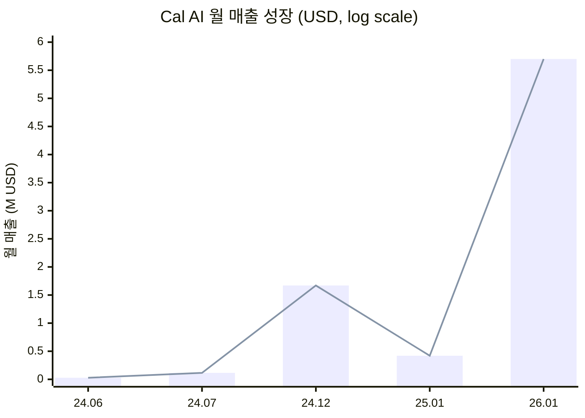
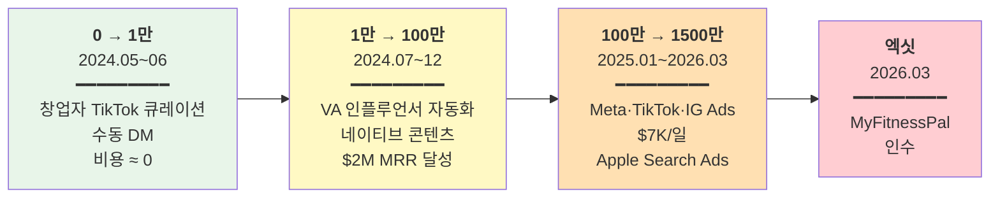

# Cal AI

> **Status**: Draft v1 / 2026-05-19  
> **분석자**: Claude (언어의숲 리서치)  
> **종합 한 줄**: 10대 부트스트랩 4인 팀이 AI 사진 칼로리 추적이라는 단일 메커닉으로 22개월 만에 ARR $50M·15M DL을 만들어 MyFitnessPal에 매각한, AI 네이티브 freemium의 신문법 케이스.

> 📸 **이미지 슬롯 안내**: 본 문서에는 핵심 이미지 7곳 슬롯이 표시되어 있습니다. 환경 네트워크 제약으로 자동 다운로드 불가 → 원본 소스에서 이미지를 받아 `research/images/01-cal-ai/` 폴더에 지정된 파일명으로 저장하면 자동 렌더링됩니다.

---

📸 **Slot 1 / Logo** — 원본: [Apple App Store](https://apps.apple.com/us/app/cal-ai-calorie-tracker/id6480417616) → 저장: `research/images/01-cal-ai/00-logo.png`

## 0. Quick Facts

| 항목 | 값 | 출처(Tier) |
|------|----|----|
| 회사명·앱명 | Cal AI (개발사 viraldevelopment) | [App Store][T2] |
| 본사·국가 | 미국 (창업 시 NY 롱아일랜드 Roslyn, 현 SF 추정) | [CBS New York][T2] |
| 창업 연·월 | 2024년 5월 | [TechCrunch][T2] |
| 창업자 | Zach Yadegari(17, CEO) / Henry Langmack / Blake Anderson(24) / Jake Castillo(30) | [CNBC][T2] |
| 현재 팀 규모 (매각 시점) | 정직원 7명 + 소규모 외주 | [TechCrunch][T2] |
| 누적 펀딩 | **$0 (100% 부트스트랩, VC 펀딩 없음)** | [TechCrunch][T2] |
| 추정 ARR | 2025년 매출 ~$30M / 2026.01 단월 $5.7M → ARR $50M+ | [My First Million][T1] |
| 누적 다운로드 (2026.03 매각 시점) | 15M+ | [eWeek][T2] |
| 카테고리 | Health & Fitness / 칼로리 트래커 |  |
| 주요 BM | 프리미엄 구독 (Day 1부터 paywall) |  |
| 매각 | 2025.12 deal close → 2026.03 발표, MyFitnessPal에 매각. 추정 $50M~ | [TechCrunch][T2] / [LinkedIn Thomas Smale][T2] |

---

## 1. 기업의 성장 과정

📸 **Slot 2 / 창업팀** — 원본: [TechCrunch 2025.03.16](https://techcrunch.com/2025/03/16/photo-calorie-app-cal-ai-downloaded-over-a-million-times-was-built-by-two-teenagers/) 또는 [CNBC 2025.09.06](https://www.cnbc.com/2025/09/06/cal-ai-how-a-teenage-ceo-built-a-fast-growing-calorie-tracking-app.html) → 저장: `research/images/01-cal-ai/01-founders.jpg`

### 1.1 창업 배경

**창업자 Zach Yadegari (b. 2007)의 사전 경력**:
- 7세: 어머니가 등록시킨 여름 코딩 캠프로 코딩 시작
- 10세: 시간당 $30로 코딩 과외 영업 (지역 페이스북 그룹에 홍보)
- 14세: 학교에서 차단된 게임 사이트를 우회하는 **"Totally Science"** 웹사이트 출시 (학교가 "Science"라는 단어가 들어가 차단 안 함)
- 16세: Totally Science를 약 $100K에 매각
- 17세 (2024.05): Cal AI 출시

**Cal AI 직전 시도 — Grind Clock (실패)**:
Henry Langmack과 함께 만든 첫 협업 프로젝트. David Goggins에서 영감받은 동기부여형 알람 앱. 출시 2주 만에 20K 다운로드 → 곧 모멘텀 상실 [Founderspedia][T3].

→ **알라미와 카테고리가 정확히 겹치는 실패 경험**. 이 실패가 Cal AI의 "단일 메커닉 + 즉각적 가치" 설계로 이어진 듯.

**Cal AI 창업 배경**:
- 문제: MyFitnessPal류는 수동 검색·입력이 너무 번거로움
- 가설: GPT-4 Vision API로 사진 한 장이면 칼로리·매크로 자동 추출 가능
- 실행: Zach가 부모님 집(NY Roslyn)에서 2024.05 출시. Henry는 코딩 캠프 시절 친구, Blake/Jake는 X(Twitter)에서 만남 [CNBC][T2].

### 1.2 연혁·마일스톤 (시계열)

| 연·월 | 사건 | 의미 | 출처 |
|-------|------|------|------|
| 2024.05 | Cal AI iOS·Android 동시 출시 | 시작점 | [TechCrunch][T2] |
| 2024.06 | 출시 1개월: 매출 ~$28K | 첫 PMF 신호 | [Yuanchang summary of MFM][T2] |
| 2024.07 | 2개월: 매출 ~$115K (4배 성장) | 인플루언서 마케팅 작동 | [Yuanchang][T2] |
| 2024.12 | $20M ARR 달성, MFM 첫 출연 (Ep 687) | "고등학생이 $20M/년" 화제 | [My First Million][T1] |
| 2025.01 | 일일 신규 DL 20K~30K, 누적 매출 $5M+ | 신년 다이어트 시즌 폭증 | [Getlatka][T3] |
| 2025.03 | 누적 DL 1M+ 돌파 | TechCrunch 첫 보도 | [TechCrunch][T2] |
| 2025.05 | 누적 매출 $9M | 1주년 시점 | [Getlatka][T3] |
| 2025.06 | Forbes 30 Under 30 선정 | 브랜드 정통성 확보 | [LinkedIn][T1] |
| 2025.09 | Zach Ivy League 15개 대학 모두 낙방 (창업가 정체성 강화 화제) | 마케팅 자산화 | [Fortune][T2] / [CollegeFix][T2] |
| 2025.12 | MyFitnessPal과 인수 deal 종결 | 엑싯 확정 | [TechCrunch][T2] |
| 2026.01 | 단월 매출 $5.7M → ARR $50M+ 도달 | 매각 직전 정점 | [MFM Ep 802][T1] |
| 2026.03.02 | MyFitnessPal 공식 인수 발표 | 청소년 창업 엑싯 화제 | [TechCrunch][T2] |
| 2026.04 | Apple, Cal AI 등 단속 시작 ("paywall 투명성") | 안티패턴 노출 | [TechCrunch][T2] |

### 1.3 결정적 변환지점 — 사용자 성장 3단계

**매출 성장 곡선** (마일스톤 표 1.2 기반):

> 📊 데이터: 24.06 $28K (Month 1) → 24.07 $115K (+311%) → 24.12 ~$1.67M/월 ($20M ARR) → 25.01 신년 폭증 후 누적 매출 $5M+ → 26.01 단월 $5.7M ($50M+ ARR). 출처: [MFM Ep 687·802][T1] / [Yuanchang][T2] / [Getlatka][T3]

**사용자 성장 3단계 채널 진화**:

#### 0 → 1만 (2024.05~2024.06, 1~2개월)
- **채널**: 창업자 본인이 **개인 TikTok 계정을 fitness/health 콘텐츠만 팔로우하도록 큐레이션** → 알고리즘이 타겟 크리에이터 노출 → **수동 DM**으로 인플루언서 컨택 [Yuanchang summary][T2]
- **의사결정**: VC 펀딩 안 받기, Day 1부터 paywall 세팅
- **비용**: 거의 0 (DM·창업자 인건비만)
- **트리거**: 음식 사진 → AI 결과 비교 영상이 TikTok 알고리즘에 자연 노출

#### 1만 → 10만 (2024.07~2024.12, ~6개월)
- **채널**: 인플루언서 **시스템화** — 처음엔 Zach 본인 DM → 이후 **버추얼 어시스턴트(VA) 팀**이 대량 DM 자동화
- **딜 구조**: 인플루언서 engagement·팔로워에 맞춰 **월 리테이너 + 다중 비디오 번들**로 단가 절감
- **콘텐츠 포맷**: "네이티브 스타일" — 광고처럼 안 보이는 일상 vlog 안에 자연스럽게 Cal AI 사용 장면 노출
- **결과**: $2M MRR까지 인플루언서로만 도달 [Yuanchang][T2]

#### 10만 → 1500만 (2025.01~2026.03, ~14개월)
- **채널 추가**: Meta · TikTok · Instagram **퍼포먼스 광고**
- **광고비**: 최대 **일 $7,000** ($210K/월) [Inc.][T2]
- **추가 채널**: **Apple Search Ads**로 MyFitnessPal 등 경쟁사 키워드 직접 점유
- **트리거**: 신년 결심 시즌 (2025.01) — 누적된 paywall A/B 테스트 결과가 폭증 트래픽과 만남

### 1.4 현재 상황 (2026.05 기준)

- **소유**: MyFitnessPal (2026.03 공식 인수)
- **팀**: 매각 시 정직원 7명 + 외주 [TechCrunch][T2]
- **매출**: 2025년 ~$30M, 2026.01 ARR $50M+ [MFM][T1]
- **누적 DL**: 15M+ [eWeek][T2]
- **부트스트랩 강도**: ★★★★★ (외부 펀딩 $0)

---

## 2. 프로덕트 관점 — LTV 높이는 방법

> LTV = 리텐션 × ARPU × 사용기간

### 2.1 리텐션 메커닉

📸 **Slot 4 / 코어 메커닉 스크린샷** — 원본: [Apple App Store 스크린샷](https://apps.apple.com/us/app/cal-ai-calorie-tracker/id6480417616) 또는 [Screensdesign UI Breakdown](https://screensdesign.com/showcase/cal-ai-calorie-tracker) → 저장: `research/images/01-cal-ai/03-app-core-screen.png`

**공개 지표**:
- 고객 유지율 30%+ (1개월 기준 추정) [Getlatka][T3]
- App Store 평점 4.8★ / 282K 리뷰 (또는 4.7★ / 155K — 출처마다 다름) [Sensor Tower / App Store][T2-T3]

> ⚠️ D1/D7/D30 정확한 리텐션은 비공개. 30%+ "유지율"이 어느 기간 기준인지 모호.

**Hook 모델 분석**:

| 단계 | Cal AI 구현 |
|------|-------------|
| **External Trigger** | TikTok 인플루언서 영상, 퍼포먼스 광고, 친구 추천 |
| **Internal Trigger** | 식사 직후 → "이거 칼로리 얼마지?" 호기심·죄책감 |
| **Action** | 음식 사진 한 장 촬영 (최소 행동) |
| **Variable Reward** | (1) AI 추정값의 정확도 reveal (게임적 흥미) (2) 매크로 차트 시각화 (3) 일일 목표 대비 진행률 |
| **Investment** | 온보딩 퀴즈로 만든 개인화 목표 + 일별 누적 식사 로그 → 끊으면 손해 |

**누적 자산**: 사용자의 일별 식사 로그가 시간이 갈수록 누적됨 → 끊기 어려워짐. (Forest의 "나무 숲" 누적 자산과 동일 매커니즘)

**알림**: 식사 시간대 푸시 트리거 (공개 자료에는 디테일 없음 — ❓ 추가 리서치 필요)

### 2.2 ARPU 레버

- **연 구독 우선** + 월·주 옵션 병행 → 연이 가장 저렴해 보이도록 anchoring
- **다이내믹 프라이싱** (Dynamic Pricing): 사용자 응답·기기·지역에 따라 가격 차등 노출 [NutriScan blog][T3]
  - 연: $19.99 ~ $29.99 (가장 흔한 가격 $29.99)
  - 월: $5.99 ~ $19.99 (가장 흔한 가격 $9.99)
  - 주: $2.49 ~ $2.99
- **A/B 가격 실험을 paywall 단에서 상시 운영** (아래 4.2 참조)

### 2.3 사용 빈도·세션
- **트리거 빈도**: 식사 시마다 = 하루 3~5회 (잠재 최대)
- **DAU/MAU**: 공개 데이터 없음 ❓
- **평균 세션 시간**: 공개 없음 ❓ (사진 촬영 → AI 결과 → 로그까지 30~60초 추정)

### 2.4 학습과학적 관점

해당 없음 (학습 앱 아님). 단, **행동변화 심리학**에서:
- 자기효능감(self-efficacy): "사진만 찍으면 끝" → 식단 관리의 진입장벽을 극단적으로 낮춤
- 즉시 피드백 루프: 사진 → 결과 0초 → 행동 강화

### 2.5 장단점·특이점

**🟢 장점**
- 단일 메커닉(사진→칼로리)이 명확하고 즉각적
- AI가 노동(수동 입력)을 0초로 대체 — **Cal AI 신문법의 핵심**
- 결과물 자체가 SNS에 자연 공유됨 (비포애프터 포맷)

**🔴 단점**
- AI 추정 정확도 ~90% 주장이지만 실사용 편차 큼 (사용자 리뷰)
- 다이내믹 프라이싱으로 사용자 불신 ("친구는 더 싸게 봤다")
- 3일 자동 갱신 트랩 — Apple이 2026.04 단속 시작 [TechCrunch][T2]

**🟡 특이점**
- MFM 팟캐스트 출연이 그 자체로 그로스 자산 (Forbes 30U30 연결까지)
- 창업자 본인이 마케팅 페르소나 (Ivy League 낙방 스토리 자산화)

---

## 3. 마케팅 관점 — CAC 낮추는 방법

### 3.1 주력 무료/저비용 채널 (초기)

| 채널 | 설명 | 효과 |
|------|------|------|
| **창업자 개인 TikTok 큐레이션** | health/fitness 콘텐츠만 팔로우·인터랙션 → 알고리즘이 타겟 크리에이터 노출 | 인플루언서 데이터베이스 자동 구축 |
| **수동 DM** | Zach 본인이 크리에이터에게 직접 DM, "써보고 솔직하게 리뷰해줘" | 초기 신뢰성 확보 |
| **MFM 팟캐스트 출연 (2회)** | "고등학생이 $20M/년" 화제성 | PR 무료 증폭 |
| **창업자 스토리 PR** | Ivy League 15개 낙방, Forbes 30U30 | 매체 자발 보도 |

### 3.2 바이럴·레퍼럴

📸 **Slot 5 / TikTok 콘텐츠 예시** — 원본: [TikTok 검색 "Cal AI"](https://www.tiktok.com/discover/cal-ai-app-review) — fitness 인플루언서가 음식 촬영 후 AI 결과 보여주는 네이티브 영상 캡처 → 저장: `research/images/01-cal-ai/04-tiktok-influencer.png`

- **산출물이 콘텐츠가 됨**: AI 추정 결과 화면 = TikTok 콘텐츠. "AI가 내 음식 칼로리 맞췄나?" 비포애프터 포맷이 알고리즘 친화적
- **공식 레퍼럴 프로그램 여부**: 공개 자료에 명시 없음 ❓
- **UGC**: 사용자가 자발적으로 결과 스크린샷 공유 → Cal AI 검색 트래픽 부메랑

### 3.3 퍼포먼스 마케팅

- **도입 시점**: 인플루언서 마케팅이 $2M MRR을 만든 **후에** 도입 (선후 명확)
- **플랫폼**: Meta (Facebook + Instagram), TikTok Ads
- **광고비**: **일 $7,000** (월 ~$210K) [Inc.][T2]
- **Apple Search Ads**: MyFitnessPal·Lose It 등 경쟁사 키워드 점유 (싸움터로 들어감)
- **인플루언서 단가 협상**: 월 리테이너 + 다중 비디오 번들로 비용 절감

### 3.4 브랜딩·커뮤니티

- **한 줄 메시지**: "사진 한 장으로 칼로리 추적" — 카테고리·차별점·약속이 한 줄에
- **비주얼**: 단순·기능적, 색상 톤 화이트/그린 (헬스 카테고리 표준)
- **커뮤니티**: 공식 디스코드·포럼 등 운영 안 함 (확인된 바 없음 ❓)

### 3.5 채널 효율

- 인플루언서 → 퍼포먼스 광고 → ASA 순으로 **CAC 단계별 진화**
- 정확한 CAC 비공개. 단 ARR $50M / 누적 DL 15M / 유지율 30%+를 역산하면 단위경제 매우 건강한 것으로 추정 (T3 추정)

---

## 4. 비즈니스 관점 — 결제전환·BM·Paywall

### 4.1 BM 구조

- **100% 구독** (광고·IAP 없음)
- 무료 사용자 = 무료체험 3일 카드 등록한 사람만
- 다른 사용자는 paywall 이전까지 사용 불가 (hard paywall)

### 4.2 Paywall 디자인 — **★ 핵심 차별화**

📸 **Slot 6 / 온보딩+Paywall 플로우** — 원본: [Adapty Paywall Library](https://adapty.io/paywall-library/cal-ai-food-calorie-tracker/) 또는 [Screensdesign](https://screensdesign.com/apps/cal-ai-calorie-tracker) — 온보딩 퀴즈 → 로딩 → paywall 4~5컷 합성 권장 → 저장: `research/images/01-cal-ai/05-onboarding-paywall.png`

**Superwall 케이스 스터디 데이터** [Superwall][T2]:

| 항목 | 수치 |
|------|------|
| 누적 paywall 실험 횟수 | **123건** (46개 trigger point에 걸쳐) |
| 온보딩 paywall 단독 실험 | **61건** |
| 실험 페이스 | 월 ~5건 (업계 상위 평균 14.7건보다 한참 빠름) |
| 트라이얼→유료 전환율 개선 | **+31%** |
| 월 매출 증가 (10개월) | **3배+** |
| 매출 중 온보딩 paywall 기여 | (업계 통념) 60~80% |

**Paywall 작동 구조**:
1. 다운로드 → **긴 온보딩 퀴즈** (목표 체중·활동량·식습관 등 1.5~2.5분 소요)
2. **"커스텀 플랜 생성 중" 로딩 화면** — 투입한 정보가 무의미하지 않음을 시각적으로 보여줌
3. 개인화된 일일 목표 (칼로리·매크로) 제시
4. **3일 무료체험 paywall** — 카드 등록 필수
5. 자동 갱신 (연 구독 default)

**심리적 레버**:
- **Sunk cost / Investment**: 2분 답변한 사용자는 "여기서 안 쓰면 시간 낭비"
- **Personalization Halo**: "내 데이터 기반"으로 보이는 플랜 → 가격 저항 ↓
- **Dynamic Pricing**: 사용자 응답 패턴별 최적 가격 표시

### 4.3 가격 구조

📸 **Slot 7 / 다이내믹 프라이싱** — 원본: [NutriScan 비교 분석](https://nutriscan.app/blog/posts/cal-ai-pricing-2026-monthly-yearly-premium-abc6e7b26f) — 동일 시점에 사용자별로 다른 가격 보이는 paywall 캡처 비교 → 저장: `research/images/01-cal-ai/06-dynamic-pricing.png`

| 플랜 | 가격 범위 | 비고 |
|------|----------|------|
| 주 | $2.49 ~ $2.99 | 가장 비싸 보이게 anchoring |
| 월 | $5.99 ~ $19.99 (주로 $9.99) | 다이내믹 |
| 연 | $19.99 ~ $29.99 (주로 $29.99) | default 추천 |

- **공식 사이트에 가격 비공개** — 다운로드 → 온보딩 끝까지 가야만 노출

### 4.4 무료체험 정책

- **3일 (카테고리 최단)** — 경쟁사 MyFitnessPal·MacroFactor·Lose It·NutriScan은 7일
- 카드 등록 필수
- 자동 갱신 default
- → 사용자 불만 다수, 캔슬 어려움 보고

### 4.5 전환율

- 트라이얼→유료 전환율 **+31% 개선** (시작 베이스라인 비공개)
- 업계 평균 추정 (Adapty 벤치마크): 헬스 카테고리 trial→paid ~30~40%
- Cal AI는 paywall 최적화로 **상위 5% 추정** [Adapty][T3]

---

## 5. 3-Stage Growth Loop 위치 매핑

### 5.1 현재 단계: **Stage 1 → Stage 3 직행** (S2 건너뜀)

| Stage | Cal AI 상황 |
|-------|--------------|
| Stage 1 (BEP) | Day 1 구독 paywall → 1개월 만에 $28K 매출. **수개월 내 BEP 도달** |
| Stage 2 (F2P·광고·micropayment 레이어) | **건너뜀**. 광고·IAP·F2P 없이 구독 단일 BM 유지 |
| Stage 3 (확장) | 22개월 만에 **MyFitnessPal에 매각 (d 옵션 — IP 매각·M&A)** |

### 5.2 단계 전환 트리거

- **S1 → S3 직행** 이유: AI 기술의 시간적 우위 + MyFitnessPal이라는 정확한 매수자 존재 + 10대 창업자 EXIT 매력
- 단계 진입 결정: 인플루언서 → 퍼포먼스 광고 전환이 단위경제 검증의 분기점

### 5.3 다음 단계 신호

- 매각 후 MyFitnessPal 산하 운영. 독립 브랜드 유지될지 통합될지 미정
- Zach는 차기 프로젝트 모색 중 (Inc.)

### 5.4 언어의숲이 배울 1가지

**"Stage 2 광고·F2P 레이어를 깔 시간에 Stage 3 매각으로 직행할 수 있다"** — AI 기술 우위는 시간 가치가 가장 크므로, **빠른 매각도 정당한 전략**.  
단 매수자가 명확해야 함 (MyFitnessPal처럼 같은 카테고리의 기존 1위가 AI 솔루션을 외부에서 사야 하는 상황).

→ 언어의숲의 경우: 듀오링고/Speak/유아/Cake 등이 잠재 매수자. 단, 매각이 목표가 아니라면 Stage 2 통과 설계 필요.

---

## 🟢 언어의숲이 가져갈 Top 3

### 1. **온보딩 = Paywall의 일부** (Investment 메커닉 직접 차용)
- 적용안: 1.5~2.5분 짜리 **"내 영어 진단 퀴즈"** → "당신만의 학습 플랜 생성 중" 로딩 → 개인화 학습 목표 제시 → 무료체험 paywall
- 효과: Sunk cost로 결제 저항 ↓
- 측정: 온보딩 완료율 / 완료 후 trial 시작률

### 2. **Day 1 Paywall + 단일 BM 집중** (광고·IAP 분산 X)
- 적용안: 출시일부터 구독 paywall. 광고·잡다한 IAP 모두 보류
- 효과: 단위경제 검증 빠름. 메시지·UX 일관성 ↑
- 측정: 첫 30일 trial→paid 전환율

### 3. **Paywall A/B 테스트를 운영의 한 축으로** (Superwall/Adapty식)
- 적용안: 출시 직후부터 paywall layout·문구·가격을 **월 5건 이상 실험**. Cal AI 페이스(123건/22개월)를 벤치마크
- 효과: 복리 효과 — 신년·신학기 등 트래픽 폭증 시점에 최적화된 paywall 보유
- 측정: 월별 실험 횟수 / trial→paid 컨버전 변화

### Bonus 인사이트
- **인플루언서 마케팅 시스템화** — 창업자 본인 계정으로 알고리즘 큐레이션 → VA로 DM 자동화. 언어의숲의 한국 영어학습 KOL 시장에 직접 적용 가능
- **퍼포먼스 광고는 후순위** — 인플루언서로 $2M MRR 만든 후에야 광고 도입. 단위경제 확인 전 광고비 태우지 말 것

---

## 🔴 안티패턴 (피할 것)

### 1. **3일 자동갱신 트랩 + 다이내믹 프라이싱 불투명성**
- 사용자 불만 폭주 → **Apple 단속 (2026.04)** → 매각 후 정책 변경 가능성
- 단기 매출은 좋지만 브랜드 신뢰·앱스토어 정책 리스크를 누적시킴
- **언어의숲은 7일+ 무료체험 + 명시적 가격 공개 권장**

### 2. **공식 사이트에 가격 미공개**
- SEO 부메랑·신뢰 손실. Apple도 이걸 단속 대상으로 지목
- 단기 CVR보다 장기 브랜드를 위해 가격은 공개해야 함

---

## ❓ 추가 리서치 필요

1. D1/D7/D30 정확한 리텐션 (Sensor Tower 유료 데이터 필요)
2. 일별 DAU/MAU 비율
3. 평균 세션 시간 (사진 촬영부터 로그까지)
4. 매각 deal 정확한 가격 (공개 안 됨)
5. 매각 후 MFP 산하 브랜드 유지 여부
6. 푸시·이메일 시퀀스 디테일
7. 한국·일본 등 동아시아 진출 여부

---

## References

### Tier 1 (1차 출처 — 창업자 본인·공식)
1. [My First Million — Ep 802: I built a $50M AI app in high school (and just sold it for...)](https://open.spotify.com/episode/5NH5DolRk68wShCamCIFSJ) — T1, accessed 2026-05-19
2. [My First Million — Ep 687: The high schooler making $20M a year](https://www.mfmpod.com/the-high-schooler-making-20m-a-year/) — T1, accessed 2026-05-19 (HTTP 403 on direct fetch, summary via PodPulse)
3. [Zach Yadegari LinkedIn](https://www.linkedin.com/in/zachyadegari/) — T1
4. [Cal AI 공식 사이트 — calai.app](https://www.calai.app/) — T1 (HTTP 403 on direct fetch)

### Tier 2 (검증 매체)
1. [TechCrunch — Photo calorie app Cal AI, downloaded over a million times, was built by two teenagers (2025.03.16)](https://techcrunch.com/2025/03/16/photo-calorie-app-cal-ai-downloaded-over-a-million-times-was-built-by-two-teenagers/) — T2
2. [TechCrunch — MyFitnessPal has acquired Cal AI (2026.03.02)](https://techcrunch.com/2026/03/02/myfitnesspal-has-acquired-cal-ai-the-viral-calorie-app-built-by-teens/) — T2
3. [TechCrunch — Apple's Cal AI crackdown signals it's still policing the App Store (2026.04.21)](https://techcrunch.com/2026/04/21/apples-cal-ai-crackdown-signals-its-still-policing-the-app-store/) — T2
4. [CNBC — Cal AI: How a teenage CEO built a fast-growing calorie-tracking app (2025.09.06)](https://www.cnbc.com/2025/09/06/cal-ai-how-a-teenage-ceo-built-a-fast-growing-calorie-tracking-app.html) — T2 (HTTP 403, search snippet)
5. [Inc. — He Built an AI App in High School, Made $40 Million, and Sold to MyFitnessPal](https://www.inc.com/ben-sherry/he-built-an-ai-app-in-high-school-made-40m-and-sold-to-myfitnesspal-now-hes-aiming-even-bigger/91307748) — T2
6. [Fortune — Gen Z founder treats college like vacation 30 million app by 18](https://fortune.com/2025/09/27/gen-z-founder-treats-college-like-vacation-30-million-app-by-18/) — T2
7. [CBS New York — 18-year-old from Long Island creates Cal AI calorie counting app worth millions](https://www.cbsnews.com/newyork/news/zach-yadegari-cal-ai-founder-long-island/) — T2
8. [eWeek — MyFitnessPal Buys Teens' Calorie App After 15M Downloads in 2 Years](https://www.eweek.com/news/myfitnesspal-acquires-cal-ai-teen-founders/) — T2
9. [Founded.com — Teenager built a $30M a year calorie app](https://www.founded.com/this-teenager-built-a-30m-a-year-calorie-app-in-high-school-then-sold-it-to-myfitnesspal-two-years-later/) — T2
10. [Yahoo Finance — MyFitnessPal acquired Cal AI](https://finance.yahoo.com/news/myfitnesspal-acquired-cal-ai-viral-140000003.html) — T2
11. [The College Fix — Teen behind $30 million AI app rejected from 15 colleges](https://www.thecollegefix.com/teen-behind-30-million-ai-app-rejected-from-15-colleges/) — T2
12. [Yuanchang's Blog — How a 19-Year-Old Built an AI App to $50M ARR and Sold It](https://yuanchang.org/en/posts/zach-yadegari-cal-ai-50m-exit/) — T2 (MFM 인터뷰 요약본)

### Tier 3 (업계 추정·케이스 스터디)
1. [Superwall — How Cal AI scaled paywall experimentation and grew monthly revenue 3x+ in 10 months](https://superwall.com/case-studies/cal-ai) — T3 (HTTP 403, 검색 스니펫)
2. [Adapty — Paywall Newsletter #22: From Calories to Conversions](https://adapty.io/blog/paywall-newsletter-22/) — T3
3. [Adapty Paywall Library — Cal AI Food Calorie Tracker](https://adapty.io/paywall-library/cal-ai-food-calorie-tracker/) — T3 (HTTP 403)
4. [Sensor Tower — Cal AI App Store Overview](https://app.sensortower.com/overview/6480417616?country=US) — T3
5. [Similarweb — Cal AI Google Play Stats](https://www.similarweb.com/app/google/com.viraldevelopment.calai/) — T3
6. [AppstoreSpy — Cal AI Trends Revenue Statistics](https://appstorespy.com/android-google-play/com.viraldevelopment.calai-trends-revenue-statistics-downloads-ratings) — T3
7. [Getlatka — How Cal AI Achieved $35 Million Revenue in Just One Year](https://getlatka.com/blog/how-cal-ai-achieved-35-million-revenue-in-just-one-year/) — T3
8. [NutriScan — Cal AI Pricing 2026 Monthly vs Yearly](https://nutriscan.app/blog/posts/cal-ai-pricing-2026-monthly-yearly-premium-abc6e7b26f) — T3
9. [NutriScan — Cal AI Free Trial: How to Cancel](https://nutriscan.app/blog/posts/cal-ai-free-trial-cancel-before-charged-0761ab8d00) — T3
10. [Founderspedia — Zach Yadegari Tech Founder of Cal AI](https://founderspedia.com/zach-yadegari/) — T3
11. [The Growth Hacking Lab — Calz AI case study](https://thegrowthhackinglab.com/case-studies/calz-ai-calorie-tracking-app-8-months-200k-month/) — T3 (HTTP 403)
12. [Screensdesign — Cal AI UI Breakdown](https://screensdesign.com/showcase/cal-ai-calorie-tracker) — T3 (HTTP 403)

### Tier 4 (동종 벤치마크)
1. [Adapty — State of In-App Subscriptions Report 2026](https://adapty.io/state-of-in-app-subscriptions-report/) — T4
