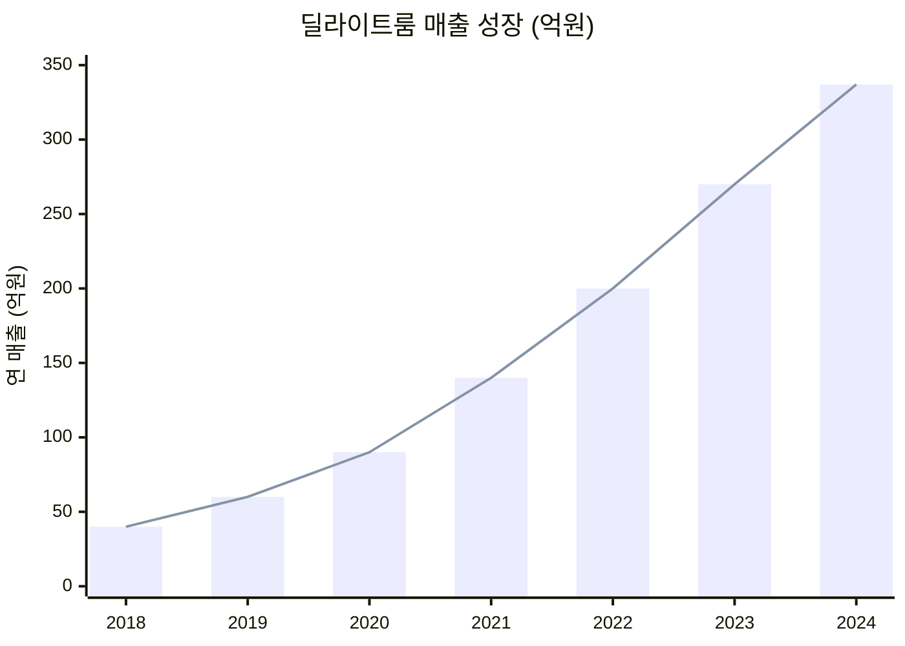
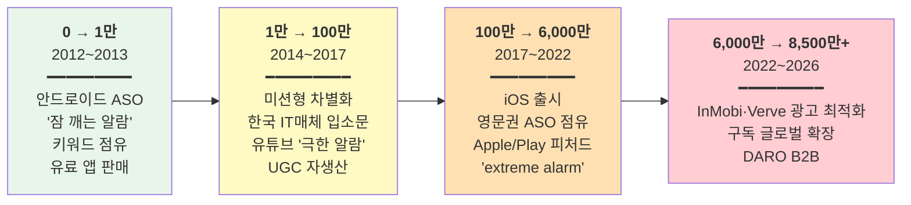
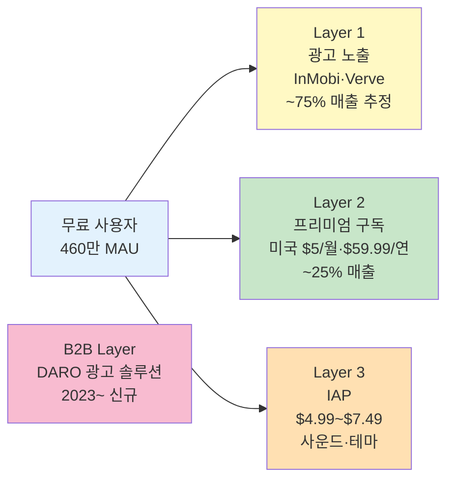
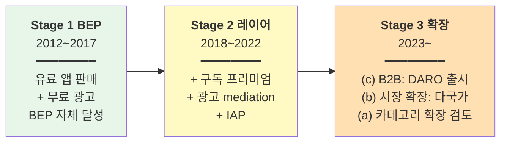

# 알라미 (Alarmy) — 딜라이트룸 (Delight Room)

> **Status**: Draft v1 / 2026-05-19  
> **분석자**: Claude (언어의숲 리서치)  
> **종합 한 줄**: 대학생이 만든 미션형 알람 앱이 12년 부트스트랩으로 100여 개국 1위·연매출 337억원·영업이익률 50%+를 만들어낸 한국 출발 글로벌 1위 유틸리티 앱. 광고→구독→광고솔루션(DARO) 3단 BM의 모범 사례.

---

## 0. Quick Facts

| 항목 | 값 | 출처(Tier) |
|------|----|----|
| 회사명·앱명 | 딜라이트룸 (Delight Room) / 알라미 (Alarmy) | [공식 사이트][T1] |
| 본사·국가 | 대한민국 서울 | [공식][T1] |
| 창업 연·월 | 2013년 5월 (앱은 2012년 학부생 시절 개발) | [디지털타임스][T2] |
| 창업자 | 신재명 (KAIST 대학원 전산학과 HCI) | [디지털타임스][T2] |
| 현재 팀 규모 | 70~80명 추정 (한국 본사) | [공식 채용][T1] |
| 누적 펀딩 | **외부 투자 거의 없음, 부트스트랩** | [채널톡 인터뷰][T2] |
| 2024 매출 | **337억원** (영업이익 190억원, 영업이익률 56%) | [와우테일 / ZDNet][T2] |
| 2021 매출 | ~140억원 ($11.21M), 3년간 +292.6% | [Verve case study][T3] |
| 누적 다운로드 | 7,500만~8,500만 (시점에 따라 다름, 2024~26) | [채널톡][T2] / [Verve][T3] |
| MAU / DAU (글로벌) | MAU 460만 / DAU 190~200만 (DAU/MAU ~41%) | [채널톡][T2] |
| 해외 사용자 비중 | **85%** | [InMobi case][T3] |
| 카테고리 | Utilities / Alarm Clock |  |
| 주요 BM | 광고(인앱) + 프리미엄 구독 + 광고 솔루션(DARO) |  |
| 1위 국가 수 | 100여 개국 (App Store 알람 카테고리) | [채널톡][T2] |

---

## 1. 기업의 성장 과정

### 1.1 창업 배경

**창업자 신재명**:
- 인하대 → KAIST 대학원 전산학과 HCI(Human-Computer Interaction) 전공
- 1989년생 추정 (2022 디지털타임스 인터뷰 33세)
- 학부 시절 본인이 **"아침에 알람을 화장실에 두고 자야 일어나는 사람"**이었음

**창업 영감** (직접 인용):
> "아침에 일어나기 위해 알람을 화장실에 두고 잤다. 그러던 중 해외에서 40만원짜리 알람시계가 크라우드펀딩 사이트에서 2억 원어치나 팔리는 것을 보고 내가 만들어도 되겠다는 생각이 들었다" — 신재명 [디지털타임스 2022][T2]

→ **PMF 가설**: "잠 못 깨는 사람들은 비싸도 사 줄 만큼 절박한 니즈가 있다"는 명확한 직관에서 출발.

**창업 결정**:
- 2012년 학부생 시절 개인 프로젝트로 안드로이드 앱 출시 → 유료(파는 앱)로 팔리기 시작
- 2013년 5월 딜라이트룸 법인 설립

### 1.2 연혁·마일스톤 (시계열)

| 연·월 | 사건 | 의미 | 출처 |
|-------|------|------|------|
| 2012 | 신재명, 학부 시절 안드로이드 알라미 개발 | 시작 | [디지털타임스][T2] |
| 2013.05 | 딜라이트룸 법인 설립 | 정식 사업화 | [디지털타임스][T2] |
| 2014~2017 | 미션형 알람(수학·사진·QR·흔들기) 강화 + 한국 인지도 | 차별화 확립 | [Verve][T3] |
| 2017 | iOS 출시 (안드로이드 우선 → iOS 확장) | 글로벌 채널 확장 | [Sensor Tower][T3] |
| 2018 | 구독 BM 본격 검토 시작 (당시 유틸리티 앱 중 구독 도입 사례 희소) | 의사결정 분기점 | [신재명 Medium][T1] |
| 2019 | 알라미 프리미엄(구독) 출시 | BM 다각화 | [신재명 Medium][T1] |
| 2021 | 매출 ~$11.21M(140억원 추정), 구독 비중 25%(33억원) | 구독 검증 완료 | [Indie Hackers][T3] / [Medium][T1] |
| 2022 | 누적 DL 6,000만 돌파, 170개국 사용 | 글로벌 1위 확립 | [디지털타임스][T2] |
| Q4 2022~Q4 2023 | InMobi·Verve 파트너십으로 광고 매출 54~80% 증가 | 광고 레이어 최적화 | [InMobi][T3] / [Verve][T3] |
| 2023 | **DARO(다로) 출시** — 앱 개발사 대상 광고 수익화 솔루션 (B2B 확장) | Stage 3 신호 | [채널톡][T2] |
| 2024 | **매출 337억원, 영업이익 190억원, 영업이익률 56%** | 흑자 정점 | [와우테일·ZDNet][T2] |
| 2025+ | 차세대 알람·수면 통합 앱(다로 연동) 로드맵 | "기본 알람 앱 대체" 비전 | [블로터 신재명 인터뷰][T2] |

### 1.3 결정적 변환지점 — 사용자 성장 3단계

**매출 성장 곡선**:

> 📊 데이터: 2024년은 [와우테일·ZDNet][T2] 확정치, 2021년은 [Indie Hackers $11.21M][T3] 환산, 그 외 연도는 "3년간 +292.6%" 역산 및 [채널톡 인터뷰][T2]의 "투자 없이 연매출 300억" 발언 기준으로 보간한 추정치. 2022·2023 값은 ±10% 오차.

**사용자 성장 3단계 채널 진화**:

#### 0 → 1만 (2012~2013, ~18개월)
- **채널**: 안드로이드 Google Play **유료 앱 카테고리** 등장 ("못 깨우는 사람들" 키워드)
- **의사결정**: 처음부터 **유료 앱으로 출시** (무료 + 광고가 아니라 paid app, 1~2달러)
- **비용**: 거의 0 (개인 학부생 인건비)
- **트리거**: "절박한 사람이 비싸도 산다"는 가설 검증

#### 1만 → 100만 (2014~2017, ~3~4년)
- **채널**: 미션형 알람의 차별성 → 한국 IT·생활 매체 입소문 + 유튜브에서 **"안 꺼지는 알람" 도전 영상** UGC 자생산
- **의사결정**: iOS 출시(2017) — 안드로이드 검증된 후 iOS 확장
- **비용**: 거의 0 (유료광고 X)
- **트리거**: "수학 풀어야 꺼지는 알람" 컨셉이 SNS·유튜브 콘텐츠로 자생

#### 100만 → 6,000만+ (2017~2022, ~5년)
- **채널**: 영문권 ASO ("alarm clock" 키워드 장기 점유) + Apple/Play 알람 카테고리 피처드 반복
- **의사결정**: 2019 구독 BM 출시, 2021~22 구독 글로벌 확장
- **비용**: 광고 비중 낮음, 오가닉 우선 (광고는 카테고리 위치 굳히는 보조)
- **트리거**: 영문권에서 "extreme/loud alarm" 검색 트래픽 점유 + 유튜브 리뷰어 자발 노출

### 1.4 현재 상황 (2024~2026.05)

- **조직**: 한국 본사 70~80명 추정 (정확한 규모는 비공개, 채용 페이지 기준)
- **매출**: 2024년 337억원, 영업이익 190억원, 영업이익률 56%
- **사용자**: MAU 460만, DAU 190~200만, 누적 DL 8,500만+
- **외부 투자**: 거의 없음. 자기자본 + 영업이익으로 운영
- **운영 철학**: "투자 없이 영업이익으로 사업 운영" — 신재명 CEO가 명시적으로 부트스트랩 추구

---

## 2. 프로덕트 관점 — LTV 높이는 방법

> LTV = 리텐션 × ARPU × 사용기간

### 2.1 리텐션 메커닉

**공개 지표**:
- **DAU/MAU ≈ 41%** (190만/460만) — 알람 앱치고 매우 높음. "매일 아침 켜는" 카테고리 특성
- **6,000만 DL → 460만 MAU = 잔존율 ~7.7%** (누적 기준, 장기 유지율은 카테고리 평균 대비 우수)

> ⚠️ D1/D7/D30 정확치는 비공개. 단 DAU/MAU 41%는 SNS·메신저 앱급 (참고: 일반 유틸리티 ~10~20%)

**Hook 모델 분석** — 알라미는 **외부 트리거 자체가 앱**인 독특한 경우:

| 단계 | 알라미 구현 |
|------|-------------|
| **External Trigger** | **알람 자체** — 사용자가 설정한 시간에 알람이 울림. 다른 어떤 앱보다 강제력 강함 |
| **Internal Trigger** | "이번엔 진짜 일어나야 한다"는 자기효능감 욕구 (반복 지각 경험) |
| **Action** | 미션 수행 (수학 풀기 / 사진 촬영 / QR 스캔 / 흔들기) — 의도적으로 **인지 부담 高** |
| **Variable Reward** | (1) 미션 성공/실패 (게임적 가변성) (2) 시간 내 일어났을 때 자아 만족 (3) "오늘 안 늦었다"는 즉각적 결과 |
| **Investment** | 알람 설정·미션 커스터마이징·수면 트래킹 데이터 누적 → 다른 앱으로 못 옮김 (스위칭 비용 ↑) |

**누적 자산**: 알람 패턴, 수면 데이터, 미션 설정 → Forest의 "나무 숲"·Cal AI의 "식사 로그"와 동급 sticky asset.

### 2.2 ARPU 레버

**다단 수익화 (3-Layer Stack)**:
1. **광고** (코어): 무료 사용자 인앱 광고. **InMobi·Verve 등 mediation 최적화로 ARPU ↑**
2. **구독 (Premium)**: 미국 월 $5 / 연 $59.99. 미션 3개까지 + 광고 제거 + 고급 미션·사운드
3. **일회성 IAP**: $4.99~$7.49 범위 (사운드팩·테마 등)

**ARPU 인상 레버**:
- 광고 mediation 최적화 (InMobi 80%↑, Verve 54%↑)
- 구독·IAP 가격 지역 차등 적용 (글로벌 진출 시 "구매력 낮은 나라 배려" 명시 [Medium 후기][T1])
- "58% 할인" 같은 가격 anchoring + 사용자 후기 paywall 도입 [Adapty][T3]

### 2.3 사용 빈도·세션
- **트리거 빈도**: 매일 아침 (최소 1회, 다중 알람 시 더 많음)
- **DAU/MAU 41%** — 카테고리 평균 대비 압도적
- 평균 세션 시간 비공개 (알람 종료까지 30초~수 분 추정)

### 2.4 학습과학적 관점

해당 없음 (학습 앱 아님). 단, **행동변화 심리학**에서:
- **자기효능감(self-efficacy)**: 미션 수행 후 일어나면 "오늘은 늦지 않았다"는 성공 경험 강화
- **인지부하 의도적 부여**: 일반 알람과 정반대 설계 — 잠을 완전히 깨우기 위해 의식적 노력 강제

### 2.5 장단점·특이점

**🟢 장점**
- "안 꺼지는 알람"이라는 한 줄 메시지로 카테고리 정의
- 매일 아침 강제 트리거 → 카테고리 내 가장 강력한 리텐션 메커니즘
- 광고+구독+IAP 멀티 레이어로 ARPU 다각화

**🔴 단점**
- 구독 도입이 카테고리 통념상 늦었음 (2019, 창업 7년 차)
- 핵심 메커닉(미션)이 한 번 익숙해지면 차별화 약화

**🟡 특이점**
- 신재명 본인이 [Medium][T1]·[채널톡][T2]·[블로터][T2] 등에서 운영 노하우를 적극 공개 → 그 자체가 PR 자산
- 영업이익률 56%는 SaaS·앱 카테고리에서도 극단치 (구글·메타 수준)

---

## 3. 마케팅 관점 — CAC 낮추는 방법

### 3.1 주력 무료/저비용 채널

| 채널 | 설명 | 효과 |
|------|------|------|
| **ASO 키워드 점유** | "alarm clock", "loud alarm", "extreme alarm" 등 영문 카테고리 키워드 장기 점유 | 100여 개국 1위의 핵심 동력 |
| **Apple·Play 피처드** | 알람 카테고리 1위 = 자동 추천 → 신규 트래픽 부메랑 | 광고비 0 |
| **유튜브 자발 UGC** | "알라미 안 꺼지는 알람 도전" 류 영상 자생산 | 무료 영문권 노출 |
| **신재명 본인 PR** | EO STUDIO·플래텀·아웃스탠딩·디지털타임스 인터뷰 | 한국 매체 자발 보도 |

### 3.2 바이럴·레퍼럴

- **산출물이 콘텐츠가 되는가**: ◎ — 안 꺼지는 알람 영상이 그 자체로 TikTok·유튜브 콘텐츠
- **공식 레퍼럴 프로그램**: 명시적 자료 없음 ❓
- **UGC 메커닉**: 사용자가 미션 실패·성공을 SNS에 자발적으로 공유 → 카테고리 인식 자생산

### 3.3 퍼포먼스 마케팅

- **유료광고 비중**: 매우 낮음 — 부트스트랩 운영 + 오가닉 우선 [채널톡][T2]
- 광고비 절감이 영업이익률 56%의 핵심 동력

### 3.4 브랜딩·커뮤니티

- **한 줄 메시지**: "무조건 깨워주는 알람" — 카테고리·차별점·약속 한 줄
- **비주얼**: 단순·강렬한 옐로우 톤
- **커뮤니티**: Medium의 딜라이트룸 채널에서 자체 블로그 운영 ([medium.com/delightroom][T1])

### 3.5 채널 효율

| 채널 | 추정 ROI |
|------|---------|
| ASO + 피처드 | ★★★★★ (메인 동력) |
| 유튜브 UGC | ★★★★ (자생산) |
| PR (신재명 인터뷰) | ★★★ (한국 인지도) |
| 유료광고 | ★ (거의 안 함) |

→ **알라미 = "광고비를 거의 안 쓰는데 100개국 1위"** 모델

---

## 4. 비즈니스 관점 — 결제전환·BM·Paywall

### 4.1 BM 구조 (3-Layer Stack)

> 매출 분포 추정 (2021 기준): 광고 ~75% / 구독 25% / IAP 미량 → 2024 시점은 구독 비중 더 ↑ 가능성

### 4.2 Paywall 디자인

- **무료체험 없음** — 구독 바로 결제 ([검색 결과 종합][T3])
- **Paywall 트리거**:
  - 신규 사용자: 온보딩 중간
  - 기존 무료 사용자: 미션 3개째 추가 시 (무료는 1개 제한)
- **심리적 레버**:
  - 사용자 후기 + "58% 할인" 가격 anchoring [Adapty paywall library][T3]
  - "광고 없이" + "고급 미션" 등 가치 명확

### 4.3 가격 구조

| 플랜 | 미국 | 한국 (추정) | 비고 |
|------|------|------------|------|
| 월 구독 | $5.00 | ~6,500원 | |
| 연 구독 | $59.99 | ~75,000원 | 연간 = 월 대비 12개월/$60 ≈ 月 환산 50% 할인 |
| IAP (사운드·테마) | $4.99 ~ $7.49 | ~6,500~9,900원 | |

- **지역 차등**: 명시적으로 "구매력 낮은 나라 배려"한 다국가 가격 설정 [Medium 글로벌 진출 후기][T1]
- **연간 우선 노출**: "Monthly보다 Yearly가 나은 이유" 자체 Medium에서 분석 공개 [Joon Won Lee Medium][T1]

### 4.4 무료체험 정책

- **무료체험 없음** — 직접 구독 모델 [JustUseApp 후기][T3]
- 대신 무료 버전이 충분히 사용 가능 (광고만 보면 됨)
- → **"무료에 만족하다가 미션 한도에 부딪힐 때 결제 유도"** 동선

### 4.5 전환율

- 무료→유료 전환율 비공개 ❓
- 단 460만 MAU + 2021 구독 매출 33억원 → 구독자 수 추정: ~50~100만 (가격 평균 $40 가정)
- → **유료 전환율 추정 10~20% (T3)** — 글로벌 유틸리티 평균 5~10% 대비 양호

---

## 5. 3-Stage Growth Loop 위치 매핑

### 5.1 현재 단계: **Stage 1 → Stage 2 → Stage 3 (모두 진행 중)**

| Stage | 알라미 상황 |
|-------|------------|
| **Stage 1 (BEP)** | 2012~2017 — 유료 앱 + 광고로 흑자 운영. 부트스트랩 |
| **Stage 2 (광고·F2P·micropayment 레이어)** | 2018~2022 — 구독 출시·다단 광고 mediation·IAP. **사용자 가설과 정확히 일치하는 경로** |
| **Stage 3 (노하우 확장)** | 2023~ — **(c) B2B DARO** + (b) 시장 확장 + (a) 차세대 앱 검토 |

### 5.2 단계 전환 트리거

- **S1 → S2 트리거 (2018~2019)**: 광고 매출의 한계 인식. 신재명이 직접 [Medium][T1]에서 "유틸리티 앱이 구독을 한다는 게 당시엔 이상하게 보였지만 LTV를 키울 유일한 방법" 회고
- **S2 → S3 트리거 (2023)**: 광고 mediation 노하우가 자체 솔루션화 가능하다는 자각 → **DARO 사내 분사**

### 5.3 다음 단계 신호

- DARO B2B 성장이 알라미 본 매출 일부 대체 가능성
- 차세대 알람·수면 통합 앱(블로터 인터뷰에서 신재명 직접 언급) — Stage 3 (a) 카테고리 복제

### 5.4 언어의숲이 배울 1가지

**"부트스트랩에서 영업이익률 50%+를 만들면 광고+구독+B2B 3단 스택이 자연히 누적된다"** — 첫 BM(광고 또는 유료)으로 BEP만 확실히 잡으면, 5~7년에 걸쳐 다음 레이어를 부담 없이 쌓을 수 있음.

→ 언어의숲 적용: 첫 BM(구독)으로 BEP → 2~3년 차 광고/IAP 검토 → 5년 차 B2B(교육기관 라이센싱) 검토.

---

## 🟢 언어의숲이 가져갈 Top 3

### 1. **"강제 트리거"를 제품 안에 심기** (알라미의 가장 강한 무기)
- 알라미의 알람 = 사용자가 무를 수 없는 외부 트리거. 매일 사용 강제.
- **적용안**: 언어의숲에서 **"매일 정해진 시간 영어 일기 알림 + 미루면 학습 누적 자산 부서짐"** 같은 강제력 메커닉. 단순 푸시가 아니라 사용자가 *반드시* 반응해야 하는 디자인.

### 2. **광고비 거의 안 쓰는 부트스트랩 글로벌화** (영업이익률 56%의 원리)
- 알라미는 유료광고 비중이 매우 낮음. ASO + 자발 UGC + 카테고리 피처드만으로 100여 개국 1위.
- **적용안**: 출시 후 6~12개월은 **유료광고 0**으로 운영. ASO 키워드("AI 영어 일기", "영어 작문 자동") 일찍 점유. 산출물(개인화 학습 자료)이 SNS에 자발 공유되도록 디자인.

### 3. **다단 BM 스택 (광고 + 구독 + B2B)** — 5년 뷰
- 알라미의 BM 진화: 유료 앱 → +광고 → +구독 → +B2B 솔루션
- **적용안**: 언어의숲도 처음엔 구독 단일 → 2년 차 광고·IAP → 5년 차 B2B(학원·학교 라이센싱 또는 코어 AI 기술 외부 판매). DARO 같은 자체 솔루션화 가능성도 염두에.

### Bonus 인사이트
- **창업자 본인이 운영 노하우 공개** — 신재명의 Medium·인터뷰가 그 자체로 신뢰·인지 자산. 언어의숲 창업자도 Medium·뉴스레터 운영 권장.
- **연간 구독 우선 노출** — 딜라이트룸이 자체적으로 "Yearly가 Monthly보다 나은 이유" 분석 공유함. 같은 결론.

---

## 🔴 안티패턴 (피할 것)

### 1. **구독 도입을 7년이나 늦춤 (2019)**
- 신재명 본인도 회고에서 "더 일찍 했어야 했다"는 뉘앙스
- 광고 only 모델로는 LTV 천장이 명확. 언어의숲은 **Day 1부터 구독**이 정답 (Cal AI 모델과 일치)

### 2. **카테고리 외 확장 더딤**
- 알라미는 알람 카테고리 외 신규 앱 출시가 12년간 미진. 단일 앱 의존도 高
- 언어의숲은 처음부터 "영어 학습 + 다국어" 같은 인접 카테고리 시드 일찍 깔아둘 것

---

## ❓ 추가 리서치 필요

1. 정확한 D1/D7/D30 리텐션
2. 구독자 수 절대치 (50만? 100만?)
3. 무료→유료 전환율 공식 수치
4. 한국 vs 미국 ARPU 차이
5. DARO 솔루션의 실제 B2B 매출 비중
6. 직원 정확 수 (70~80명은 추정)
7. 푸시·이메일 시퀀스 디테일

---

## References

### Tier 1 (1차 출처 — 창업자·공식)
1. [신재명 — 알라미 구독 모델 출시기 (Medium DelightRoom)](https://medium.com/delightroom/%EC%95%8C%EB%9D%BC%EB%AF%B8-%EA%B5%AC%EB%8F%85-%EB%AA%A8%EB%8D%B8-%EC%B6%9C%EC%8B%9C%EA%B8%B0-c79af31e839b) — T1, accessed 2026-05-19
2. [Joon Won Lee — 모바일 구독 상품 Yearly가 Monthly보다 나은 이유 (Medium)](https://medium.com/delightroom/%EB%AA%A8%EB%B0%94%EC%9D%BC-%EA%B5%AC%EB%8F%85-%EC%83%81%ED%92%88-yearly%EA%B0%80-monthly-%EB%B3%B4%EB%8B%A4-%EB%82%98%EC%9D%80-%EC%9D%B4%EC%9C%A0-9551f9e0f610) — T1
3. [DelightRoom — 알라미 구독 글로벌 진출 후기 (Medium)](https://medium.com/delightroom/%EC%95%8C%EB%9D%BC%EB%AF%B8-%EA%B5%AC%EB%8F%85-%EA%B8%80%EB%A1%9C%EB%B2%8C-%EC%A7%84%EC%B6%9C-%ED%9B%84%EA%B8%B0-475c0e058a06) — T1
4. [알라미 공식 (alar.my)](https://alar.my/en) — T1
5. [딜라이트룸 공식 채용·회사](https://alar.my/en/company) — T1

### Tier 2 (검증 매체)
1. [채널톡 — 투자 없이 연매출 300억, 알라미를 만든 흑자 DNA](https://channel.io/ko/blog/articles/interview-alamy-91d26dc1) — T2 (403 on direct fetch, 검색 스니펫 의존)
2. [디지털타임스 — 10년간 깎고 다듬은 '알라미'... 세계 170개 국가 아침 깨운다](http://www.dt.co.kr/contents.html?article_no=2022053102101231650001) — T2
3. [와우테일 — '알라미' 운영사 딜라이트룸, 24년 매출 337억원·영업익 190억원](https://wowtale.net/2025/01/17/236141/) — T2
4. [ZDNet Korea — 딜라이트룸, 작년 매출 337억·영업익 190억...영업이익률 50% 이상](https://zdnet.co.kr/view/?no=20250117153050) — T2
5. [블로터 — 신재명 딜라이트룸 대표 "알라미와 다로 잇는 수익화 플라이휠 구축"](https://www.bloter.net/news/articleView.html?idxno=636113) — T2
6. [스타트업투데이 — [스타트업 101 #43] 딜라이트룸, "알람 앱 '알라미'로 성공적인 아침 선사"](https://www.startuptoday.kr/news/articleView.html?idxno=45073) — T2
7. [메디게이트뉴스 — 투자 없이 200억 매출 '딜라이트룸'](https://medigatenews.com/news/326268163) — T2
8. [YouTube — 투자 없이 세계 1위 알람앱을 만들기까지 (딜라이트룸 신재명)](https://www.youtube.com/watch?v=qgmqEAoMXhs) — T2 (영상 인터뷰)
9. [YouTube — 알람 앱 하나로 97개국 1위 달성한 노하우](https://www.youtube.com/watch?v=QkCXXqUy3Ho) — T2

### Tier 3 (업계 추정·케이스 스터디)
1. [Indie Hackers — Alarmy: The $11 Million Alarm Clock App](https://www.indiehackers.com/post/alarmy-the-11-million-alarm-clock-app-c74024c017) — T3
2. [InMobi case study — DelightRoom Grows Global In-app Revenues by 80% with InMobi](https://advertising.inmobi.com/case-study/delight-room-partners-with-inmobi-to-grow-global-in-app-ad-revenues-by-80) — T3
3. [Verve case study — DelightRoom's Alarmy clocks record ad revenue growth](https://verve.com/case-studies/delightroom-alarmy/) — T3
4. [Airbridge case study — How world's premier alarm app Alarmy boosted ROAS](https://www.airbridge.io/en/case-studies/alarmy-roas-measurement) — T3
5. [Adapty Paywall Library — Alarmy](https://adapty.io/paywall-library/alarmy/) — T3
6. [Sensor Tower — Alarmy Publisher Overview](https://app.sensortower.com/publisher/ios/609598561) — T3
7. [THE VC — 딜라이트룸 기업정보](https://thevc.kr/delightroom) — T3
8. [Crunchbase — Alarmy Company Profile](https://www.crunchbase.com/organization/alarmy) — T3
9. [JustUseApp — Alarmy Reviews](https://justuseapp.com/en/app/1163786766/alarmy-morning-alarm-clock) — T3

### Tier 4 (동종 벤치마크)
1. [나무위키 — 알라미 (애플리케이션)](https://namu.wiki/w/%EC%95%8C%EB%9D%BC%EB%AF%B8(%EC%95%A0%ED%94%8C%EB%A6%AC%EC%BC%80%EC%9D%B4%EC%85%98)) — T4 (배경 참고)
