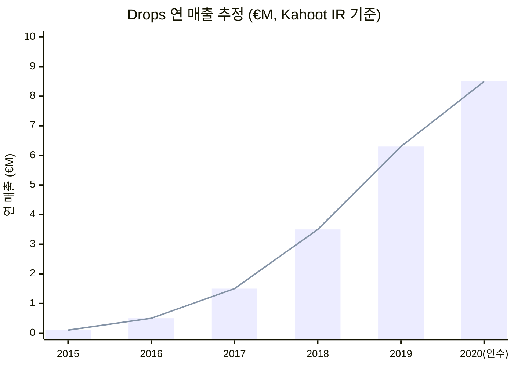
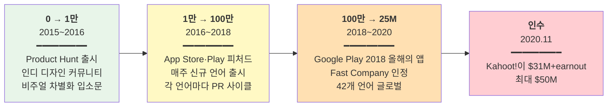
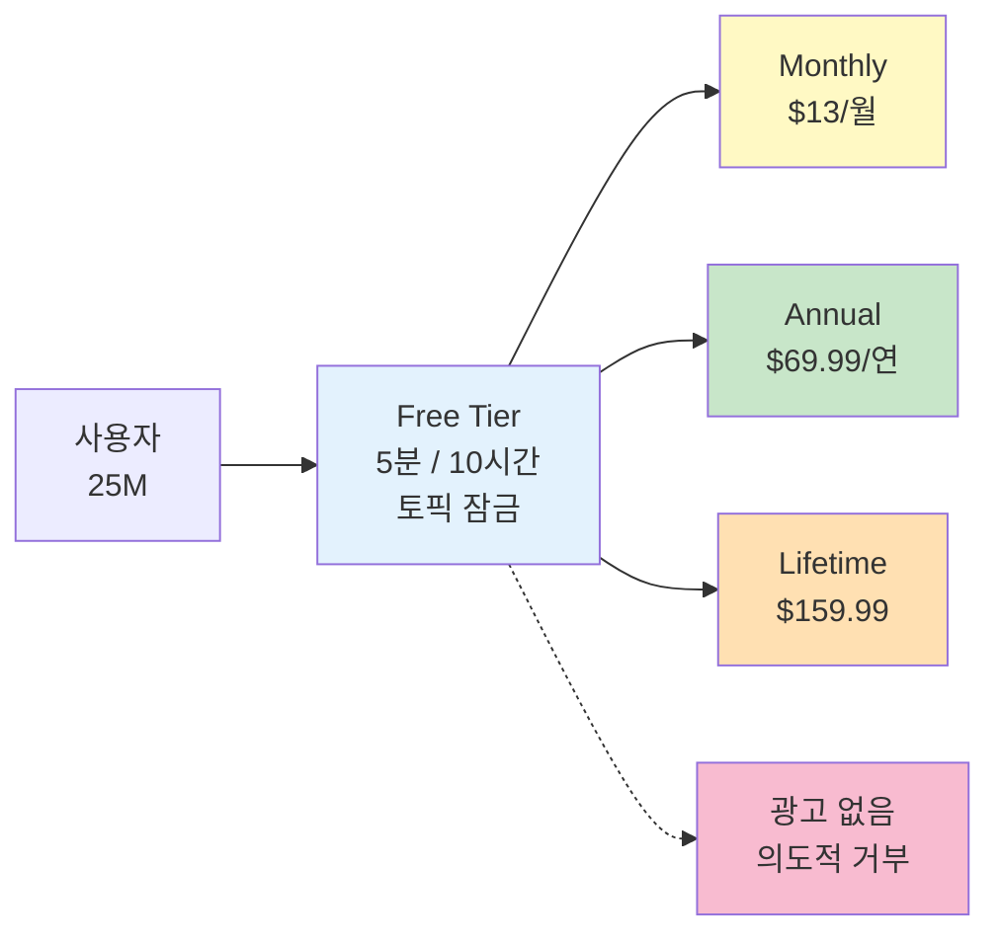
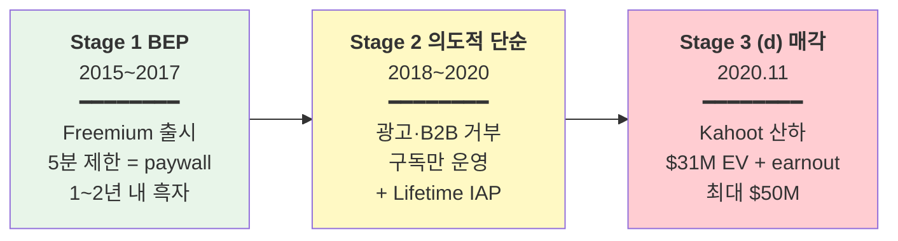

# Drops (Language Learning Games) — PlanB Labs

> **Status**: Draft v1 / 2026-05-19  
> **분석자**: Claude (언어의숲 리서치)  
> **종합 한 줄**: 헝가리 2인 창업자가 첫 앱 실패 후 "5분 제한 = 결핍의 BM"이라는 단일 메커닉으로 5년 만에 €6.3M 매출·25M 사용자·42개 언어를 만들어 Kahoot에 최대 $50M에 매각한, 언어학습 카테고리 부트스트랩→매각 풀사이클의 교과서.

---

## 0. Quick Facts

| 항목 | 값 | 출처(Tier) |
|------|----|----|
| 회사명·앱명 | PlanB Labs OÜ (에스토니아 법인) / Drops (Language Learning Games) | [Kahoot IR][T1] |
| 본사·국가 | 헝가리 부다페스트 (법인은 에스토니아) | [Wikipedia][T2] |
| 창업 연·월 | 2015 (Drops 출시) | [Kahoot 발표문][T1] |
| 창업자 | Daniel Farkas, Mark Szulyovszky (2인 공동창업) | [Kahoot 발표문][T1] |
| 첫 시도 (실패작) | LearnInvisible — 리텐션 실패로 폐기 후 Drops로 피벗 | [Kahoot 발표문][T1] |
| 누적 펀딩 | 부트스트랩 (외부 VC 거의 없음) | [TechCrunch][T2] |
| 2019 매출 | **€6.3M** (현금전환률 ~40% → 약 €2.5M 영업현금흐름) | [Kahoot 발표문][T1] |
| 매각 시점 사용자 | **25M** (Drops + Scripts 합산), 42개 언어 | [Kahoot 발표문][T1] |
| 인수 | **2020.11.24, Kahoot!** | [TechCrunch][T2] / [Kahoot IR][T1] |
| 인수가 | **$31M (Enterprise Value) + 최대 $19M earnout (2020-22 성과 연동) = 최대 $50M** | [PRNewswire][T2] / [TechCrunch][T2] |
| 매각 후 사용자 트래픽 (2024~) | 월 ~90K DL, 월 매출 ~$200K (성장 둔화) | [Sensor Tower 추정][T3] |
| 주요 BM | Freemium (5분/일 무료) + 구독 (월 $13 / 연 $69.99 / Lifetime $159.99) |  |
| 카테고리 | 언어 학습 |  |

---

## 1. 기업의 성장 과정

### 1.1 창업 배경

**창업자 Daniel Farkas & Mark Szulyovszky**:
- 헝가리 부다페스트 출신 2인 공동창업자
- 디자인·엔지니어링 백그라운드 (구체 학력 비공개)
- **첫 시도 LearnInvisible 실패** — 사용자 리텐션을 잡지 못함. 이 실패가 Drops의 "5분 제한" 디자인의 결정적 학습 소스

**Drops 창업 가설**:
> "언어 학습은 길게 하는 게 아니라 매일 짧게 해야 유지된다. 그렇다면 앱이 시간을 *짧게 강제* 하는 게 옳다." (Drops 디자인 철학)

→ 핵심 PMF: **"시간 제한 = 결핍 = 학습 가치 강화 + paywall 동인"** 세 가지를 한 메커닉으로 해결.

### 1.2 연혁·마일스톤 (시계열)

| 연·월 | 사건 | 의미 | 출처 |
|-------|------|------|------|
| 2015 | Drops 출시 (PlanB Labs) | 시작 | [Kahoot IR][T1] |
| 2016~2017 | 다국어 확장 시작, iOS·Android 동시 운영 | 카테고리 다각화 | [Wikipedia][T2] |
| 2018 | **Google Play "올해의 앱(App of the Year)"** | 글로벌 인지 폭증 | [Tracxn][T3] |
| 2019 | **Fast Company "가장 혁신적 기업 Top 50" (교육 분야 Top 10)** | 글로벌 위상 | [Fast Company][T2] |
| 2019 | **연간 매출 €6.3M, 현금전환률 ~40%** | 단위경제 강건 | [Kahoot 발표문][T1] |
| 2020.11.24 | **Kahoot!이 PlanB Labs 100% 인수 발표** ($31M + earnout 최대 $19M) | EXIT | [TechCrunch][T2] |
| 2021~2023 | Kahoot 산하 독립 브랜드로 운영, earnout 기간 성과 측정 | 통합 운영 시작 | [Kahoot IR][T1] |
| 2024~ | 월 다운로드 ~90K, 월 매출 ~$200K (피크 대비 둔화) | 성숙기 진입 | [Sensor Tower][T3] |

### 1.3 결정적 변환지점 — 사용자 성장 3단계

**매출 성장 곡선 (인수 시점까지)**:

> 📊 데이터: 2019 €6.3M은 [Kahoot 발표문][T1] 공식치. 그 외 연도는 "fastest-growing"·"25M users by acquisition"·"$31M EV"로 역산한 보간 추정 (오차 ±20%).

**사용자 성장 3단계 채널 진화**:

#### 0 → 1만 (2015~2016, ~12개월)
- **채널**: Product Hunt 출시 + 디자인 커뮤니티 (Drops의 미려한 비주얼이 디자인 블로거들 입소문)
- **의사결정**: **시간 제한(5분/일)** 도입 — 첫 출시부터 핵심 차별화
- **비용**: 0 (창업자 인건비만)
- **트리거**: "5분이면 학습이 된다고?" 라는 카피가 인디 커뮤니티 호기심 자극

#### 1만 → 100만 (2016~2018, ~2년)
- **채널**: Apple·Google의 **반복 피처드** + 매주~매월 **신규 언어 추가**할 때마다 **PR 사이클** 발동
- **의사결정**: 영어 외 일본어·한국어·아랍어·힌디어 등 **고난도 언어 우선 출시** → 다른 앱이 안 다루는 시장 점유
- **비용**: 광고비 거의 없음, 피처드 노출이 무료 채널
- **트리거**: 2018 Google Play 올해의 앱 선정 → 매체 자발 보도 폭증

#### 100만 → 2,500만 (2018~2020, ~2년)
- **채널**: 42개 언어 라인업 완성 → "다른 언어 앱들이 안 가르치는 언어"로 long-tail 점유
- **의사결정**: B2C freemium 유지, B2B(학교·기업) 진출은 거의 안 함 → 단순 단일 채널
- **비용**: 마케팅비는 매출의 한 자리수% 추정
- **트리거**: Fast Company "Most Innovative" + Apple 피처드 연쇄

### 1.4 현재 상황 (인수 이후)

- **소속**: Kahoot! 산하 독립 브랜드 운영
- **사용자**: 25M+ (인수 시점), 이후 정체 추정
- **매출**: 월 ~$200K (Sensor Tower 추정, 인수 전 €6.3M/년 = 월 €525K 대비 ~50% 감소)
- **성장 둔화 원인**: Kahoot 산하 통합 후 신규 기능 출시 둔화 + Duolingo·Babbel 등 경쟁 격화 추정

---

## 2. 프로덕트 관점 — LTV 높이는 방법

> LTV = 리텐션 × ARPU × 사용기간

### 2.1 리텐션 메커닉

**공개 지표** — Drops의 D1/D7/D30은 공개 없음. 단 "fastest-growing language platform"·"40% cash conversion"이 간접 지표.

**Hook 모델 분석** — Drops는 **"의도된 결핍"**이 Hook의 핵심:

| 단계 | Drops 구현 |
|------|-------------|
| **External Trigger** | 일일 알림 ("오늘의 5분을 잊지 마세요") |
| **Internal Trigger** | "내일은 단어를 모르면 안 된다"는 학습 불안 + 짧은 시간 안에 끝낼 수 있다는 안도감 |
| **Action** | 5분 게임 시작 (스와이프 기반 단어 매칭) |
| **Variable Reward** | (1) 단어 맞춤·실패의 게임적 가변성 (2) 시각적 일러스트 카드 reveal (3) 일일 progress |
| **Investment** | 진도·통계 누적 + 잠금 해제한 토픽 + 스트릭. **5분 부족하면 결제로 해소** |

**누적 자산**: 진도·토픽 잠금 해제·스트릭 → 다른 언어 앱으로 옮기면 다 잃음.

**시간 제한의 효과**:
- 무료 사용자: 5분 → "더 하고 싶은데 막혔다" → **즉시 결제 유도**
- 학습자 입장에서도 5분이 인지부하 적정 (학습과학 합치)

### 2.2 ARPU 레버

| 플랜 | 가격 | 비고 |
|------|------|------|
| 무료 | $0 | 5분/10시간, 토픽 잠금 |
| Monthly Premium | $13/월 | |
| Annual Premium | $69.99/연 | 월 환산 $5.83 (월 대비 55% ↓) |
| Lifetime | $159.99 | 일시불 |

- **Lifetime 옵션 제공** — 카테고리에서 보기 드문 강한 선택지. 가격 anchoring으로 연간 결제 유도
- **Tough Word Dojo, 추가 테스트, 광고 제거** 등 프리미엄 기능

### 2.3 사용 빈도·세션
- **세션 길이**: 무료 사용자 강제 5분 = 가장 짧은 학습 앱 중 하나
- **트리거 빈도**: 일 1회 권장 (10시간 쿨다운)
- **DAU/MAU**: 비공개 ❓

### 2.4 학습과학적 관점

Drops는 학습과학적으로 **여러 원리를 정교하게 결합**:

- **인지부하 (Cognitive Load)**: 5분 = 단기 작업기억 한계 내. Sweller의 인지부하 이론 합치
- **인출 기반 (Retrieval Practice)**: 단어 매칭 게임이 회상 행위 강제
- **간격 반복 (Spaced Repetition)**: 학습한 단어가 며칠 후 다시 등장
- **자기효능감 (Self-efficacy)**: 5분이라는 부담 없는 시간이 매일 성공 경험 축적
- **시각 부호화 (Dual-coding)**: 단어 + 일러스트 = 두 채널 동시 기억

→ **학습과학 + 게임 + BM이 한 메커닉(5분 제한)에 응축**된 드문 케이스.

### 2.5 장단점·특이점

**🟢 장점**
- 5분 제한이 학습 가치·BM·리텐션을 동시에 해결
- 42개 언어로 long-tail 사용자 흡수
- 시각 디자인이 강한 브랜드 자산

**🔴 단점**
- 5분 제한이 "심도 있는 학습"엔 부족 — FluentU 등 일부 리뷰는 "fluent 만들기엔 한계" 지적
- Lifetime 옵션이 LTV 천장을 빨리 확정시킴 (단점 평가는 논쟁적)

**🟡 특이점**
- Kahoot에 매각 후 성장 둔화 — Stage 3 (d) IP 매각 후 자율성 감소가 성장 정체로 이어진 사례

---

## 3. 마케팅 관점 — CAC 낮추는 방법

### 3.1 주력 무료/저비용 채널

| 채널 | 설명 | 효과 |
|------|------|------|
| **Apple·Google 피처드** | 2018 Google Play 올해의 앱 + Apple Editor's Choice 반복 | 메인 트래픽 동력 |
| **신규 언어 PR 사이클** | 새 언어 출시할 때마다 매체 보도 + 해당 언어권 검색 점유 | 비용 0 PR |
| **디자인 커뮤니티 입소문** | 미려한 비주얼이 디자인 블로그·SNS 자발 공유 | 인디 단계 핵심 |
| **Fast Company "Most Innovative" 등 어워드** | 어워드 자체가 PR 자산 | 신뢰도·브랜드 강화 |

### 3.2 바이럴·레퍼럴

- **산출물이 콘텐츠가 되는가**: ◯ — 미려한 단어 카드 스크린샷이 SNS에 공유 가능 (단, Alarmy·Cal AI보다 약함)
- **공식 레퍼럴 프로그램**: 명시적 자료 없음 ❓
- **UGC**: 학습 스크린샷·스트릭 공유 가능

### 3.3 퍼포먼스 마케팅

- **유료광고 비중**: 매우 낮음. 매출 €6.3M에 cash conversion 40%면 광고비 자체가 작아야 가능
- 광고 도입을 **의도적으로 피함** (광고는 학습 가치 훼손)
- → Drops는 **광고 0 + freemium + 시간 제한**이라는 엄격한 BM 디자인 고수

### 3.4 브랜딩·커뮤니티

- **한 줄 메시지**: "5분, 매일, 언어 학습" — 시간·빈도·결과를 한 줄에 약속
- **비주얼 아이덴티티**: 그라데이션 + 미니멀 일러스트 (Drops 브랜드 자산 핵심)
- **커뮤니티 운영**: 명시적 자료 없음 (Reddit 등에서 자발 토론은 있음)

### 3.5 채널 효율

| 채널 | 추정 ROI |
|------|---------|
| Apple·Google 피처드 | ★★★★★ (주력) |
| 신규 언어 PR | ★★★★ (반복 사이클) |
| 디자인 커뮤니티 | ★★★ (초기) |
| 어워드 | ★★★ (브랜드 강화) |
| 유료광고 | ★ (거의 안 함) |

→ Drops = **"피처드와 PR만으로 25M 사용자 만든 케이스"**

---

## 4. 비즈니스 관점 — 결제전환·BM·Paywall

### 4.1 BM 구조

- **광고 없음** — 의도적 결정. 학습 가치 훼손 회피
- **무료체험 없음** — 무료 tier 자체가 충분히 사용 가능 (다만 5분 제한)
- 100% 구독·일회성 결제로 매출 발생

### 4.2 Paywall 디자인

- **Paywall 트리거 위치**:
  1. **5분 한도 도달 시** — 가장 강한 트리거 ("계속하려면 Premium")
  2. **잠긴 토픽 진입 시** — "이 토픽을 무료로 풀려면 게임 진행 / 즉시 풀려면 Premium"
- **심리적 레버**:
  - **결핍 (Scarcity)**: 5분 제한이 그 자체로 결제 동인
  - **Lifetime 옵션**: "월 결제 vs 평생" anchoring으로 연 결제 유도

### 4.3 가격 구조

| 플랜 | 가격 | 월 환산 | 비고 |
|------|------|--------|------|
| Monthly | $13 | $13 | 가장 비싸 보이는 anchor |
| Annual | $69.99 | $5.83 | 월 대비 55% 할인 — default 추천 |
| Lifetime | $159.99 | — | 연 대비 ~28개월 환산. "장기 학습자" 타깃 |

- **지역 차등**: 명시적 자료 부족 ❓

### 4.4 무료체험 정책

- **무료체험 없음** — 무료 tier 자체가 영구적으로 5분/일 제공
- → "체험"이 아니라 "결핍 유지" 모델

### 4.5 전환율

- 무료→유료 전환율 비공개 ❓
- 단 €6.3M 매출 / ~25M 사용자(인수 시점) → ARPDU $0.25/년 (대부분 무료) → 유료 전환율 ~3~5% 추정 (T3)
- 언어학습 freemium 평균 2~3% 대비 양호

---

## 5. 3-Stage Growth Loop 위치 매핑

### 5.1 현재 단계: **S1 → S2 (의도적 단순화) → S3 (d) 매각**

| Stage | Drops 상황 |
|-------|-----------|
| **Stage 1 (BEP)** | 2015~2017 — Freemium + 5분 제한으로 빠른 BEP |
| **Stage 2 (광고·F2P·B2B 레이어)** | **의도적 거부** — 광고 도입 안 함, B2B 진출 안 함. Lifetime IAP 정도만 추가 |
| **Stage 3 (확장)** | (d) Kahoot에 매각 (2020.11) — IP 매각·M&A 방식 |

### 5.2 단계 전환 트리거

- **S1 → S2**: 단위경제 빠르게 검증되자 광고 추가 유혹을 명시적으로 거부. 학습 가치 보호.
- **S2 → S3 (d)**: Kahoot가 글로벌 게임형 학습 플랫폼으로서 Drops를 정확하게 보완하는 매수자였음 + 창업자들이 운영 피로 후 EXIT 선택 추정.

### 5.3 다음 단계 신호

- 인수 후 5년이 지나면서 성장 둔화 → Kahoot 산하 통합 운영의 한계 신호
- 차세대 언어 학습 앱(Speak, Cake AI 등)이 AI 기능으로 침투 → Drops 차별화 약화

### 5.4 언어의숲이 배울 1가지

**"광고를 의도적으로 거부하는 게 옳을 수 있다 (학습 가치 보호 우선)"** — Drops는 freemium에서 광고 옵션을 끝까지 거부했음. 학습 카테고리는 광고가 가치 훼손하는 case가 많음. 언어의숲도 광고 없이 구독 단일 BM 유지 권장.

---

## 🟢 언어의숲이 가져갈 Top 3

### 1. **"시간 제한 = 결핍의 BM"** (Drops의 시그니처)
- 5분/10시간 제한이 학습 가치·paywall·리텐션을 한 메커닉으로 해결
- **적용안**: 언어의숲은 "**하루 1편 영어 일기 → AI 학습자료 무료**, 2편째부터 Premium" 또는 "5분 학습 영상 무료, 더 하려면 결제". 결핍을 명시적 BM 트리거로 사용.

### 2. **광고 거부 + 구독·Lifetime 만 운영** (학습 카테고리 안티-광고 원칙)
- Drops는 광고를 의도적으로 거부. 학습 가치 훼손 회피.
- **적용안**: 언어의숲도 **첫 5년 광고 도입 금지**. 구독·IAP·B2B만으로 매출 만들기. (단, Alarmy는 광고로 성공 — 카테고리 차이 인식)

### 3. **신규 언어/카테고리 출시 = 무료 PR 사이클** (Drops의 그로스 엔진)
- 새 언어를 출시할 때마다 매체 보도·해당 언어권 검색 점유·앱스토어 피처드를 동시 트리거
- **적용안**: 언어의숲도 "이번 달 영어 → 다음 분기 일본어 → 다음 분기 스페인어" 식으로 단계적 출시. 매 출시가 PR 자산.

### Bonus 인사이트
- **Lifetime 옵션 도입 고려** — 가격 anchoring으로 연 구독 전환율 ↑
- **42개 언어 long-tail 점유** — 메이저 앱이 안 다루는 언어를 우선 출시. Drops가 일본어·아랍어 등으로 점유한 것처럼.

---

## 🔴 안티패턴 (피할 것)

### 1. **매각 후 성장 둔화** (Stage 3 (d) 매각의 리스크)
- Drops는 Kahoot 산하 5년간 성장 정체. 자율성·민첩성 손실로 추정
- 언어의숲은 EXIT을 고려하더라도 **인수자 선택 신중** + **earnout 조건으로 통제권 일부 유지** 권장

### 2. **5분 제한의 양면성** — 학습 깊이 부족 우려
- FluentU 등 비평적 리뷰: "5분으론 fluent 안 된다"
- 언어의숲은 **AI 개인화로 깊이도 보완** — Drops가 못 한 부분

---

## ❓ 추가 리서치 필요

1. 정확한 D1/D7/D30 리텐션
2. 무료→유료 전환율 공식치
3. 0→1만 단계의 정확한 PR·커뮤니티 디테일
4. Lifetime 가입자 비중
5. 매각 후 earnout 실제 지급액 ($19M 다 받았는지)
6. 5년 후 Drops 매출·MAU 실측치
7. Kahoot 산하에서 의사결정권 변화

---

## References

### Tier 1 (1차 출처 — 회사·인수자 공식)
1. [Kahoot! — Kahoot! acquires Drops to make language learning more awesome (2020.11.24)](https://kahoot.com/investor/announcements/kahoot-acquires-drops-to-make-language-learning-awesome/) — T1
2. [Drops 공식 사이트 About](https://languagedrops.com/about) — T1
3. [Drops 공식 — Kahoot acquires Drops 발표](https://languagedrops.com/press-releases/kahoot-acquires-drops-to-make-language-learning-more-awesome) — T1
4. [Drops Help Center — Free vs Premium](https://support.languagedrops.com/hc/en-us/articles/19824401360019-Drops-Free-vs-Premium-What-are-the-Features-and-Differences) — T1
5. [Drops 공식 LinkedIn](https://www.linkedin.com/company/languagedrops) — T1

### Tier 2 (검증 매체)
1. [TechCrunch — Kahoot drops $50M on Drops (2020.11.24)](https://techcrunch.com/2020/11/24/kahoot-drops-50m-on-drops-to-add-language-learning-to-its-gamified-education-stable/) — T2
2. [PRNewswire — Kahoot! acquires Drops](https://www.prnewswire.com/news-releases/kahoot-acquires-drops-to-make-language-learning-more-awesome-301179459.html) — T2
3. [NewsnReleases — Kahoot! acquires Drops for an enterprise value of $31 million](https://newsnreleases.com/2020/11/24/kahoot-acquires-drops-for-an-enterprise-value-of-31-million/) — T2
4. [Wikipedia — Drops (app)](https://en.wikipedia.org/wiki/Drops_(app)) — T2
5. [FluentU — Drops App Review](https://www.fluentu.com/blog/reviews/drops-language-app/) — T2
6. [Sorainen — Kahoot acquires Drops (M&A deal)](https://www.sorainen.com/deals/kahoot-acquires-drops/) — T2

### Tier 3 (업계 추정)
1. [Tracxn — Drops 2025 Company Profile](https://tracxn.com/d/companies/drops/__shFSqtRjmJHoiNB4_3QhA80Xz4izl4LBTi2moOwc9oc) — T3
2. [Sensor Tower — Drops App Overview](https://app.sensortower.com/overview/939540371?country=US) — T3
3. [Drops App Store page](https://apps.apple.com/us/app/drops-language-learning-games/id939540371) — T3

### Tier 4 (동종 벤치마크)
1. [Adapty — Freemium Monetization Models](https://adapty.io/blog/freemium-app-monetization-strategies/) — T4
