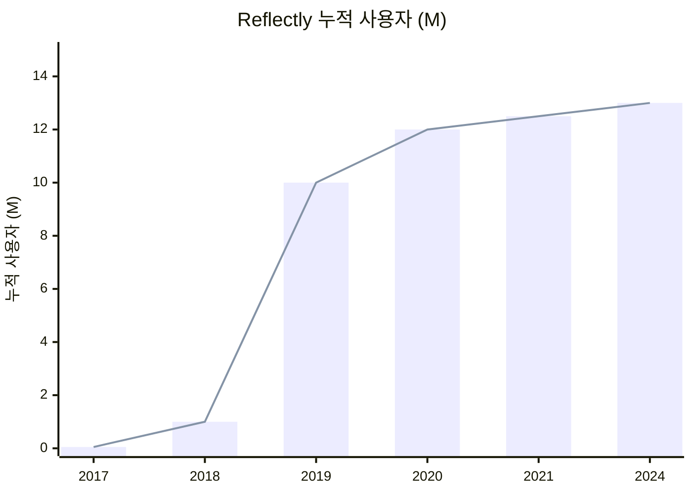
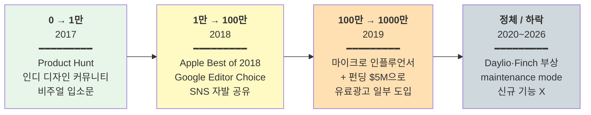
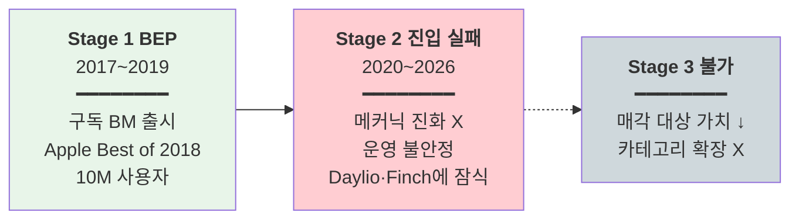

# Reflectly — Reflective Technologies ApS

> **Status**: Draft v1 / 2026-05-19  
> **분석자**: Claude (언어의숲 리서치)  
> **종합 한 줄**: 덴마크 3인 창업팀이 AI 기반 일기 + 미려한 디자인으로 2년 만에 0→10M 사용자 폭증·Apple Best of 2018을 만들었으나, 메커닉 진화·운영 안정성 미흡으로 Stage 2 진입에 실패하고 Daylio·Finch에 점유율을 잃은 **"Stage 2 실패의 교훈" 케이스**.

> ⚠️ **수정**: 이전 가벼운 비교에서 Reflectly를 "100% 부트스트랩"으로 기재했으나, 실제로는 2018년 DKK 5M (~$770K) 시드 + 2019년 $4.3M 펀딩을 받음. **"소규모 펀딩 + 인디스러운 운영"** 분류가 정확함.

---

## 0. Quick Facts

| 항목 | 값 | 출처(Tier) |
|------|----|----|
| 회사명·앱명 | Reflective Technologies ApS / Reflectly | [공식 사이트][T1] |
| 본사·국가 | 덴마크 코펜하겐 (창업자들은 Aarhus University 배경) | [Aarhus University 동문 기사][T2] |
| 창업 연·월 | **2017** (Tracxn은 2016 표기, 다수 매체는 2017) | [Crunchbase][T3] |
| 창업자 | **Daniel Vestergaard, Jakob Brøgger-Mikkelsen, Jacob Kristensen** (3인) | [BusinessofApps][T2] |
| 누적 펀딩 | **~$5M** (2018 DKK 5M 시드 + 2019 $4.3M) — 소규모 펀딩 | [Nordic9][T2] / [BusinessofApps][T2] |
| 누적 사용자 (2019 말) | **10M+** (12개월 만에 2M → 10M) | [BusinessofApps][T2] |
| 유료 구독자 (2019 말) | **~250K** (12개월 만에 4x) | [BusinessofApps][T2] |
| 매출 규모 | 추정 ARR ~$15M (2019 피크) → 2024~ 정체·하락 | [Sensor Tower 추정][T3] |
| 카테고리 | Health & Fitness / Journaling |  |
| 주요 BM | Freemium + 구독 (월 $9.99 / 연 $59.99) |  |
| 주요 수상 | **Apple Best of 2018**, Google Editor's Choice | [Medium Jakob Brøgger][T1] |
| 현재 상태 | "Maintenance mode" — 신규 기능 출시 둔화, Daylio·Finch에 점유 잠식 | [Marlvel intel report 2026][T3] |

---

## 1. 기업의 성장 과정

### 1.1 창업 배경

**창업자 3인** (모두 Aarhus University IT Product Development 동문):
- Daniel Vestergaard
- Jakob Brøgger-Mikkelsen
- Jacob Kristensen

**창업 배경**:
- 셋 다 학부 시절부터 다른 회사 웹·모바일 앱 외주로 기술·자본 축적
- 자기계발·AI 개인화에 대한 공통 관심사 → **"마음챙김을 모두에게 접근 가능하게"** 미션
- 부트스트랩이 아니라 **소규모 외부 자금 + 인디적 운영** 조합

### 1.2 연혁·마일스톤 (시계열)

| 연·월 | 사건 | 의미 | 출처 |
|-------|------|------|------|
| 2017 | Reflective Technologies ApS 창업, Reflectly 출시 | 시작 | [Crunchbase][T3] |
| 2018 | **Apple Best of 2018 선정** ("self-care" 카테고리) + Google Editor's Choice | 폭발적 노출 | [Medium Jakob][T1] |
| 2018 말 | **1M 사용자 돌파** (1년 만에 1000% 성장) | PMF 검증 | [Medium Jakob][T1] |
| 2018 | DKK 5M (~$770K) 시드 펀딩 (Nordic 액셀러레이터·엔젤) | 자본 조달 | [Nordic9][T2] |
| 2019 | $4.3M 추가 펀딩 | Series Seed/A | [BusinessofApps][T2] |
| 2019 말 | **2M → 10M 사용자 (12개월 만에 5x)** + 유료구독자 ~250K (4x) | Peak | [BusinessofApps][T2] |
| 2020 | 코로나로 mental health 카테고리 트래픽 ↑ — 단기 호황 | 외부 호재 | [Sensor Tower][T3] |
| 2021~2023 | 신규 기능 출시 둔화. Daylio·Stoic·Finch 부상 | 경쟁 압박 | [Marlvel 분석][T3] |
| 2024~2026 | **Maintenance mode** 진입 (로그인 오류·데이터 손실 신고) → 유료 사용자 이탈 | Stage 2 실패 신호 | [Marlvel][T3] |

### 1.3 결정적 변환지점 — 사용자 성장 3단계

**사용자 성장 곡선**:

> 📊 데이터: 2018 1M·2019 10M은 [Medium Jakob][T1]·[BusinessofApps][T2] 확정치. 2020~24 값은 [Sensor Tower 추정][T3] 보간 — Stage 2 실패로 정체 곡선.

**사용자 성장 3단계 채널 진화**:

#### 0 → 1만 (2017, ~12개월)
- **채널**: Product Hunt + 디자인 블로그 + Indie Hackers
- **트리거**: 그라데이션·Stories 풍의 미려한 비주얼 = SNS 친화적

#### 1만 → 100만 (2018, ~12개월)
- **채널**: **Apple Best of 2018** → App Store 메인 노출 무한 반복
- **외부 호재**: Apple이 2018 핵심 트렌드로 "self-care"를 선정
- **트리거**: AI 가이드 일기라는 컨셉 + 비주얼이 Instagram Stories에 그대로 공유 가능

#### 100만 → 1000만 (2019, ~12개월)
- **채널**: 펀딩 $5M로 마이크로 인플루언서·유료광고 일부 도입
- **트리거**: mental health 메가 트렌드 + 1세대 사용자 자발 공유

#### Stage 2 실패 (2020~)
- 신규 기능 출시 둔화
- Daylio(아이콘 기반 빠른 입력)·Stoic·Finch(가상 펫)에 점유율 잠식
- 운영 불안정 (로그인 실패·데이터 손실 신고)

### 1.4 현재 상황 (2024~2026.05)

- **사용자**: 누적 ~13M, MAU 정체
- **유료 구독자**: 이탈 보고 (Marlvel 분석)
- **매출**: ARR 정점 대비 50%+ 하락 추정
- **상태**: maintenance mode

---

## 2. 프로덕트 관점 — LTV 높이는 방법

> LTV = 리텐션 × ARPU × 사용기간

### 2.1 리텐션 메커닉

**Hook 모델 분석**:

| 단계 | Reflectly 구현 |
|------|---------------|
| **External Trigger** | 일일 알림 ("오늘 어땠어요?") |
| **Internal Trigger** | 감정 정리 욕구 + 자기성찰 |
| **Action** | 기분 선택 → AI 가이드 질문 답변 (1~3분) |
| **Variable Reward** | AI 응답·감정 통계 시각화·과거 일기 회상 |
| **Investment** | 일기·기분 데이터 누적 → 옮기기 어려움 |

**문제점 (Stage 2 실패 원인)**:
- Action(일기 작성)이 Daylio의 아이콘 선택(10초) 대비 시간 부담 ↑ → 리텐션 약화
- 5년간 리텐션 메커닉 거의 변화 없음

### 2.2 ARPU 레버

| 플랜 | 가격 |
|------|------|
| 무료 | $0 (기본 일기·기분 트래킹) |
| Monthly | $9.99 |
| Annual | $59.99 |

- Lifetime 옵션 없음
- 무료체험 일부 시점에 제공 (현재 정책 불확실)

### 2.3 사용 빈도·세션
- 일 1회 권장 (저녁 일기 시간대)
- 세션 길이: 1~3분
- DAU/MAU 비공개 ❓

### 2.4 학습과학적 관점

해당 카테고리는 학습이 아닌 **저널링·마음챙김**. 단:
- **Self-reflection**: 일기 메타인지로 자기조절·자기효능감 ↑
- **Expressive Writing (Pennebaker 연구)**: 감정을 글로 쓰는 행위 자체가 정신 건강에 긍정적
- → 이론 기반은 견고했지만 운영이 못 따라감

### 2.5 장단점·특이점

**🟢 장점**
- 일기 데이터 누적 메커닉이 sticky
- 비주얼 디자인이 강력한 브랜드 자산

**🔴 단점**
- 메커닉 진화 부재 (5년간 동일)
- 운영 안정성 문제 (로그인 오류·데이터 손실)
- 경쟁자 진입 속도 추월

**🟡 특이점**
- 펀딩을 받았는데도 운영을 키우지 못함 → **자금만으론 Stage 2 못 넘는다**는 반례

---

## 3. 마케팅 관점 — CAC 낮추는 방법

### 3.1 주력 무료 채널

| 채널 | 효과 |
|------|------|
| **Apple Best of 2018** | ★★★★★ — Reflectly의 단일 최대 그로스 이벤트 |
| Google Editor's Choice | ★★★★ |
| Instagram Stories 자발 공유 | ★★★★ — 미려한 일기 캡처가 그대로 콘텐츠 |
| Product Hunt | ★★★ (초기) |

### 3.2 바이럴·레퍼럴

- **산출물이 콘텐츠가 되는가**: ◎ — 사용자가 일기·기분 차트 스크린샷을 SNS에 자발 공유. 디자인이 곧 마케팅
- **공식 레퍼럴**: 명시적 자료 없음 ❓

### 3.3 퍼포먼스 마케팅
- 2019 펀딩 이후 일부 유료광고 도입
- 단 채널·비용 디테일 비공개

### 3.4 브랜딩·커뮤니티
- **한 줄 메시지**: "A Journal for Happiness"
- 비주얼 아이덴티티가 카테고리 최강

### 3.5 채널 효율
- Apple 피처드 의존도 매우 高 → 이후 노출 감소 시 그로스 정체

---

## 4. 비즈니스 관점 — 결제전환·BM·Paywall

### 4.1 BM 구조

- 100% Freemium + 구독
- 광고 없음 (학습·웰빙 카테고리 표준)
- IAP 없음

### 4.2 Paywall 디자인

- 온보딩 후 즉시 paywall 노출 (구체 디자인은 [Adapty paywall library][T3] 참조)
- 무료 사용자도 기본 기능은 영구 사용 가능
- 프리미엄: 광고 X + AI 가이드 무제한 + 추가 통계

### 4.3 가격 구조

| 플랜 | 가격 | 월 환산 |
|------|------|--------|
| Monthly | $9.99 | $9.99 |
| Annual | $59.99 | $5.00 (월 대비 50%↓) |

### 4.4 무료체험
- 시기별 정책 변화 있음 (현재 불확실 ❓)

### 4.5 전환율
- 2019 시점 구독자 250K / 사용자 10M = **2.5% 유료 전환율**
- 카테고리 평균 1~3% 대비 양호했으나 이후 정체

---

## 5. 3-Stage Growth Loop 위치 매핑

### 5.1 현재 단계: **S1 → S2 진입 실패**

| Stage | Reflectly 상황 |
|-------|---------------|
| **Stage 1 (BEP)** | 2017~2019 — Freemium 구독으로 흑자, 펀딩까지 받음 |
| **Stage 2 (광고·F2P·micropayment·확장 레이어)** | **진입 실패** — 메커닉 진화 못 함, 경쟁자에 잠식 |
| **Stage 3 (확장)** | 불가 — 매각 대상으로서의 가치도 약화 |

### 5.2 단계 전환 트리거 (실패 원인)

- **운영 부재**: 펀딩 받은 후 신규 기능 출시 페이스가 떨어짐
- **경쟁자 등장**: Daylio(2014~)가 아이콘 기반 빠른 입력으로 차별화, Finch(2019~)가 가상 펫 게이미피케이션으로 차별화
- **제품 진화 없음**: 일기 작성이 너무 무거운 액션이라는 피드백을 5년간 무시

### 5.3 다음 단계 신호 (현재)

- maintenance mode 지속 시 사용자 이탈 가속
- 매각 가능성: 매수자가 가격 압박 (잔존 사용자 자산 정도)

### 5.4 언어의숲이 배울 1가지

**"펀딩 받았다고 Stage 2가 자동으로 되지 않는다 — 메커닉을 계속 진화시켜야 한다"** — Reflectly는 자본은 있었으나 제품 운영 페이스가 떨어졌고, 경쟁자가 같은 카테고리의 다른 메커닉(Daylio 아이콘 입력, Finch 가상 펫)으로 침투했음. 언어의숲은 **분기마다 한 가지 신규 메커닉** 출시 페이스를 의무화 권장.

---

## 🟢 언어의숲이 가져갈 Top 3

### 1. **산출물 비주얼이 곧 마케팅 자산** (Reflectly의 단일 강점)
- 일기·기분 차트 디자인이 SNS에 자발 공유 가능
- **적용안**: 언어의숲의 학습 결과물(영어 일기·진도 리포트·AI 피드백)도 **공유 가능한 비주얼**로 디자인. Instagram Stories 비율로 자동 export.

### 2. **Apple Best of / Google Editor's Choice 노림** (Reflectly의 단일 최대 그로스 이벤트)
- Reflectly의 1M → 10M 폭증은 사실상 Apple Best of 2018 한 방
- **적용안**: 출시 초기부터 Apple Design Award 기준에 맞춘 UX·접근성·비주얼 투자. 어워드 신청 시기를 그로스 플랜에 명시.

### 3. **분기별 신규 메커닉 출시 페이스 의무화** (Reflectly가 실패한 지점)
- Reflectly는 5년간 핵심 메커닉(AI 가이드 일기) 거의 변화 없음 → 잠식
- **적용안**: 언어의숲은 **분기 1회 이상 신규 학습 메커닉 출시** (예: Q1 일기→영상, Q2 일기→대화, Q3 음성→대본, Q4 발음 코칭). 진화 페이스가 곧 해자.

### Bonus 인사이트
- **운영 안정성 = 리텐션의 근간** — 로그인 오류·데이터 손실 같은 기본기를 잃으면 회복 불가
- **3인 공동창업자 모델** — 디자인·엔지니어링·제품 분담. 언어의숲도 비슷한 분담 권장

---

## 🔴 안티패턴 (피할 것)

### 1. **펀딩 후 운영 페이스 둔화 (가장 큰 함정)**
- 자본이 들어오면 채용·매니지먼트에 시간 분산 → 제품 운영 페이스 ↓
- 언어의숲이 펀딩 받게 될 경우 **제품 출시 페이스 KPI를 분기마다 의무화**

### 2. **카테고리 단일 메커닉 고수**
- Reflectly의 "AI 가이드 일기"가 너무 무거운 액션이라는 피드백을 5년 무시
- 사용자 피드백·이탈 분석을 통한 **메커닉 진화 의사결정**을 분기마다 강제

### 3. **운영 안정성 무시**
- 로그인 실패·데이터 손실 같은 기본기를 잃으면 사용자 신뢰 회복 불가
- 언어의숲은 출시일부터 **백업·복구·로그인 SLA 99.9%** 이상 운영

---

## ❓ 추가 리서치 필요

1. 정확한 D1/D7/D30 리텐션 (피크·현재)
2. 운영팀 규모 변화 (펀딩 후 채용 늘었는지)
3. 매출 정점 정확한 시점·금액
4. 매각 시도·협상 이력
5. 창업자 인터뷰 (Pivot 또는 Exit 의향)
6. Daylio·Finch 부상 시점 비교

---

## References

### Tier 1 (1차 출처)
1. [Jakob Brøgger-Mikkelsen — Why we grew more than 1000% and surpassed 1,000,000 users in 2018 (Medium)](https://medium.com/@jakobbrggermikkelsen/why-we-grew-more-than-1000-and-surpassed-1-000-000-users-in-2018-98198e70857c) — T1
2. [Reflectly 공식 사이트](https://reflectlyapp.com/) — T1

### Tier 2 (검증 매체)
1. [BusinessofApps — Mental health app Reflectly raises $4.3 million amid sharp user growth](https://www.businessofapps.com/news/mental-health-app-reflectly-raises-4-3-million-amid-sharp-user-growth/) — T2
2. [Nordic9 — Reflectly secures $770k](https://nordic9.com/news/reflectly-secures-dkk-5m-for-a-mobile-app-ai-based-personal-journal-news9955865409/) — T2
3. [Aarhus University CS — IT-Product development alumnus have created app with 10 million users](https://cs.au.dk/news-events/news/show-news/artikel/it-product-development-alumnus-have-created-app-with-10-million-users) — T2
4. [TechSavvy — Reflectly: Fra idé til verdensledende mental-app på 3 år (덴마크어)](https://techsavvy.media/reflectly-fra-ide-til-verdensledende-mental-app-paa-3-aar/) — T2
5. [ChoosingTherapy — Reflectly App Review 2024](https://www.choosingtherapy.com/reflectly-app-review/) — T2

### Tier 3 (업계 추정·평가)
1. [Sensor Tower — Reflective Technologies Publisher Overview](https://app.sensortower.com/ios/publisher/reflectly-aps/469957278) — T3
2. [Marlvel Intel Report — Reflectly 2026 Review](https://marlvel.ai/intel-report/health-fitness/reflectly-journal-ai-diary) — T3
3. [Tracxn — Reflectly Company Profile](https://tracxn.com/d/companies/reflectly/__wsshogrPyXc3oWbnVxQpSUXv8csfyJ-MxqGjHRa0Djc) — T3
4. [Crunchbase — Reflectly Company Profile](https://www.crunchbase.com/organization/reflectly) — T3
5. [Dealroom — Reflectly company information](https://app.dealroom.co/companies/reflectly) — T3
6. [Sensor Tower — Reflectly App Overview US](https://app.sensortower.com/overview/1241229134?country=US) — T3
7. [SaaSHub — Reflectly Alternatives & Competitors](https://www.saashub.com/reflectly-alternatives) — T3

### Tier 4 (동종 벤치마크)
1. [yourLumira — Daylio vs Reflectly vs yourLumira](https://www.yourlumira.com/blog/daylio-vs-reflectly-vs-yourlumira) — T4
2. [MindfulSuite — Best Guided Journaling Apps 2026](https://www.mindfulsuite.com/reviews/best-guided-journaling-apps) — T4
