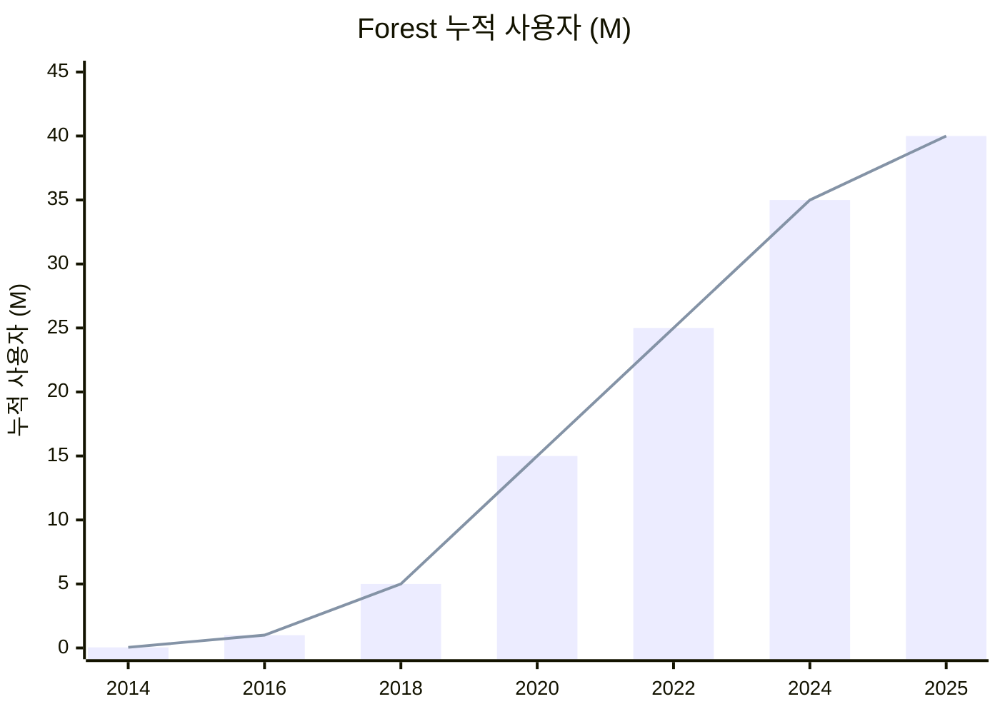
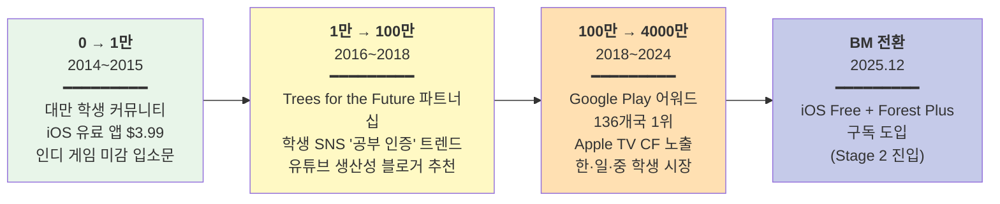
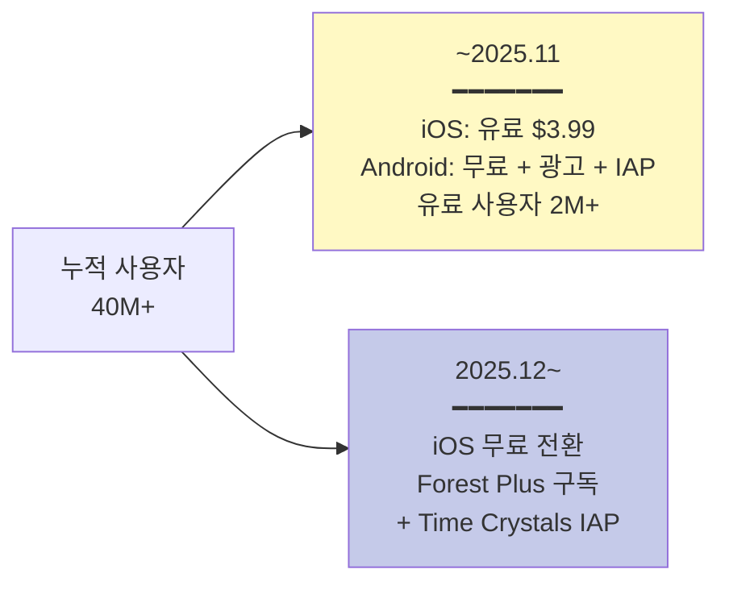
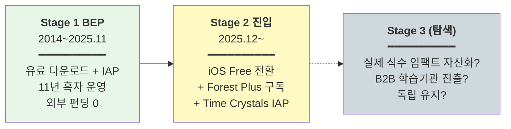

# Forest — Seekrtech Co., Ltd.

> **Status**: Draft v1 / 2026-05-19  
> **분석자**: Claude (언어의숲 리서치)  
> **종합 한 줄**: 대만 2인 부부 창업팀이 "가상 나무를 심고 실제 나무를 기부한다"는 메타포 메커닉 하나로 11년 동안 풀타임 10~15명만 유지하며 40M+ 사용자·136개국 1위·실제 나무 200만+ 식수까지 도달한, **부트스트랩 강도 5사 중 최강** 사례.

> ⚠️ **사전 가설 수정**: 이전에 "Apple Design Award 2018 수상"이라 적었으나 확인 결과 **Google Play Editors' Choice 2018 (Productivity)** 및 **Google Play Best Self-improvement 2018 (9개국)** 이 정확함. Apple Design Award는 미확인.

---

## 0. Quick Facts

| 항목 | 값 | 출처(Tier) |
|------|----|----|
| 회사명·앱명 | Seekrtech Co., Ltd. / Forest: Focus for Productivity | [공식 사이트][T1] |
| 본사·국가 | 대만 (타이난·타이베이 추정) | [Seekrtech 공식][T1] |
| 창업 연·월 | 2014.05 (Forest iOS 출시) | [Wikipedia][T2] |
| 창업자 | **Marcus Pi (Shaokan Pi)** + **Amy Cheng (Amy Jeng)** — 2인 부부 공동창업 | [TaiwanPlus Facebook][T2] |
| 누적 펀딩 | **$0 — 100% 부트스트랩** (외부 펀딩 0건 확인) | [Dealroom][T3] |
| 현재 팀 규모 | 풀타임 10~15명 (소수정예 유지) | [Seekrtech 공식][T1] |
| 누적 사용자 (2025.01) | **40M+** | [Grokipedia / AppSamurai][T2] |
| 유료 사용자 | **2M+** | [Apple App Store / AppGrooves][T2] |
| 월 다운로드 (피크) | **1.73M/월** | [Appstor.io 추정][T3] |
| 1위 국가 수 | **136개국 Productivity 카테고리** | [AppGrooves][T2] |
| 실제 식수 | **200만+ (2025 기준, 일부 자료는 212K+)** | [Trees for the Future][T2] / [Wikipedia][T2] |
| 주요 BM (2025.12 이전) | iOS 유료 다운로드 ($3.99) + IAP / Android 광고 + IAP |  |
| 주요 BM (2025.12~) | **Free + Forest Plus 구독** + IAP (Time Crystals) | [Wikipedia][T2] |
| 주요 수상 | 2018 Google Play Editors' Choice (Productivity), 2018 Google Play Best Self-improvement (9개국) | [Seekrtech][T1] |
| 카테고리 | Productivity |  |

---

## 1. 기업의 성장 과정

### 1.1 창업 배경

**창업자 Marcus Pi + Amy Cheng** (부부):
- 대만 대학생 시절부터 협업
- **Seekrtech**는 두 사람이 만든 작은 스튜디오로 시작
- 학생·지식근로자의 **집중력 문제**를 본인들이 겪으면서 가설 도출

**Forest 창업 가설**:
> "스마트폰 사용을 강제로 막는 게 아니라, **가상 나무를 죽이고 싶지 않은 마음**을 이용하면 사람들이 자발적으로 집중할 것이다." (게이미피케이션 핵심)

→ **"가상 자산 + 도덕적 부담 + 실제 사회 가치"** 3가지를 한 메커닉에 묶음 = Forest의 시그니처.

### 1.2 연혁·마일스톤 (시계열)

| 연·월 | 사건 | 의미 | 출처 |
|-------|------|------|------|
| 2014.05 | Forest iOS 출시 (유료 앱 $3.99) | 시작 | [Wikipedia][T2] |
| 2015~2016 | Android 출시 (Freemium + IAP) | 다플랫폼 | [Wikipedia][T2] |
| 2016~2017 | **Trees for the Future 파트너십 발표** — 가상 코인 → 실제 나무 기부 | 시그니처 차별화 | [Trees for the Future][T2] |
| 2018 | **Google Play Editors' Choice (Productivity)** 수상 + Best Self-improvement 9개국 | 글로벌 인지 폭증 | [Seekrtech][T1] |
| 2019~2022 | 학생·지식근로자 코어 팬덤 형성, Asia·EU에서 Apple "Amazing Apps" TV CF 노출 | 브랜드 강화 | [AppGrooves][T2] |
| 2023~2024 | 누적 사용자 30~40M, 실제 나무 식수 200만 그루 달성 | 가시적 임팩트 | [공식][T1] |
| **2025.12** | **BM 대전환** — iOS도 무료 다운로드 + **Forest Plus 구독** 도입 | Stage 2 진입 | [Wikipedia][T2] |
| 2025.01 | 누적 사용자 40M+ | 11년 차 정점 | [AppSamurai][T2] |

### 1.3 결정적 변환지점 — 사용자 성장 3단계

**누적 사용자 곡선** (Seekrtech가 정밀 매출 비공개 → 사용자 수 위주 시각화):

> 📊 데이터: 2025.01 40M은 [AppSamurai/Grokipedia][T2] 확정치. 그 외 연도는 "fastest growing"·"212K trees by year X → 2M trees by 2025"·유료 사용자 2M 기반 보간 추정 (오차 ±20%).

**사용자 성장 3단계 채널 진화**:

#### 0 → 1만 (2014~2015, ~12개월)
- **채널**: 대만 대학생 커뮤니티 (학교 게시판·페이스북 그룹) + 인디 게임/디자인 블로그
- **의사결정**: **iOS 유료 출시 ($3.99)** — 무료가 아니라 처음부터 결제 받음 (낮은 가격으로 진입장벽 ↓)
- **비용**: 0
- **트리거**: 미려한 일러스트·게임적 메커닉이 디자인·인디 게임 블로거 자발 추천 유도

#### 1만 → 100만 (2016~2018, ~3년)
- **채널**: **Trees for the Future 파트너십** (가상 코인 → 실제 나무) — 이 자체가 PR 자산
- **외부 트렌드**: 학생 SNS에서 "공부 인증" 트렌드 (Forest 화면 스크린샷이 공유 자산)
- **트리거**: 유튜브 생산성·학습 블로거가 자발 리뷰 → 영어권 청소년 침투

#### 100만 → 4,000만 (2018~2024, ~6년)
- **채널**: 2018 Google Play 어워드 → 어워드 후광 + 카테고리 피처드 무한 반복
- **외부 노출**: Apple "Amazing Apps" TV CF (몇 차례) → 비유료광고 노출
- **시장 확장**: 한국·일본·중국 학생 시장 (집중력·생산성 컬처 정합)
- **임팩트 자산**: 실제 나무 200만 그루 식수 → 사회적 가치가 PR 사이클 지속

#### BM 전환 (2025.12)
- **사건**: iOS도 무료 다운로드로 전환 + Forest Plus 구독 출시
- **의도**: 유료 다운로드 모델의 LTV 한계 인식 → 11년 만의 Stage 2 본격 진입

### 1.4 현재 상황 (2026.05)

- **조직**: 풀타임 10~15명 추정 (11년간 거의 변화 없음)
- **사용자**: 누적 40M+, 유료 2M+
- **펀딩**: 0 (외부 펀딩 일체 없음)
- **임팩트**: 실제 식수 200만+ 그루 (사하라 이남 아프리카 중심)
- **BM 진화**: 2025.12부터 Free + 구독 + IAP 멀티

---

## 2. 프로덕트 관점 — LTV 높이는 방법

> LTV = 리텐션 × ARPU × 사용기간

### 2.1 리텐션 메커닉

**Hook 모델 분석** — Forest는 **부정적 감정(나무 죽음의 죄책감)**을 Variable Reward로 활용한 드문 케이스:

| 단계 | Forest 구현 |
|------|------------|
| **External Trigger** | 사용자가 자발적으로 타이머 시작 (외부 알림은 약함) |
| **Internal Trigger** | 집중하고 싶은 의지 + 폰 만지면 안 된다는 자기 통제 욕구 |
| **Action** | 타이머 설정 + "심기" 버튼 |
| **Variable Reward** | (1) **나무가 자라는 시각적 피드백** (positive) (2) **폰 만지면 나무가 죽는 죄책감** (negative — 강력) (3) 가상 코인 누적 (4) 실제 나무 식수 기여 (도덕적 만족) |
| **Investment** | 가상 숲의 누적 자산 + 실제 식수 기록 + 친구와 같이 심기 기능 |

**누적 자산 = "내 가상 숲"**:
- 매 집중 세션이 숲에 나무 한 그루 추가
- 시간이 갈수록 숲이 우거짐 → 시각적 누적 자산
- **이게 Forest의 가장 강력한 리텐션 동인** (Alarmy의 알람 데이터·Cal AI의 식사 로그와 동급)

### 2.2 ARPU 레버 (2025.12 이후 신규)

| 플랜 | 구조 |
|------|------|
| Free | 다운로드 무료, 기본 메커닉 사용 가능 |
| **Forest Plus 구독** | 추가 나무 종 + 향상된 코인 보상 + 확장 기능 |
| Time Crystals IAP | 가상 시간 빠르게 진행 등 |
| 90+ 나무 종 잠금 해제 | 코인으로 또는 IAP |

> ⚠️ 정확한 가격(월/연 등) 공개 자료 부족 ❓ — 2025.12 전환 직후라 데이터 부재

### 2.3 사용 빈도·세션
- 트리거 빈도: 집중 세션마다 (학생 핵심 사용자는 일 3~5회 추정)
- 평균 세션: 25분 ~ 2시간 (사용자 설정)
- DAU/MAU: 비공개 ❓

### 2.4 학습과학적 관점

해당 카테고리는 학습이 아닌 **집중·생산성**. 단:
- **Self-determination theory (Ryan & Deci)**: 자율성·유능감·관계성 충족 — Forest는 세 가지 모두 자극
- **Operant Conditioning**: 나무 자람(긍정 강화) + 나무 죽음(부정 처벌) 양면 활용
- **Goal-setting theory (Locke)**: 명확한 시간 목표 설정으로 동기 강화
- → **행동심리학을 가장 정교하게 적용한 생산성 앱 중 하나**

### 2.5 장단점·특이점

**🟢 장점**
- 메커닉이 학습·집중·환경·게임을 동시에 잡음
- 11년간 디자인 자산이 누적 (시각 BR 일관성)
- 실제 나무 200만 그루 = 매수자가 망가뜨릴 수 없는 사회적 자산

**🔴 단점**
- 매출 규모 한계 (구독 늦게 도입)
- 한국·일본·중국 학생 의존도 높을 가능성

**🟡 특이점**
- 11년간 풀타임 10~15명 유지 = **자본 효율 극단**
- 직원당 매출 추정 $500K~$1M (T3)
- 외부 투자 0건 — 5사 중 부트스트랩 강도 최강

---

## 3. 마케팅 관점 — CAC 낮추는 방법

### 3.1 주력 무료 채널

| 채널 | 효과 |
|------|------|
| **2018 Google Play 어워드** | ★★★★★ — Forest의 가장 큰 단일 그로스 이벤트 |
| **Trees for the Future 파트너십** | ★★★★★ — 그 자체가 영구 PR 자산 (매년 식수 보도) |
| **유튜브 생산성 블로거 자발 추천** | ★★★★ — 학습·생산성 카테고리 KOL 자생 |
| **학생 SNS "공부 인증" 트렌드** | ★★★★ — Forest 스크린샷이 UGC |
| **Apple TV CF 노출** | ★★★ — Apple의 자발 추천 |

### 3.2 바이럴·레퍼럴

- **산출물이 콘텐츠가 되는가**: ◎ — Forest 숲 화면이 공부 인증샷의 표준
- **공식 레퍼럴**: 친구와 같이 심기 기능 (소셜)
- **UGC**: 학생들이 자발적으로 Forest 스크린샷을 SNS에 올림 → 영구 PR 사이클

### 3.3 퍼포먼스 마케팅

- 유료광고 비중 매우 낮음 (확인된 광고 캠페인 거의 없음)
- 부트스트랩 운영 + 오가닉·UGC·어워드만으로 40M 사용자

### 3.4 브랜딩·커뮤니티

- **한 줄 메시지**: "Stay focused, be present"
- **비주얼 아이덴티티**: 따뜻한 일러스트 + 자연·평화 톤 — 카테고리 내 최강
- **사회적 가치**: 실제 식수 임팩트가 브랜드의 일부

### 3.5 채널 효율

| 채널 | 추정 ROI |
|------|---------|
| Trees for the Future PR | ★★★★★ (영구 자산) |
| Google Play 어워드 | ★★★★★ (단일 최대 이벤트) |
| 유튜브 자발 추천 | ★★★★ |
| 학생 UGC | ★★★★ |
| 유료광고 | ★ (거의 없음) |

→ Forest = **"광고 0원, 어워드와 사회적 가치만으로 40M"** 모델

---

## 4. 비즈니스 관점 — 결제전환·BM·Paywall

### 4.1 BM 구조

**기존 모델 (2014~2025.11)**:
- iOS: 유료 다운로드 $3.99 (Lifetime 모델)
- Android: 무료 + 광고 + IAP
- → **두 플랫폼이 다른 BM**이라는 독특한 구조

**신규 모델 (2025.12~)**:
- iOS도 무료 다운로드
- Forest Plus 구독 (가격 비공개 ❓)
- Time Crystals IAP

### 4.2 Paywall 디자인

- 기존: iOS는 다운로드 paywall (유료 앱), Android는 IAP paywall (코인·나무 종)
- 신규: 다운로드 후 일부 기능 잠금 → 구독 유도 (구체 디자인 비공개 ❓)

### 4.3 가격 구조

| 플랜 | 가격 |
|------|------|
| iOS 다운로드 (구) | $3.99 일시불 (lifetime 사용) |
| Android (구) | 무료 + 광고 + IAP $0.99~$9.99 |
| **Forest Plus 구독 (신, 2025.12~)** | 가격 비공개 ❓ |
| Time Crystals IAP | 다양 |

### 4.4 무료체험

- 기존엔 무료체험 개념 없음 (iOS 유료, Android 무료 모델)
- 신규: 무료 사용자 = 영구 freemium 형태로 추정

### 4.5 전환율

- 누적 40M 중 유료 2M = **5% 전환율** (기존 모델 기준)
- 생산성 카테고리 평균 1~3% 대비 우수

---

## 5. 3-Stage Growth Loop 위치 매핑

### 5.1 현재 단계: **S1 (장기) → S2 (2025.12 진입)**

| Stage | Forest 상황 |
|-------|------------|
| **Stage 1 (BEP)** | 2014~2025.11 — 유료 다운로드 + IAP만으로 11년 흑자. **최장기간 Stage 1 유지** |
| **Stage 2 (광고·F2P·micropayment·확장 레이어)** | **2025.12 진입** — 구독 도입. 11년 만의 BM 진화 |
| **Stage 3 (확장)** | 미진행. 단일 앱·소규모 팀 유지 정책 |

### 5.2 단계 전환 트리거 (2025.12 구독 전환)

- **추정 트리거**: 유료 다운로드 모델의 LTV 천장 인식. 매년 신규 유저는 일시불 결제 후 더 이상 결제 안 함 → LTV 정체
- 구독 도입으로 매년 갱신 매출 발생

### 5.3 다음 단계 신호

- Forest Plus 구독이 안착하면 → Stage 3 확장 (학습기관 라이센싱, 추가 카테고리) 검토 가능
- 안 되면 → 단일 앱 부트스트랩 모델 유지

### 5.4 언어의숲이 배울 1가지

**"누적 자산 = 가상 숲 모델은 어떤 카테고리에도 이식 가능"** — Forest의 가장 강력한 무기는 "내 숲" 메타포로 사용자의 진척을 시각화·게이미피케이션한 것. 언어의숲은 **이름부터 "숲"**이라 이 메타포를 직접 차용 가능:
- 매 영어 일기마다 단어/문장이 **나무 한 그루**로 심김
- 학습이 누적될수록 **개인 어휘의 숲이 우거짐**
- "오늘 영어 일기 안 쓰면 내 숲의 어느 나무가 시든다" — Forest의 negative reward 차용
- (선택) 실제 어딘가에 기부 연결 — Forest 모델 그대로

---

## 🟢 언어의숲이 가져갈 Top 3

### 1. **"내 숲" 메타포 직접 차용** (이름이 같다)
- Forest의 가상 숲 메커니즘이 학습 카테고리에 그대로 적용 가능
- **적용안**: 영어 일기·학습 세션마다 단어/문장이 나무로 심김. 매일 안 하면 시들고, 누적되면 우거짐. 언어의숲 이름 자체가 이 메커니즘에 정합 — 가장 큰 보너스.

### 2. **사회적 가치를 BM에 묶기** (Trees for the Future 모델)
- Forest는 가상 코인 → 실제 나무 기부로 도덕적 자산·영구 PR을 한 번에 확보
- **적용안**: 언어의숲의 구독료 일부를 **실제 학습 격차 해소 (저소득층 학생 무료 교육 지원)** 등 사회적 가치에 연결. PR 자산 + 사용자 자부심 + 매수자 가치 ↑.

### 3. **부트스트랩 11년 + 풀타임 10명 유지의 정합성**
- Forest는 매출 규모를 키우기보다 **단위경제·삶의 질·자율성**을 우선
- **적용안**: 언어의숲도 첫 5년은 **펀딩 최소화 + 인원 15명 이내**로 운영. 직원당 매출 $500K+ 유지 KPI. (Reflectly의 안티패턴 = 펀딩 후 둔화 회피)

### Bonus 인사이트
- **유료 다운로드 모델의 LTV 한계** — Forest는 11년 만에야 구독 도입. 언어의숲은 **Day 1부터 구독**이 옳음
- **BM 전환 결단의 어려움** — Forest 같은 견고한 모델도 11년 후 구독 전환. **첫 BM 결정이 향후 5~10년을 좌우**한다는 무게감 인식

---

## 🔴 안티패턴 (피할 것)

### 1. **유료 다운로드 모델 (구식 BM)**
- 11년간 iOS 유료가 LTV 천장이었음. 구독으로 진작 전환했어야 한다는 자기비판이 BM 전환의 동기
- **언어의숲은 Day 1 구독**

### 2. **글로벌 마케팅에 돈 거의 안 씀** — 양면적
- 부트스트랩 정합성은 ◯이지만, 카테고리 1위 (Headspace·Calm 같은 마인드풀니스 1위 자리)를 놓침
- 언어의숲은 부트스트랩 유지하되 **출시 1년 후부터 일부 유료광고로 추격 가능성**

---

## ❓ 추가 리서치 필요

1. Forest Plus 구독 정확한 가격
2. 2025.12 BM 전환 후 매출·전환율 데이터
3. 한국·일본·중국 시장 비중
4. 학생 외 직장인 비중
5. Marcus Pi·Amy Cheng 직접 인터뷰 (한국·영어 매체에 거의 없음)
6. 실제 식수 임팩트의 매출 기여도 (사회적 가치 → 결제 의향 데이터)
7. 매각 의향 또는 외부 협상 이력

---

## References

### Tier 1 (1차 출처)
1. [Forest 공식 사이트 forestapp.cc](https://www.forestapp.cc/) — T1
2. [Seekrtech 공식 사이트](https://www.seekrtech.com/) — T1
3. [Forest App Store 페이지](https://apps.apple.com/us/app/forest-focus-for-productivity/id866450515) — T1
4. [Forest Google Play 페이지](https://play.google.com/store/apps/details?id=cc.forestapp) — T1

### Tier 2 (검증 매체·정보)
1. [Wikipedia — Forest (application)](https://en.wikipedia.org/wiki/Forest_(application)) — T2 (BM 전환 등 핵심 정보)
2. [Grokipedia — Forest (application)](https://grokipedia.com/page/Forest_(application)) — T2
3. [AppSamurai — Mobile App Success Story: Forest By Seekrtech](https://appsamurai.com/blog/mobile-app-success-story-forest-by-seekrtech/) — T2
4. [TaiwanPlus Facebook — Marcus Pi co-founder of Seekrtech](https://www.facebook.com/TaiwanPlusMedia/posts/marcus-pi-is-the-co-founder-of-seekrtech-creator-of-forest-an-app-that-boasts-40/499436195929147/) — T2
5. [AppGrooves — Forest detailed review](https://appgrooves.com/app/forest-stay-focused-by-forestappcc) — T2
6. [Apple Newsroom — Apple Design Awards highlight excellence (2018)](https://www.apple.com/newsroom/2018/06/apple-design-awards-highlight-excellence-in-app-and-game-design/) — T2 (Apple 어워드 여부 검증용)
7. [Apple App Store — Meet This Year's Apple Design Award Winners](https://apps.apple.com/us/story/id1623414390) — T2

### Tier 3 (업계 추정)
1. [Dealroom — Forest company information](https://app.dealroom.co/companies/forest_1) — T3
2. [Appstor.io — Forest downloads estimate (1.73M/month)](https://forest-stay-focused-be-present.appstor.io/) — T3
3. [Oreate AI Blog — How the Forest App Cultivates Focus and Revenue](https://www.oreateai.com/blog/how-the-forest-app-cultivates-focus-and-revenue/6b9931c5a256b3fc24fa51da47e69dae) — T3
4. [Inklings News — Forest app maximizes productivity, gives back to the environment](https://www.inklingsnews.com/arts-and-entertainment/2022/10/17/forest-app-maximizes-productivity-gives-back-to-the-environment/) — T3

### Tier 4 (동종 벤치마크)
1. [PrimeProductiv4 — Forest Review](https://www.primeproductiv4.com/apps-tools/forestapp-review) — T4
