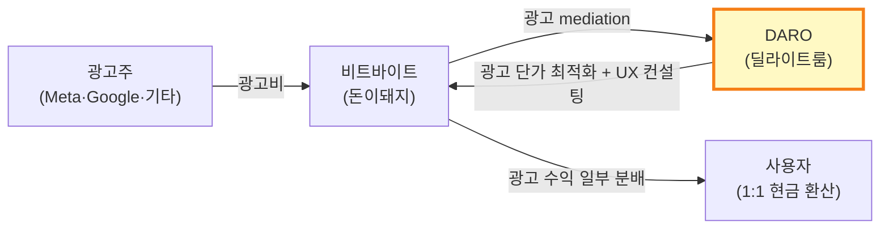

# 돈이돼지 (Money Piggy) — 비트바이트

> **Status**: Draft v1 / 2026-05-19  
> **분석자**: Claude (언어의숲 리서치)  
> **종합 한 줄**: ㈜비트바이트(플레이키보드 운영사, 안서형 창업)가 **딜라이트룸의 광고 mediation 솔루션 DARO**를 적용해 2025.02 출시한 앱테크. **4인 팀**으로 출시 8개월 만에 **월 영업이익 ₩2억** 돌파. 알라미 노하우의 솔루션화 + 부트스트랩 팀의 결합 케이스.

> **⭐ 영어의숲 관점에서 특별히 중요한 케이스**: ① 4인 팀이라는 동일 사이즈 ② 한국 출발 부트스트랩 ③ 딜라이트룸 투자·솔루션 활용 ④ Stage 2 광고 BM의 모범 케이스 ⑤ 한국 영어의숲의 직접적 잠재 경로 (DARO 도입 / 딜라이트룸 투자) 시사

---

## 0. Quick Facts

| 항목 | 값 | 출처(Tier) |
|------|----|----|
| 회사명 | ㈜비트바이트 (Bitbyte Corp.) | [Crunchbase][T2] |
| 앱명 | 돈이돼지 (Money Piggy) | [App Store][T2] |
| 본사·국가 | 한국 | [LinkedIn][T1] |
| 창업 (비트바이트) | 2018년 (안서형 19세, 대학생 창업) | [Folin·EO][T2] |
| 돈이돼지 출시 | **2025.02** | [디지털데일리·뉴스탭][T2] |
| 창업자 | **안서형** (Founder/CEO, b. 1999) | [LinkedIn][T1] |
| 현재 팀 규모 | **4명** | [DARO Case Study][T2] |
| 누적 펀딩 | **₩22억** (삼성전자, 미래에셋벤처투자, 딜라이트룸) | [플래텀][T2] |
| 누적 매출 (비트바이트 전체) | **DARO 도입 후 매출 8배 → 10배 성장** | [디지털데일리][T2] |
| **월 영업이익 (돈이돼지)** | **₩2억** (출시 8개월 시점, 2025.10~) | [DARO Case Study][T2] |
| 누적 출금 (사용자) | **₩3억** (2025.07 기준) | [DARO Case Study][T2] |
| 출시 2개월 적립 포인트 | **1억 포인트** | [뉴스탭][T2] |
| 첫 출금 성공률 | **91%** | [DARO Case Study][T2] |
| 카테고리 | 앱테크 / 보상형 플랫폼 (Earn-to-Watch) |  |
| BM | 광고 수익을 사용자와 분배 (1:1 출금) |  |
| 비트바이트 모회사 BEP | **2025.04 월간 BEP 돌파** (창업 7년차) | [ZDNet][T2] |

---

## 1. 기업의 성장 과정

### 1.1 창업 배경

**안서형 (b. 1999, 대학생 창업가)**
- 19세에 비트바이트 창업 (2018)
- 첫 서비스: **플레이키보드** — 키보드 콘텐츠 플랫폼
- "스마트폰 키보드 1위"를 목표로 한 콘텐츠 마켓플레이스
- EO·바이브토크·비즈니스포스트 등 다수 인터뷰 출연

**비트바이트 → 돈이돼지의 흐름**
- 2018~2024: 플레이키보드 단일 서비스 운영, 글로벌 200만~400만 MAU 도달
- 2023: **딜라이트룸이 비트바이트에 투자**
- 2024.09: 딜라이트룸 발표 — 비트바이트 BEP 달성 목표로 **DARO 지원 강화** ([아웃스탠딩][T2])
- 2025.02: 돈이돼지 출시 (DARO 활용 신규 캐시카우 앱)
- 2025.04: 비트바이트 전체 **월간 BEP 돌파** (창업 7년차)
- 2025.05~07: 4·5월 연속 흑자 → 7월까지 흑자 구조 유지

**돈이돼지 창업 배경**
> 비트바이트는 플레이키보드만으로는 BEP 도달이 어려워, 딜라이트룸의 DARO 광고 솔루션을 활용한 **단순 BM의 캐시카우 앱**을 추가로 출시. 광고 자체가 코어 가치인 앱테크 카테고리를 선택. — [디지털데일리][T2] 기반 재구성

### 1.2 연혁·마일스톤 (시계열)

| 연·월 | 사건 | 의미 | 출처 |
|-------|------|------|------|
| 2018 | 비트바이트 창업, 플레이키보드 출시 | 시작점 | [Folin][T2] |
| 2020~2024 | 플레이키보드 매년 매출 성장, MAU 70만~200만 도달 | 단일 앱 안정화 | [ZDNet][T2] |
| 2023 | 딜라이트룸이 비트바이트에 투자 | DARO 도입의 정초 | [플래텀][T2] |
| 2023 | 딜라이트룸 DARO 공식 출시 (B2B 광고 솔루션) | 알라미 13년 노하우 모듈화 | [머니투데이][T2] |
| 2024.09 | 딜라이트룸, 비트바이트 BEP 목표 DARO 지원 강화 발표 | 포트폴리오사 직접 지원 | [아웃스탠딩][T2] |
| **2025.02** | **돈이돼지 출시** | DARO 활용 신규 캐시카우 | [뉴스탭][T2] |
| 2025.04 | 비트바이트 월간 BEP 돌파 (창업 7년차) | 첫 흑자 | [ZDNet][T2] |
| 2025.05 | 돈이돼지 출시 2개월, 누적 1억 포인트 적립 | PMF 시그널 | [뉴스탭][T2] |
| 2025.06 | 돈이돼지 출시 4개월, 비트바이트 전체 매출 **10배 증가** | 캐시카우 작동 | [디지털데일리][T2] |
| 2025.07 | 누적 출금 ₩3억 돌파, 첫 출금 성공률 91% | 신뢰 구축 | [DARO Case][T2] |
| 2025.10~ | 출시 8개월, **월 영업이익 ₩2억** | 4인 팀의 자생 가능 단위경제 | [DARO Case][T2] |
| 2026.04 | 안서형 EO 바이브토크 재출연 (8년 만) | 회고·노하우 공유 | [EO YouTube][T2] |

### 1.3 결정적 변환지점 — 사용자 성장

#### 0 → 1만 (2025.02~03, 1~2개월)
- **채널**: 플레이키보드 기존 유저 베이스 (200만+ MAU)에 노출 가능
  - ⚠️ 단, 플레이키보드는 키보드 앱이라 직접 cross-promotion 디테일은 비공개
- **앱테크 카테고리 SEO 키워드 점유**: "앱테크", "돈버는앱" 검색 1순위 노출
- **블로그·유튜브·트위터 UGC**: 사용자들의 "월 5만~20만원 부수입" 실증 콘텐츠가 자생산
- **친구 초대 인센티브**: 500원 + 추가 50원 (간접 50원/지인의 지인까지)
- **트리거**: 5,000원부터 1:1 출금 가능 = 빠른 보상 사이클

#### 1만 → 10만 (2025.04~07, ~4개월)
- **DARO 광고 mediation 최적화**: 알라미 노하우로 광고 단가·노출 최적화
- **카테고리 1위 진입**: Google Play·App Store 앱테크 카테고리 검색 톱
- **트리거**: 4월 비트바이트 매출 10배 도달 → 미디어 보도 사이클

#### 10만+ (2025.08~ 진행 중)
- **출시 8개월 시점에 월 영업이익 ₩2억** = MAU 수십만 추정 (광고 ARPU 모델)
- 1,200+ 오픈채팅방 커뮤니티 형성

### 1.4 현재 상황 (2026.05 기준)

- **소유**: ㈜비트바이트 독립 운영 (딜라이트룸 투자)
- **팀**: **4명** (안서형 + 3명, 추정)
- **매출**: 월 영업이익 ₩2억 수준 유지 (2025.10+)
- **상태**: 부트스트랩 + 1라운드 투자 후 흑자
- **부트스트랩 강도**: ★★★★☆ (전형적 한국 부트스트랩 + 전략적 1라운드)

---

## 2. 프로덕트 관점 — LTV 높이는 방법

### 2.1 리텐션 메커닉

**Hook 모델 분석**

| 단계 | 돈이돼지 구현 |
|------|--------------|
| **External Trigger** | 친구 초대, 오픈채팅방, 앱 푸시 알림 |
| **Internal Trigger** | "내 적립 포인트 얼마 됐지?" 호기심 + 일일 보상 박탈감 |
| **Action** | 5~10초 광고 시청 + 돼지 캐릭터 터치 (최소 행동) |
| **Variable Reward** | 광고당 적립 포인트 변동 (가변), 일일 누적 박스, 추첨 |
| **Investment** | 누적 포인트 → 5,000원 출금 한도까지 모으는 sunk cost |

**누적 자산**: 적립 포인트가 5,000원 출금 한도에 도달할 때까지 사용자 sticky (Forest의 "숲" 누적과 유사)

**지표** (공개 자료 기반):
- 첫 출금 성공률 91% — 신뢰의 강력한 시그널
- 평균 적립: ₩370/일, 최고 ₩1,000+/일
- 출시 2개월에 누적 적립 1억 포인트 = ₩1억

### 2.2 ARPU 레버

- **광고 시청 ARPU = 변동** — DARO mediation 최적화로 광고 단가 ↑
- 일일 적립 한도 없음 = 헤비 유저 ARPU 무제한
- 친구 초대 500원 + 자동 50원 (지인의 지인) → 바이럴이 LTV 직접 증폭

### 2.3 사용 빈도·세션

- **트리거 빈도**: 매우 높음 (광고 시청 ≈ 무제한)
- 평균 세션: 짧음 (광고 5~10초 × N회)
- DAU/MAU: 공개 없음 ❓

### 2.4 학습과학적 관점

해당 없음. 단, **변동보상 강화 학습** 원리는 적용됨 (가변적 광고 보상 = 슬롯머신 메커닉)

### 2.5 장단점·특이점

**🟢 장점**
- 단일 메커닉: "광고 보면 돈 받는다" 한 줄로 설명
- 1:1 출금 = 약속 명확, 신뢰 1순위
- DARO 도입으로 광고 운영 부담 해소 → 4인 팀 가능
- 친구 초대 메커닉이 직접 보상 (CAC 무료화)

**🔴 단점**
- 사용자 평균 ARPU가 본질적으로 낮음 (광고 단가 한계)
- 광고 fatigue로 D30 이후 이탈 가능성 (장기 리텐션 미지수)
- 카테고리 자체가 사용자 신뢰에 민감 (출금 지연 시 폭발)

**🟡 특이점**
- **DARO 솔루션 의존성** — 알라미 노하우 없이는 단가 최적화 어려움
- 비트바이트가 플레이키보드(콘텐츠)와 돈이돼지(앱테크)를 함께 운영하면서 사용자 데이터 시너지 가능성

---

## 3. 마케팅 관점 — CAC 낮추는 방법

### 3.1 주력 무료/저비용 채널

| 채널 | 활용 | 효과 |
|------|------|------|
| **앱테크 카테고리 SEO/ASO** | "앱테크", "돈버는앱" 검색 1순위 | 오가닉 유입 핵심 |
| **블로그·유튜브 UGC** | "월 20만원 후기" 자생산 콘텐츠 | 무료 PR 사이클 |
| **오픈채팅방 커뮤니티** | 1,200+ 사용자 자발 운영 | 신뢰·재유입 채널 |
| **카테고리 톱 매체 보도** | 디지털데일리·뉴스탭·플래텀 다수 | 정통성 확보 |
| **친구 초대 인센티브** | 500원/명 + 50원 자동 (지인의 지인) | 바이럴 보상 직결 |

### 3.2 바이럴·레퍼럴

- **현금 인센티브가 핵심**: Forest는 가상 코인 → 실제 나무, 돈이돼지는 가상 포인트 → 실제 현금
- 친구의 친구까지 자동 50원 분배 → MLM 형 바이럴 구조 (단 광고 매출 분배라 합법)
- 출시 8개월 안 누적 출금 ₩3억 = 사용자가 실제로 돈을 받았다는 강력한 사회적 증거

### 3.3 퍼포먼스 마케팅

- **유료광고 비중 거의 0** (추정) — 비트바이트는 부트스트랩, 매출 8배 성장 직전까지 광고비 거의 없음
- 카테고리 1위 진입 후 일부 광고 가능성 (구체 데이터 없음 ❓)

### 3.4 브랜딩·커뮤니티

- 한 줄 메시지: **"터치하면 현금 주는 앱테크"** — 카테고리·차별점·약속이 한 줄
- 비주얼: 돼지 캐릭터 (귀엽고 직관적)
- 커뮤니티: 1,200+ 오픈채팅방 (사용자 자발 운영)
- 가이드북 공식 페이지 (moneypiggy.pagenow.me) — 사용자 학습 지원

### 3.5 채널 효율

- 정확한 CAC 비공개. 단 ₩22억 누적 펀딩 중 대부분이 R&D·운영비로 추정 → 마케팅 CAC 매우 낮음
- 친구 초대 인센티브 ₩500/명 = 사실상 가장 비싼 CAC 채널 (그러나 사용자가 모르고 광고 매출에서 분배)

---

## 4. 비즈니스 관점 — 결제전환·BM·DARO

### 4.1 BM 구조 — **★ DARO 모델의 정수**

**돈이돼지의 BM**:
1. 사용자 광고 시청 → 광고주가 비트바이트에 광고비 지불
2. **DARO** (딜라이트룸)가 mediation·optimization 수행 → 광고 단가 최대화
3. 광고 수익의 일부를 사용자에게 포인트로 환원 (1:1 출금)
4. **수익 분배 비율은 비공개**. 추정: 비트바이트 ~50% / 사용자 ~50% (업계 통념 T4)

**DARO 솔루션 효과**:
- 비트바이트 매출: **8배 → 10배** 성장
- 평균 다른 도입사: 광고 수익 **+150%** (12개사 평균)
- 비트윈 (커플 메신저, 10년 서비스): **2.8배**
- DARO 자체 매출: 2023년 ₩20억 → 2024년 **₩90억** (4배 성장)

### 4.2 Paywall 디자인

해당 없음 — 돈이돼지는 **사용자 결제 없음**. 광고 수익 분배 모델.

### 4.3 가격 구조

- 사용자 비용: **₩0** (광고 시청만)
- 출금 임계점: **₩5,000부터** (≈ 광고 5,000회 시청 또는 만보기 20만보)
- 출금 수수료: **₩0** (1:1)

### 4.4 사용자 보상 정책

- 적립률: 40보당 ₩1 (만보기) + 광고당 ₩X (변동)
- 친구 초대: ₩500/명 + ₩50 자동 (지인의 지인 초대 시)
- 일일 한도: 없음

### 4.5 매출·전환 지표

- 출시 2개월: 누적 적립 ₩1억
- 출시 4개월: 비트바이트 전체 매출 10배
- 출시 8개월: **월 영업이익 ₩2억**
- 누적 출금 ₩3억 (2025.07) → 사용자에게 분배된 광고 수익

---

## 5. 3-Stage Growth Loop 위치 매핑

### 5.1 현재 단계: **Stage 1 = Stage 2 동시 진행 (특수 케이스)**

| Stage | 돈이돼지 상황 |
|-------|--------------|
| Stage 1 (BEP) | **광고 BM 자체가 Day 1 수익 모델** → 출시 2개월 만에 PMF 시그널, 4개월 만에 BEP |
| Stage 2 (광고·F2P 레이어) | **광고 BM이 코어** → 별도 Stage 2 없음. 사용자 결제 없는 영구 freemium |
| Stage 3 (확장) | 미진행. 다국가·다카테고리 확장 가능성 |

> ⚠️ 돈이돼지는 다른 5사와 달리 **광고가 코어 BM**이라 일반적 3-Stage 모델이 적용되지 않음. Stage 1·2가 동시.

### 5.2 단계 전환 트리거

- **DARO 솔루션 도입** = 비트바이트의 Stage 1 → 흑자 전환의 결정타
- 4인 팀 + 외부 광고 솔루션 = 부트스트랩에서 가능한 가장 효율적 BM

### 5.3 다음 단계 신호

- 글로벌 확장 (한국어 외): 미정
- 다른 캐시카우 앱 (비트바이트 3번째 앱): 미정
- 플레이키보드와의 사용자 데이터 시너지: 시도 가능

### 5.4 영어의숲이 배울 1가지

**"광고 운영을 직접 하지 말고 솔루션(DARO 같은)으로 외주화하면 4인 팀도 광고 매출 8배 성장 가능"** — 영어의숲이 Pre-A에서 Free to Learn 도입 시, 광고 영업·mediation을 직접 할 필요 없음. **DARO 도입이 가장 합리적 옵션** (이미 딜라이트룸이 영어의숲 컨텍스트에 가까운 사례 다수 보유).

---

## 🟢 영어의숲이 가져갈 Top 3

### 1. **DARO 솔루션 직접 도입 검토** (Pre-A 단계)
- **적용안**: 4개월 BEP 후 Stage 2 진입 시점에 광고 BM 추가. 단 광고 영업·mediation 직접 X, DARO 도입
- **효과**: 비트바이트 + 비트윈 + 12개 도입사 평균 광고 수익 **+150%** ~ **+800%**
- **추가 보너스**: 딜라이트룸과의 관계 형성 → Pre-A 투자 유치 가능성
- **검토 시점**: M4 (9월) MRR ₩1,000만 도달 후 즉시 검토 시작

### 2. **친구 초대 메커닉을 광고 수익에서 분배**
- 돈이돼지: ₩500/초대 + ₩50 자동 (지인의 지인) → CAC 사실상 무료화
- **영어의숲 적용**: Pre-A에서 광고 BM 도입 후, **광고 수익 일부를 추천인 보상으로 분배**
- 단계적: 친구 초대 시 → 1주일 무료 구독 연장 / 광고 매출 환산 시 → 현금 환산 (Stage 2)

### 3. **부트스트랩 4인 팀이 월 ₩2억 영업이익 도달 가능하다는 증명**
- 돈이돼지: 4인 팀 / 8개월 / 월 영업이익 ₩2억
- **영어의숲 적용**: 4인 팀으로 4개월 MRR ₩1,000만은 충분히 도달 가능한 보수적 목표
- 단, 광고 BM이 아닌 구독 BM이라 스케일이 다름 — 광고 매출 추가 시 동일 영업이익 가능

### Bonus 인사이트
- **딜라이트룸이 한국 부트스트랩 4인 팀에 적극 투자·지원하는 패턴** — 영어의숲도 핏 좋음
- **앱테크 카테고리 SEO 점유**가 강력 — 영어의숲도 "영어 일기·AI 영어" 키워드 점유 시점에 비슷한 효과 가능

---

## 🔴 안티패턴 (피할 것)

### 1. **광고 BM을 코어로 만들지 말 것 (영어의숲의 경우)**
- 돈이돼지: 광고가 코어 가치 (사용자가 광고 보러 옴) → 작동
- 영어의숲: 광고가 코어가 되면 **학습 가치 훼손** (Drops·Cal AI가 광고 거부한 이유)
- **결정**: 광고는 어디까지나 **Free to Learn 단계의 보조 BM**. 구독이 코어

### 2. **광고 단가 직접 최적화 시도 X**
- 비트바이트도 자체 광고 운영 시도하다가 DARO 도입 → 8배 성장
- 4인 팀이 광고 mediation 직접 하면 1년 이상 노하우 축적 필요
- **결정**: Stage 2 진입 시 **DARO 또는 동급 솔루션 100% 사용**

### 3. **출금 지연·신뢰 손상 절대 금지**
- 돈이돼지의 핵심 자산은 91% 첫 출금 성공률
- 한국 앱테크 시장은 출금 사고 1회로 폭발할 수 있음 (소비자보호원 신고)
- **결정**: 영어의숲이 광고 매출 분배·환급·환불 정책 도입 시, 자동화·신뢰 1순위로

---

## ❓ 추가 리서치 필요

1. DARO의 정확한 수수료 구조 (수익 % 분배)
2. 돈이돼지 사용자 D7·D30 리텐션
3. 4인 팀 구성 (CTO/디자이너/마케터 분포)
4. 비트바이트 ARR (비공개)
5. 플레이키보드와 돈이돼지의 사용자 cross-promotion 디테일
6. 안서형 대표가 영어의숲 같은 학습 카테고리에 DARO 적용 가능하다고 보는지

---

## References

### Tier 1 (1차 출처)
1. [안서형 LinkedIn](https://www.linkedin.com/in/seohyung/) — T1
2. [안서형 EO 바이브토크 2026.04 — 4명으로 70만명+ 사용자 운영](https://www.youtube.com/watch?v=qu5h6bQ98ms) — T1
3. [안서형 EO 인터뷰 (19세 100만 다운로드)](https://www.youtube.com/watch?v=iUPirj5exbs) — T1
4. [돈이돼지 공식 사이트](https://moneypiggy.kr/) — T1
5. [돈이돼지 가이드북](https://moneypiggy.pagenow.me/) — T1
6. [DARO 공식 사이트](https://daro.so/) — T1

### Tier 2 (검증 매체)
1. [ZDNet — 비트바이트, 투자 받고 2년 만에 손익분기점 넘은 비결 (2025.07.24)](https://zdnet.co.kr/view/?no=20250724085612) — T2
2. [디지털데일리 — 딜라이트룸, 광고 수익화 솔루션 '다로' 매출 90억원 달성 (2025.02)](https://m.ddaily.co.kr/page/view/2025021409363633447) — T2
3. [플래텀 — 딜라이트룸, 광고 수익 솔루션으로 비트바이트 매출 8배 성장 지원](https://platum.kr/archives/264354) — T2
4. [머니투데이 — 딜라이트룸, 광고 수익화 노하우 꽉 담은 플랫폼 'DARO' 출시 (2023.12)](https://news.mt.co.kr/mtview.php?no=2023120409231152601) — T2
5. [머니투데이 — "광고수익 2.8배 늘었다" 딜라이트룸 '다로' 매출 90억 달성](https://www.mt.co.kr/future/2025/02/14/2025021409592994413) — T2
6. [뉴스탭 — 광고 시청형 앱테크 '돈이돼지', 출시 두 달 만에 1억 포인트 적립 (2025.05.07)](https://www.newstap.co.kr/news/articleView.html?idxno=303489) — T2
7. [아웃스탠딩 — 딜라이트룸, 포트폴리오사 비트바이트 BEP 달성 목표 DARO 지원 강화 (2024.09)](https://outstanding.kr/press/588/20240903) — T2
8. [DARO Case Study — 돈이돼지, 출시 8개월만에 월 영업이익 2억원 돌파한 비결](https://daro.so/case-study/how-daro-helped-hit-200m-krw-monthly-profit-in-8-months) — T2
9. [비즈니스포스트 — 22살 비트바이트 대표 안서형](https://www.businesspost.co.kr/BP?command=article_view&num=134137) — T2
10. [Folin — 19세에 100만 다운로드 회사를 만들다: 비트바이트 안서형](https://www.folin.co/story/721) — T2
11. [바이오타임즈 — 딜라이트룸, 광고 수익 솔루션 '다로'로 비트바이트 매출 8배↑](https://www.biotimes.co.kr/news/articleView.html?idxno=22214) — T2
12. [Datanet — 비트바이트 '돈이돼지', 앱테크 앱으로 두각](https://www.datanet.co.kr/news/articleView.html?idxno=201847) — T2
13. [Brunch — 돈이돼지 앱테크 총정리](https://brunch.co.kr/@bf892d47d3b14ee/589) — T2
14. [ditoday — 딜라이트룸 광고 수익 솔루션 '다로', 비트바이트 매출 8배](https://ditoday.com/%EB%94%9C%EB%9D%BC%EC%9D%B4%ED%8A%B8%EB%A3%B8-%EA%B4%91%EA%B3%A0-%EC%88%98%EC%9D%B5-%EC%86%94%EB%A3%A8%EC%85%98-%EB%8B%A4%EB%A1%9C-%EB%B9%84%ED%8A%B8%EB%B0%94%EC%9D%B4%ED%8A%B8/) — T2

### Tier 3 (업계 추정)
1. [THE VC — 비트바이트 기업정보](https://thevc.kr/bitbyte) — T3
2. [App Store — 돈이돼지](https://apps.apple.com/kr/app/%EB%8F%88%EC%9D%B4%EB%8F%BC%EC%A7%80-%EB%A7%8C%EB%B3%B4%EA%B8%B0-%EC%95%B1%ED%85%8C%ED%81%AC-%EB%8F%88%EB%B2%84%EB%8A%94%EC%95%B1-%ED%98%84%EA%B8%88%EC%9D%B8%EC%B6%9C-%EC%BA%90%EC%8B%9C/id6742818389) — T3
3. [Google Play — 돈이돼지](https://play.google.com/store/apps/details?id=kr.bitbyte.moneypig&hl=en_US) — T3
4. [WiseApp — 돈이돼지 상세](https://www.wiseapp.co.kr/wiseapp/detail/app/880f798fe16d2e7d067b76e8dde98c29) — T3
