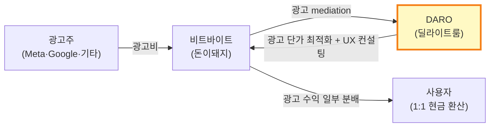

# 돈이돼지 (Money Piggy) — 비트바이트

> **Status**: Draft v2 / 2026-05-19 (교차검증 강화판)  
> **분석자**: Claude (언어의숲 리서치)  
> **종합 한 줄**: ㈜비트바이트(플레이키보드 운영사, 안서형 창업)가 [딜라이트룸의 광고 mediation 솔루션 DARO](https://daro.so/)를 적용해 2025.02 출시한 앱테크. 출시 4개월 만에 비트바이트 전체 매출 8~10배 성장을 견인했으며 ⚠️*월 영업이익 ₩2억 돌파는 DARO 자체 발표 단일 출처*.

> **⭐ 영어의숲 관점에서 중요한 이유**: ① 한국 출발 부트스트랩 ② 딜라이트룸 투자·솔루션 활용 사례 ③ Stage 2 광고 BM 모범 ④ 한국 영어의숲의 잠재 경로 시사 (DARO 도입 / 딜라이트룸 투자 핏)

---

## 📋 출처 신뢰도 시각 시스템

본 문서는 모든 사실 주장에 다음 시각 마커 부착:

| 마커 | 의미 |
|------|------|
| ✅ | **2개+ 독립 출처 교차검증** |
| ⚠️ | **단일 출처** — 추가 검증 필요 |
| ⚠️⚠️ | **회사 자체 발표·마케팅 자료** (편향 가능성) |
| ❓ | **확인 불가** 또는 출처 간 모순 |
| 📌 | 핵심 사실 (다른 결정에 영향) |

또한 출처 Tier:

| Tier | 정의 | 신뢰도 |
|------|------|--------|
| **T1** | 1차 (창업자 본인 인터뷰·SNS·LinkedIn·공식 사이트·법인 등기) | 최상 |
| **T2** | 검증 매체 (TechCrunch·ZDNet·플래텀·머니투데이·아웃스탠딩 등) | 상 |
| **T3** | 데이터 추정·집계 (THE VC·RocketPunch·Sensor Tower·NICE비즈인포·사람인) | 중 |
| **T4** | 자체 마케팅·블로그 (DARO Case Study·회사 블로그) | 하 (편향) |

---

## 0. Quick Facts

| 항목 | 값 | 출처 |
|------|----|----|
| 회사명 | **㈜비트바이트** (Bitbyte Corp.) | ✅ [NICE비즈인포 T3](https://www.nicebizinfo.com/ep/EP0100M002GE.nice?kiscode=JF6903), [잡코리아 T3](https://m.jobkorea.co.kr/company/45229262) |
| 앱명 | 돈이돼지 (Money Piggy) | ✅ [App Store T2](https://apps.apple.com/kr/app/돈이돼지-만보기-앱테크-돈버는앱-현금인출-캐시/id6742818389), [Google Play T2](https://play.google.com/store/apps/details?id=kr.bitbyte.moneypig) |
| 본사·국가 | 한국 | ✅ [LinkedIn T1](https://kr.linkedin.com/company/bitbytecorp) |
| 비트바이트 설립일 | **2018.08.16** | ✅ [NICE비즈인포 T3](https://www.nicebizinfo.com/ep/EP0100M002GE.nice?kiscode=JF6903) |
| 돈이돼지 출시 | **2025.02** | ✅ [디지털데일리 T2](https://m.ddaily.co.kr/page/view/2025021409363633447), [뉴스탭 T2 (2025.05.07 기준 출시 2개월)](https://www.newstap.co.kr/news/articleView.html?idxno=303489) |
| 창업자 | **안서형** (b. 1999, 19세 창업) | ✅ [LinkedIn T1](https://www.linkedin.com/in/seohyung/), [Folin T2](https://www.folin.co/story/721), [비즈니스포스트 T2](https://www.businesspost.co.kr/BP?command=article_view&num=134137) |
| 자본금 | ₩1,246만원 (2024.12 기준) | ✅ [NICE비즈인포 T3](https://www.nicebizinfo.com/ep/EP0100M002GE.nice?kiscode=JF6903) |
| 직원 수 | LinkedIn 표시 **2~10명** / 개발조직 5~6명 보고 / **"4명"** ⚠️⚠️ DARO 케이스 + EO 영상 제목 | [LinkedIn T1](https://kr.linkedin.com/company/bitbytecorp), [EO 인터뷰 T1](https://www.youtube.com/watch?v=qu5h6bQ98ms), ⚠️⚠️ [DARO T4](https://daro.so/case-study/how-daro-helped-hit-200m-krw-monthly-profit-in-8-months) |
| 비트바이트 2024 매출 | **₩1억 2,667만원** (전년 +79%) | ✅ [NICE비즈인포 T3](https://www.nicebizinfo.com/ep/EP0100M002GE.nice?kiscode=JF6903) |
| 누적 펀딩 | **약 ₩21.4억** (RocketPunch 집계, "22억"은 매체 반올림) | ✅ [RocketPunch T3](https://www.rocketpunch.com/companies/bitbyte), [플래텀 T2](https://platum.kr/archives/264354) |
| 한국엔젤투자협회 시드 | ₩1.6억 (2023.07) | ✅ [RocketPunch T3](https://www.rocketpunch.com/companies/bitbyte) |
| 딜라이트룸 투자 시점 | 약 2024.02 ("2년 전" 2025.07 기준) | ✅ [ZDNet T2](https://zdnet.co.kr/view/?no=20250724085612) |
| **월 영업이익 (돈이돼지)** | **₩2억** (출시 8개월 시점, 2025.10~) | ⚠️⚠️ **DARO 케이스 스터디 단독** [DARO T4](https://daro.so/case-study/how-daro-helped-hit-200m-krw-monthly-profit-in-8-months) |
| 비트바이트 전체 매출 성장 | **8배 → 10배** (돈이돼지 출시 후) | ✅ [디지털데일리 T2](https://m.ddaily.co.kr/page/view/2025021409363633447), [플래텀 T2](https://platum.kr/archives/264354), [바이오타임즈 T2](https://www.biotimes.co.kr/news/articleView.html?idxno=22214), [ditoday T2](https://ditoday.com/딜라이트룸-광고-수익-솔루션-다로-비트바이트/) |
| 비트바이트 월간 BEP | **2025.04 돌파**, 4~7월 연속 흑자 | ✅ [ZDNet T2](https://zdnet.co.kr/view/?no=20250724085612) |
| 누적 출금 (사용자) | ₩3억 (2025.07) | ⚠️⚠️ [DARO T4](https://daro.so/case-study/how-daro-helped-hit-200m-krw-monthly-profit-in-8-months) |
| 첫 출금 성공률 | 91% | ⚠️⚠️ [DARO T4](https://daro.so/case-study/how-daro-helped-hit-200m-krw-monthly-profit-in-8-months) |
| 출시 2개월 누적 적립 | 1억 포인트 | ⚠️ [뉴스탭 T2](https://www.newstap.co.kr/news/articleView.html?idxno=303489) (DARO 보도자료 인용 추정) |
| 카테고리 | 앱테크 / 보상형 플랫폼 | — |
| BM | 광고 수익을 사용자에게 분배 (1:1 출금) | ✅ 多 매체 |

> **🚨 핵심 경고**: 가장 인용되는 수치 (월 영업이익 ₩2억, 누적 출금 ₩3억, 91% 성공률, "4명 팀")는 **모두 딜라이트룸 자체 마케팅 자료(DARO Case Study)가 단독 또는 주요 출처**입니다. 한국 매체 보도들도 상당수 이 보도자료를 인용한 것으로 추정. 의사결정 시 **재무제표(공시 안 됨) 등 1차 자료로 확정 검증 권장**.

---

## 1. 기업의 성장 과정

### 1.1 창업 배경 ✅

**안서형 (b. 1999)**
- 19세 대학생 창업 (2018) [✅ Folin T2](https://www.folin.co/story/721)·[비즈니스포스트 T2](https://www.businesspost.co.kr/BP?command=article_view&num=134137)
- LinkedIn 활동 중 [T1](https://www.linkedin.com/in/seohyung/)
- 대한민국 키보드 1위 목표로 창업 [✅ 비즈니스포스트 T2](https://www.businesspost.co.kr/BP?command=article_view&num=134137)

**비트바이트 → 돈이돼지의 흐름**
- 2018.08.16: 비트바이트 법인 설립 [✅ NICE비즈인포 T3](https://www.nicebizinfo.com/ep/EP0100M002GE.nice?kiscode=JF6903)
- 2018: 첫 서비스 **플레이키보드** 출시 [✅ 다수 매체]
- 2023.07: 한국엔젤투자협회 시드 ₩1.6억 [✅ RocketPunch T3](https://www.rocketpunch.com/companies/bitbyte)
- 2024.02 추정: 딜라이트룸 전략적 투자 [✅ ZDNet T2 (2025.07 기준 "2년 전")](https://zdnet.co.kr/view/?no=20250724085612)
- 2024.09: 딜라이트룸, 비트바이트 BEP 목표로 [DARO 지원 강화 발표 ✅ T2](https://outstanding.kr/press/588/20240903)
- **2025.02**: 돈이돼지 출시 ✅ [디지털데일리 T2](https://m.ddaily.co.kr/page/view/2025021409363633447)
- **2025.04**: 비트바이트 월간 BEP 돌파 (창업 7년차) ✅ [ZDNet T2](https://zdnet.co.kr/view/?no=20250724085612)

### 1.2 연혁·마일스톤 (시계열)

| 연·월 | 사건 | 출처 |
|-------|------|------|
| 2018.08 | 비트바이트 법인 설립, 플레이키보드 출시 | ✅ [NICE T3](https://www.nicebizinfo.com/ep/EP0100M002GE.nice?kiscode=JF6903) |
| 2020 | 플레이키보드 매출 발생 시작 | ✅ [ZDNet T2](https://zdnet.co.kr/view/?no=20250724085612) |
| 2022 (추정) | 플레이키보드 누적 DL **100만** 돌파 | ✅ [플래텀 T2](https://platum.kr/archives/129363) |
| 2023.07 | 한국엔젤투자협회 시드 ₩1.6억 | ✅ [RocketPunch T3](https://www.rocketpunch.com/companies/bitbyte) |
| 2023.12 | 딜라이트룸 DARO 공식 출시 (B2B 광고 솔루션) | ✅ [머니투데이 T2](https://news.mt.co.kr/mtview.php?no=2023120409231152601) |
| 2024.02 추정 | 딜라이트룸 비트바이트 전략적 투자 | ✅ [ZDNet T2](https://zdnet.co.kr/view/?no=20250724085612) |
| 2024.09 | 딜라이트룸, 비트바이트 DARO 지원 강화 발표 | ✅ [아웃스탠딩 T2](https://outstanding.kr/press/588/20240903), [eDaily T2](https://tv.edaily.co.kr/News/NewsRead?NewsId=02276326638991584&Kind=257) |
| 2024.11.14 | 플레이키보드 누적 DL **200만** 돌파 (해외 45%, 220개국) | ✅ [플래텀 T2](https://platum.kr/archives/163399) |
| **2025.02** | **돈이돼지 출시** | ✅ [디지털데일리 T2](https://m.ddaily.co.kr/page/view/2025021409363633447) |
| 2025.04 | 비트바이트 월간 BEP 돌파 | ✅ [ZDNet T2](https://zdnet.co.kr/view/?no=20250724085612) |
| 2025.05 | 돈이돼지 출시 2개월, 누적 1억 포인트 적립 | ⚠️ [뉴스탭 T2](https://www.newstap.co.kr/news/articleView.html?idxno=303489) (단일 보도) |
| 2025.05 | 돈이돼지, 구글·애플 앱 마켓 "앱테크" 키워드 검색 결과 최상단 | ✅ [ZDNet T2](https://zdnet.co.kr/view/?no=20250508095038), [데이터넷 T2](https://www.datanet.co.kr/news/articleView.html?idxno=201847) |
| 2025.06~07 | 비트바이트 전체 매출 8배 → 10배 성장 견인 | ✅ [디지털데일리 T2](https://m.ddaily.co.kr/page/view/2025021409363633447), [플래텀 T2](https://platum.kr/archives/264354), [ditoday T2](https://ditoday.com/딜라이트룸-광고-수익-솔루션-다로-비트바이트/) |
| 2025.07 (DARO 발표) | 누적 출금 ₩3억, 첫 출금 성공률 91% | ⚠️⚠️ [DARO Case T4](https://daro.so/case-study/how-daro-helped-hit-200m-krw-monthly-profit-in-8-months) |
| 2025.10~ (DARO 발표) | 월 영업이익 ₩2억 돌파 (출시 8개월) | ⚠️⚠️ [DARO Case T4](https://daro.so/case-study/how-daro-helped-hit-200m-krw-monthly-profit-in-8-months) |
| 2026.04 | 안서형 EO 바이브토크 재출연 ("4명으로 70만명+ 사용자") | ✅ [EO YouTube T1](https://www.youtube.com/watch?v=qu5h6bQ98ms) (단, 70만은 플레이키보드 MAU 기준 추정) |

### 1.3 결정적 변환지점 — 사용자 성장

#### 0 → 1만 (2025.02~03, 1~2개월)
- **채널 가설**: 플레이키보드 기존 유저 베이스 (200만+ DL)에 cross-promotion 가능 ❓ — *디테일 비공개*
- **앱테크 카테고리 검색 1순위 점유** ✅ [ZDNet T2 (2025.05)](https://zdnet.co.kr/view/?no=20250508095038)
- **블로그·유튜브·트위터 UGC**: 사용자들의 "월 5만~20만원 부수입" 후기 자생산 ✅ [Brunch T3](https://brunch.co.kr/@bf892d47d3b14ee/589), [YouTube 후기 T3](https://www.youtube.com/watch?v=sKOaeZGzwX8)
- **친구 초대 인센티브**: ₩500/명 + ₩50 자동 (지인의 지인 초대) ✅ [공식 사이트 T1](https://moneypiggy.kr/)
- **트리거**: 5,000원부터 1:1 출금 가능 = 빠른 보상 사이클 ✅ [공식 가이드북 T1](https://moneypiggy.pagenow.me/)

#### 1만 → 10만 (2025.04~07, ~4개월)
- **DARO 광고 mediation 최적화** ✅ [디지털데일리 T2](https://m.ddaily.co.kr/page/view/2025021409363633447), [플래텀 T2](https://platum.kr/archives/264354)
- **2025.05 시점**: 구글·애플 앱마켓 "앱테크" 키워드 검색 결과 최상단 ✅ [ZDNet T2](https://zdnet.co.kr/view/?no=20250508095038)
- **트리거**: 2025.04 비트바이트 매출 10배 도달 → 미디어 보도 사이클 시작 ✅ [디지털데일리 T2](https://m.ddaily.co.kr/page/view/2025021409363633447)

#### 10만+ (2025.08~ 진행 중)
- DARO 자료 기준 ⚠️⚠️ 출시 8개월 시점 월 영업이익 ₩2억 → MAU 수십만 추정 (광고 ARPU 모델 기반 T4 역산)
- 1,200+ 오픈채팅방 커뮤니티 형성 ⚠️ [Brunch T3 단일 인용](https://brunch.co.kr/@bf892d47d3b14ee/589)

### 1.4 현재 상황 (2026.05 기준)

- **소유**: ㈜비트바이트 독립 운영, 딜라이트룸 전략적 투자자 ✅
- **팀**: ⚠️⚠️ **"4명"** (DARO Case Study) — LinkedIn은 2-10명 표시 → 정확 인원 미확정
- **매출**: 월 영업이익 ₩2억 ⚠️⚠️ (DARO 단독 출처)
- **재무**: 2024년 전체 매출 ₩1.27억 (돈이돼지 미반영) ✅ [NICE T3](https://www.nicebizinfo.com/ep/EP0100M002GE.nice?kiscode=JF6903)
  - 2025년 매출은 아직 공식 공시 안 됨
- **부트스트랩 강도**: ★★★★☆ (한국 부트스트랩 + 1라운드 + 전략적 투자)

---

## 2. 프로덕트 관점 — LTV 높이는 방법

### 2.1 리텐션 메커닉

**Hook 모델 분석** (BJ Fogg / Nir Eyal 모델 적용)

| 단계 | 돈이돼지 구현 | 출처 |
|------|--------------|------|
| **External Trigger** | 친구 초대, 오픈채팅방, 앱 푸시 | ✅ [공식 사이트 T1](https://moneypiggy.kr/) |
| **Internal Trigger** | "내 적립 포인트 얼마?" 호기심 + 박탈감 | 추론 |
| **Action** | 5~10초 광고 시청 + 돼지 캐릭터 터치 | ✅ [공식 가이드북 T1](https://moneypiggy.pagenow.me/), [App Store T2](https://apps.apple.com/kr/app/돈이돼지-만보기-앱테크-돈버는앱-현금인출-캐시/id6742818389) |
| **Variable Reward** | 광고당 적립 포인트 변동 | ✅ 다수 매체 |
| **Investment** | 누적 포인트 → ₩5,000 출금 한도까지 모으는 sunk cost | ✅ [공식 가이드북 T1](https://moneypiggy.pagenow.me/) |

**누적 자산**: 적립 포인트가 ₩5,000 출금 한도에 도달할 때까지 sticky (Forest "숲" 누적과 유사 메커닉)

**지표**:
- ⚠️⚠️ 첫 출금 성공률 **91%** — [DARO Case T4](https://daro.so/case-study/how-daro-helped-hit-200m-krw-monthly-profit-in-8-months) 단독
- 평균 적립: **₩370/일** [⚠️ Brunch T3 단일 인용](https://brunch.co.kr/@bf892d47d3b14ee/589)
- 최고 적립: ₩1,000+/일 [⚠️ Brunch T3](https://brunch.co.kr/@bf892d47d3b14ee/589)
- ⚠️ 출시 2개월 누적 적립 1억 포인트 = ₩1억 [뉴스탭 T2](https://www.newstap.co.kr/news/articleView.html?idxno=303489)

### 2.2 ARPU 레버 ✅

- **광고 시청 ARPU = 변동** — DARO mediation 최적화로 광고 단가 ↑ ([디지털데일리 T2](https://m.ddaily.co.kr/page/view/2025021409363633447))
- 일일 적립 한도 없음 = 헤비 유저 ARPU 무제한 ([공식 사이트 T1](https://moneypiggy.kr/))
- 친구 초대 ₩500 + ₩50 자동 분배 → 바이럴이 LTV 직접 증폭

### 2.3 사용 빈도·세션

- 트리거 빈도: 매우 높음 (광고 시청 ≈ 무제한)
- 평균 세션: 짧음 (광고 5~10초 × N회)
- ❓ **DAU/MAU 공개 데이터 없음** — 추정 불가

### 2.4 학습과학적 관점

해당 없음. 단 변동보상 강화 메커닉은 적용됨 (Skinner box 슬롯머신 메커닉).

### 2.5 장단점·특이점

**🟢 장점**
- 단일 메커닉: "광고 보면 돈 받는다" 한 줄로 설명 ✅ 다수 매체
- 1:1 출금 = 약속 명확 ✅ 다수 매체
- DARO 도입으로 광고 운영 부담 해소 → 소수 팀 가능 ✅ [플래텀 T2](https://platum.kr/archives/264354)
- 친구 초대 메커닉이 직접 보상 (CAC 무료화) ✅ [공식 T1](https://moneypiggy.kr/)

**🔴 단점**
- 사용자 평균 ARPU 본질적 낮음 (광고 단가 한계) — 추론
- 광고 fatigue로 D30 이후 이탈 가능성 ❓ — 데이터 없음
- 카테고리 자체가 사용자 신뢰에 민감 (출금 지연 시 폭발 위험) — 일반 통념

**🟡 특이점**
- DARO 솔루션 의존성 — 알라미 노하우 없이 단가 최적화 어려움 ✅ [머니투데이 T2](https://news.mt.co.kr/mtview.php?no=2023120409231152601)

---

## 3. 마케팅 관점 — CAC 낮추는 방법

### 3.1 주력 무료/저비용 채널

| 채널 | 활용 | 출처 |
|------|------|------|
| **앱테크 카테고리 SEO/ASO** | "앱테크" 키워드 검색 1순위 | ✅ [ZDNet T2 (2025.05)](https://zdnet.co.kr/view/?no=20250508095038), [데이터넷 T2](https://www.datanet.co.kr/news/articleView.html?idxno=201847) |
| **블로그·유튜브 UGC** | "월 20만원 후기" 자생산 | ✅ [Brunch T3](https://brunch.co.kr/@bf892d47d3b14ee/589), [YouTube T3](https://www.youtube.com/watch?v=sKOaeZGzwX8) |
| **오픈채팅방 커뮤니티** | 1,200+ 사용자 자발 운영 | ⚠️ [Brunch T3](https://brunch.co.kr/@bf892d47d3b14ee/589) 단일 인용 |
| **카테고리 톱 매체 보도** | 디지털데일리·뉴스탭·플래텀·바이오타임즈·ditoday 다수 | ✅ 다수 매체 (단 동일 보도자료 인용 가능성) |
| **친구 초대 인센티브** | ₩500/명 + ₩50 자동 | ✅ [공식 T1](https://moneypiggy.kr/) |

### 3.2 바이럴·레퍼럴

- **현금 인센티브가 핵심**: Forest 가상 코인 → 실제 나무 vs 돈이돼지 가상 포인트 → 실제 현금
- 친구의 친구까지 자동 ₩50 분배 → MLM형 바이럴 (단 광고 매출 분배 → 합법) ✅ [공식 T1](https://moneypiggy.kr/)
- ⚠️⚠️ 출시 8개월 누적 출금 ₩3억 = 사용자 받은 실제 금액 사회적 증거 — [DARO T4](https://daro.so/case-study/how-daro-helped-hit-200m-krw-monthly-profit-in-8-months) 단독

### 3.3 퍼포먼스 마케팅

- 유료광고 비중 거의 0 추정 — 비트바이트는 부트스트랩, 매출 8배 성장 직전까지 광고비 거의 없음 [✅ ZDNet T2](https://zdnet.co.kr/view/?no=20250724085612)
- 단 "DARO가 마케팅에도 적극 투자 가능하게 했다" 발언 있음 ⚠️⚠️ [DARO T4](https://daro.so/case-study/how-daro-helped-hit-200m-krw-monthly-profit-in-8-months)
- 구체 광고비 데이터 없음 ❓

### 3.4 브랜딩·커뮤니티

- 한 줄 메시지: **"터치하면 현금 주는 앱테크"** ✅ [공식 T1](https://moneypiggy.kr/)
- 비주얼: 돼지 캐릭터
- 커뮤니티: ⚠️ 1,200+ 오픈채팅방 ([Brunch T3](https://brunch.co.kr/@bf892d47d3b14ee/589))
- 공식 가이드북 페이지: [moneypiggy.pagenow.me](https://moneypiggy.pagenow.me/) ✅ T1

### 3.5 채널 효율

- 정확한 CAC 비공개 ❓
- 단 ₩21.4억 누적 펀딩 중 대부분 R&D·운영비로 추정 → 마케팅 CAC 매우 낮은 것으로 추정 — *추론*

---

## 4. 비즈니스 관점 — 결제전환·BM·DARO

### 4.1 BM 구조 — DARO 모델

**돈이돼지의 BM**:
1. 사용자 광고 시청 → 광고주가 비트바이트에 광고비 지불 ✅
2. **DARO** (딜라이트룸) mediation·optimization 수행 → 광고 단가 최대화 ✅ [머니투데이 T2](https://news.mt.co.kr/mtview.php?no=2023120409231152601)
3. 광고 수익의 일부를 사용자에게 포인트 환원 (1:1 출금) ✅ [공식 T1](https://moneypiggy.kr/)
4. ❓ **수익 분배 비율은 비공개**. 업계 통념 T4 추정: 비트바이트 ~50% / 사용자 ~50%

**DARO 솔루션 효과** ✅ multi-sourced:
- 비트바이트 매출 **8배 → 10배** 성장 ([디지털데일리 T2](https://m.ddaily.co.kr/page/view/2025021409363633447), [플래텀 T2](https://platum.kr/archives/264354), [ditoday T2](https://ditoday.com/딜라이트룸-광고-수익-솔루션-다로-비트바이트/), [바이오타임즈 T2](https://www.biotimes.co.kr/news/articleView.html?idxno=22214))
- 평균 도입사: 광고 수익 **+150%** (12개사 평균) ([디지털데일리 T2](https://m.ddaily.co.kr/page/view/2025021409363633447))
- 비트윈 (커플 메신저, 10년 서비스): **2.8배** ([머니투데이 T2](https://www.mt.co.kr/future/2025/02/14/2025021409592994413))
- DARO 자체 매출: 2023년 ₩20억 → 2024년 ₩90억 (4배) ([디지털데일리 T2](https://m.ddaily.co.kr/page/view/2025021409363633447))

### 4.2 Paywall 디자인

해당 없음 — 돈이돼지는 사용자 결제 없음, 광고 수익 분배 모델.

### 4.3 가격 구조

- 사용자 비용: ₩0 ✅ [공식 T1](https://moneypiggy.kr/)
- 출금 임계점: **₩5,000부터** ✅ [공식 가이드북 T1](https://moneypiggy.pagenow.me/)
- 출금 수수료: ₩0 (1:1) ✅ [공식 T1](https://moneypiggy.kr/)

### 4.4 사용자 보상 정책 ✅

- 적립률: 40보당 ₩1 (만보기) + 광고당 ₩X (변동) ([공식 T1](https://moneypiggy.kr/))
- 친구 초대: ₩500/명 + ₩50 자동 (지인의 지인 초대 시)
- 일일 한도: 없음

### 4.5 매출·전환 지표

- ⚠️ 출시 2개월 누적 적립 ₩1억 ([뉴스탭 T2](https://www.newstap.co.kr/news/articleView.html?idxno=303489) 단일)
- ✅ 출시 4개월 비트바이트 전체 매출 10배 ([디지털데일리 T2](https://m.ddaily.co.kr/page/view/2025021409363633447))
- ⚠️⚠️ 출시 8개월 월 영업이익 ₩2억 ([DARO T4](https://daro.so/case-study/how-daro-helped-hit-200m-krw-monthly-profit-in-8-months))
- ⚠️⚠️ 누적 출금 ₩3억 (2025.07) ([DARO T4](https://daro.so/case-study/how-daro-helped-hit-200m-krw-monthly-profit-in-8-months))

---

## 5. 3-Stage Growth Loop 위치 매핑

### 5.1 현재 단계: **Stage 1 = Stage 2 동시 진행** (특수 케이스)

| Stage | 돈이돼지 상황 |
|-------|--------------|
| Stage 1 (BEP) | 광고 BM 자체가 Day 1 수익 모델 → ✅ 출시 2개월 PMF, 4개월 BEP 도달 |
| Stage 2 (광고·F2P 레이어) | 광고 BM이 코어 → 별도 Stage 2 없음. 사용자 결제 없는 영구 freemium |
| Stage 3 (확장) | 미진행 |

> ⚠️ 돈이돼지는 광고가 코어 BM이라 일반 3-Stage 모델이 적용되지 않음. 5사 다른 케이스와 구조적으로 다름.

### 5.2 단계 전환 트리거 ✅

- **DARO 솔루션 도입** = 비트바이트 흑자 전환의 결정타 ([ZDNet T2](https://zdnet.co.kr/view/?no=20250724085612), [디지털데일리 T2](https://m.ddaily.co.kr/page/view/2025021409363633447))
- 소수 팀 + 외부 광고 솔루션 = 부트스트랩에서 가장 효율적 BM

### 5.3 다음 단계 신호

- 글로벌 확장 (한국어 외): 미정
- 비트바이트 3번째 앱: 미정
- 플레이키보드와의 사용자 데이터 시너지: 시도 가능

### 5.4 영어의숲이 배울 1가지

**"광고 운영을 직접 하지 말고 솔루션(DARO 같은)으로 외주화하면 소수 팀도 광고 매출 8배 성장 가능"** — 영어의숲이 Pre-A에서 Free to Learn 도입 시, 광고 영업·mediation을 직접 할 필요 없음. **DARO 도입이 가장 합리적 옵션** (이미 딜라이트룸이 영어의숲 컨텍스트에 가까운 사례 다수 보유).

---

## 🟢 영어의숲이 가져갈 Top 3

### 1. **DARO 솔루션 직접 도입 검토** (Pre-A 단계)
- **적용안**: 4개월 BEP 후 Stage 2 진입 시점에 광고 BM 추가. 광고 mediation 직접 X, DARO 도입
- **근거**: 비트바이트 매출 8배 성장 (✅ multi-sourced), 평균 도입사 +150% 광고 수익 ([디지털데일리 T2](https://m.ddaily.co.kr/page/view/2025021409363633447))
- **추가 가치**: 딜라이트룸과의 관계 형성 → Pre-A 투자 유치 가능성
- **검토 시점**: M4 (9월) MRR ₩1,000만 도달 후 즉시

### 2. **친구 초대 메커닉을 광고 수익에서 분배**
- 돈이돼지: ₩500/초대 + ₩50 자동 ([공식 T1](https://moneypiggy.kr/))
- **영어의숲 적용**: Pre-A에서 광고 BM 도입 후 광고 수익 일부를 추천인 보상으로
- 단계적: Stage 1 시점에는 친구 초대 → 1주일 무료 구독 연장으로

### 3. **부트스트랩 소수 팀이 광고 BM으로 큰 수익 달성 가능**
- ⚠️⚠️ 월 영업이익 ₩2억은 DARO 단독 출처라 검증 필요
- 그러나 ✅ 비트바이트 매출 8~10배 성장은 multi-sourced로 확실
- **영어의숲 적용**: 4인 팀으로도 광고 BM 도입 후 매출 큰 폭 성장 가능 — 단 실제 수치는 영업이익 ₩2억보다 보수적으로 가정

### Bonus 인사이트
- **딜라이트룸의 한국 부트스트랩 소수 팀 투자·지원 패턴** ✅ — 영어의숲 핏 좋음
- **앱테크 카테고리 SEO 점유**가 강력 ([ZDNet T2](https://zdnet.co.kr/view/?no=20250508095038)) — 영어의숲도 "영어 일기·AI 영어" 키워드 점유 시 유사 효과 가능

---

## 🔴 안티패턴 (피할 것)

### 1. 광고 BM을 코어로 만들지 말 것 (영어의숲)
- 돈이돼지: 광고가 코어 가치 → 작동
- 영어의숲: 광고가 코어가 되면 학습 가치 훼손 (Drops·Cal AI가 광고 거부한 이유)
- **결정**: 광고는 Free to Learn 보조 BM, 구독이 코어

### 2. 광고 단가 직접 최적화 시도 X
- 비트바이트도 자체 광고 운영 시도하다가 DARO 도입 → 8배 성장 ✅
- 소수 팀이 mediation 직접 하면 1년 이상 노하우 축적 필요
- **결정**: Stage 2 진입 시 DARO 또는 동급 솔루션 100% 사용

### 3. 출금 지연·신뢰 손상 절대 금지
- ⚠️⚠️ DARO 발표 91% 첫 출금 성공률 → 출처 미확정이지만, 한국 앱테크 시장은 출금 사고 1회로 폭발할 수 있음 (소비자보호원 신고)
- **결정**: 영어의숲이 광고 매출 분배·환급·환불 정책 도입 시 자동화·신뢰 1순위

---

## ❓ 추가 리서치 필요 (검증 우선순위)

### 우선순위 ★★★ (의사결정에 직접 영향)
1. **DARO 정확한 수수료 구조** — 영어의숲이 도입 시 실제 비용 산정
2. **돈이돼지 사용자 D7·D30 리텐션** — 광고 BM 리텐션 현실 검증
3. **DARO 발표 수치의 1차 검증**: 월 영업이익 ₩2억, 출금 ₩3억, 91% 성공률이 비트바이트 공식 IR 또는 재무제표에 명시되어 있는지

### 우선순위 ★★
4. 비트바이트 4명 팀 구성 (CTO/디자이너/마케터 분포) — EO 인터뷰 본 영상 시청 권장
5. 비트바이트 2025년 매출 (NICE비즈인포 2025년 공시 대기 중)
6. 플레이키보드와 돈이돼지 사용자 cross-promotion 디테일

### 우선순위 ★
7. 안서형 대표가 영어의숲 같은 학습 카테고리에 DARO 적용 가능하다고 보는지
8. 돈이돼지의 안드로이드 vs iOS 매출 비중
9. 돈이돼지 글로벌 출시 계획 여부

---

## References (Tier별 정리)

### Tier 1 (1차 출처)
1. [Bitbyte Corp. — LinkedIn](https://kr.linkedin.com/company/bitbytecorp) — T1
2. [Seohyung Ahn (안서형) — LinkedIn](https://www.linkedin.com/in/seohyung/) — T1
3. [돈이돼지 공식 사이트 (moneypiggy.kr)](https://moneypiggy.kr/) — T1
4. [돈이돼지 가이드북 (moneypiggy.pagenow.me)](https://moneypiggy.pagenow.me/) — T1
5. [DARO 공식 사이트 (daro.so)](https://daro.so/) — T1
6. [안서형 EO 바이브토크 2026.04 — 4명으로 70만명+](https://www.youtube.com/watch?v=qu5h6bQ98ms) — T1
7. [안서형 EO 인터뷰 (19세 100만 다운로드)](https://www.youtube.com/watch?v=iUPirj5exbs) — T1
8. [Bitbyte 자료 (Zillinks)](https://www.zillinks.com/share/introduction/4EitUz741Z/1) — T1

### Tier 2 (검증 매체)
1. [ZDNet — 비트바이트, 투자 받고 2년 만에 손익분기점 넘은 비결 (2025.07.24)](https://zdnet.co.kr/view/?no=20250724085612) — T2
2. [ZDNet — 돈이돼지, 구글·애플 앱테크 키워드 검색 결과 최상단 (2025.05.08)](https://zdnet.co.kr/view/?no=20250508095038) — T2
3. [디지털데일리 — 딜라이트룸, '다로' 매출 90억원 달성 (2025.02)](https://m.ddaily.co.kr/page/view/2025021409363633447) — T2
4. [플래텀 — 딜라이트룸, '다로'로 비트바이트 매출 8배 성장 지원](https://platum.kr/archives/264354) — T2
5. [플래텀 — 플레이키보드 글로벌 200만 다운로드 (2024.11)](https://platum.kr/archives/163399) — T2
6. [플래텀 — 플레이키보드 100만 다운로드 돌파](https://platum.kr/archives/129363) — T2
7. [머니투데이 — 딜라이트룸 DARO 출시 (2023.12)](https://news.mt.co.kr/mtview.php?no=2023120409231152601) — T2
8. [머니투데이 — "광고수익 2.8배 늘었다" DARO 매출 90억 달성](https://www.mt.co.kr/future/2025/02/14/2025021409592994413) — T2
9. [뉴스탭 — 돈이돼지, 출시 두 달 만에 1억 포인트 적립 (2025.05.07)](https://www.newstap.co.kr/news/articleView.html?idxno=303489) — T2 ⚠️ *DARO 보도자료 인용 추정*
10. [아웃스탠딩 — 딜라이트룸, 비트바이트 BEP 목표 DARO 지원 강화 (2024.09)](https://outstanding.kr/press/588/20240903) — T2
11. [바이오타임즈 — 딜라이트룸, '다로'로 비트바이트 매출 8배](https://www.biotimes.co.kr/news/articleView.html?idxno=22214) — T2
12. [ditoday — 딜라이트룸 '다로', 비트바이트 매출 8배](https://ditoday.com/딜라이트룸-광고-수익-솔루션-다로-비트바이트/) — T2
13. [Datanet — 돈이돼지, 앱테크 앱으로 두각](https://www.datanet.co.kr/news/articleView.html?idxno=201847) — T2
14. [eDaily — 딜라이트룸, 비트바이트 서비스 개편](https://tv.edaily.co.kr/News/NewsRead?NewsId=02276326638991584&Kind=257) — T2
15. [비즈니스포스트 — 22살 비트바이트 대표 안서형](https://www.businesspost.co.kr/BP?command=article_view&num=134137) — T2
16. [Folin — 19세에 100만 다운로드 회사: 비트바이트 안서형](https://www.folin.co/story/721) — T2
17. [Nate 뉴스 — 딜라이트룸, 비트바이트 서비스 개편](https://news.nate.com/view/20240827n12645) — T2

### Tier 3 (데이터·기업정보)
1. [NICE비즈인포 — 비트바이트 기업정보](https://www.nicebizinfo.com/ep/EP0100M002GE.nice?kiscode=JF6903) — T3
2. [RocketPunch — 비트바이트(플레이키보드) 기업정보·투자 이력](https://www.rocketpunch.com/companies/bitbyte) — T3
3. [THE VC — 비트바이트(플레이키보드)](https://thevc.kr/bitbyte) — T3
4. [잡코리아 — 비트바이트 기업정보](https://m.jobkorea.co.kr/company/45229262) — T3
5. [사람인 — 비트바이트 기업정보](https://www.saramin.co.kr/zf_user/company-info/view/csn/NTdUVVVlOXFiOTlSQ2ViM2lwb0MvZz09/company_nm/(%EC%A3%BC)%EB%B9%84%ED%8A%B8%EB%B0%94%EC%9D%B4%ED%8A%B8) — T3
6. [넥스트유니콘 — 비트바이트(플레이키보드)](https://www.nextunicorn.kr/company/88b208ce1e4b73f3) — T3
7. [App Store — 돈이돼지 (한국)](https://apps.apple.com/kr/app/돈이돼지-만보기-앱테크-돈버는앱-현금인출-캐시/id6742818389) — T3
8. [Google Play — 돈이돼지](https://play.google.com/store/apps/details?id=kr.bitbyte.moneypig&hl=en_US) — T3
9. [WiseApp — 돈이돼지](https://www.wiseapp.co.kr/wiseapp/detail/app/880f798fe16d2e7d067b76e8dde98c29) — T3
10. [Brunch — 돈이돼지 앱테크 총정리](https://brunch.co.kr/@bf892d47d3b14ee/589) — T3 (사용자 후기 블로그)

### Tier 4 (회사 자체 마케팅·편향 가능)
1. ⚠️⚠️ [DARO Case Study — 돈이돼지, 출시 8개월만에 월 영업이익 2억원](https://daro.so/case-study/how-daro-helped-hit-200m-krw-monthly-profit-in-8-months) — **T4 (딜라이트룸 자체 마케팅 자료)**

---

## 📌 본 케이스 핵심 검증 요약

**확정된 사실 (Multi-sourced ✅)**:
- 비트바이트 = 안서형 2018 창업, 플레이키보드 운영사
- 돈이돼지 2025.02 출시
- DARO 도입 후 비트바이트 매출 **8~10배 성장**
- 2025.04 월간 BEP 돌파, 4~7월 연속 흑자
- 누적 펀딩 약 ₩21.4억 (한국엔젤투자협회 + 딜라이트룸 등)

**단일 출처·재검증 필요 (⚠️ / ⚠️⚠️)**:
- 월 영업이익 ₩2억 (DARO 자체 발표)
- 4명 팀 (DARO + EO 영상 제목)
- 누적 출금 ₩3억, 91% 첫 출금 성공률 (DARO 단독)
- 출시 2개월 1억 포인트 적립 (뉴스탭 단일, 보도자료 추정)

**오류 정정 (이전 버전 → 본 버전)**:
- ❌ "플레이키보드 글로벌 400만 다운로드" → ✅ **200만 (2024.11)** [플래텀 T2](https://platum.kr/archives/163399)
- ❌ "누적 펀딩 22억" → ✅ **약 21.4억** ([RocketPunch T3](https://www.rocketpunch.com/companies/bitbyte))
- ❌ "삼성전자, 미래에셋, 딜라이트룸 등으로부터 22억 투자" 명시적 확인 → ⚠️ 다수 매체 동일 문구 반복이지만 1차 자료 미확인, 한국엔젤투자협회 시드 ₩1.6억과 딜라이트룸 전략적 투자는 ✅ 확인
